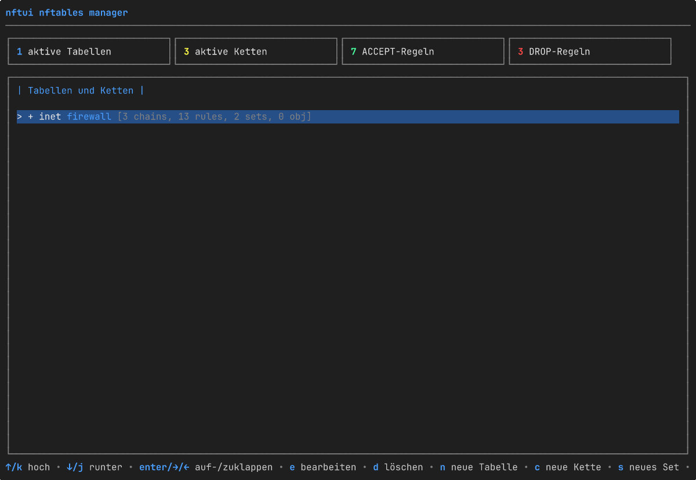

# nftui

[English](README.md) · [Magyar](README.hu.md) · [Español](README.es.md) · [Português (BR)](README.pt-BR.md) · [Français](README.fr.md) · **Deutsch** · [Italiano](README.it.md)

[](https://github.com/aafeher/nftui/actions/workflows/ci.yml)
[](https://github.com/aafeher/nftui/actions/workflows/codeql.yml)
[](https://codecov.io/gh/aafeher/nftui)
[](https://scorecard.dev/viewer/?uri=github.com/aafeher/nftui)
[](https://github.com/aafeher/nftui/releases/latest)
[](LICENSE)
[](go.mod)
[](#voraussetzungen)
[](https://github.com/aafeher/nftui/releases)



`nftui` ist eine Terminal-Benutzeroberfläche (TUI) zur Verwaltung von
`nftables` unter Linux. Durchsuchen Sie das aktive Regelwerk, bearbeiten Sie
Regeln mit vollständigen strukturierten Editoren für jeden Bedingungs- und
Aktionstyp, und wenden Sie die Änderungen auf den Kernel an — ohne die
`nft`-CLI je direkt anzufassen.

Geschrieben in Go mit dem
[Bubble Tea](https://github.com/charmbracelet/bubbletea)-Framework. Spricht
über netlink mit dem Kernel, mittels der Bibliothek
[`google/nftables`](https://github.com/google/nftables).

## Funktionen

### Regelwerk durchsuchen und verwalten

- Baumansicht aller Tabellen und Ketten mit live aus dem Kernel gelesenen
  Daten. Das Grundgerüst (Tabellen, Ketten, Sets, benannte Objekte) wird beim
  Start sofort gerendert; die Regelanzahl je Kette wird asynchron
  nachgeladen, sodass ein Regelwerk mit vielen Ketten interaktiv bleibt,
  während die Regellisten im Hintergrund eintreffen (jede Kettenzeile zeigt
  kurz `[loading rules...]`, bis ihre Abfrage ankommt).
- Regelliste je Kette mit lesbarer Darstellung jedes geparsten Ausdrucks. Die
  Liste ist gefenstert — nur die auf den Bildschirm passenden Regeln werden
  serialisiert und gezeichnet, das Scrollen durch eine Kette mit über 1000
  Regeln kostet also genauso viel wie durch eine mit 10. Der Inline-Filter
  (`/`) cacht den kleingeschriebenen Text jeder Regel beim ersten Abgleich,
  sodass weitere Tastendrücke auch bei großen Ketten flüssig bleiben.
- Detailansicht je Regel, in Tabs nach Bedingungskategorie gegliedert.
- Vollständiges CRUD für Tabellen, Ketten und Regeln: erstellen, umbenennen /
  Eigenschaften bearbeiten, löschen (mit Bestätigung), Regeln innerhalb einer
  Kette nach oben / unten verschieben, davor einfügen / am Ende anhängen.

### Regeleditor — unterstützte Bedingungen

| Kategorie | Abgleiche |
|-----------|-----------|
| **CT (conntrack)** | state, direction, status, mark, secmark, expiration, helper, l3proto, protocol, proto-src, proto-dst, labels, eventmask, ip saddr / daddr, bytes, packets, avgpkt (mit Richtung), zone, count |
| **IPv4-Header** | saddr, daddr (CIDR), protocol, ttl, length, dscp, version, hdrlength, id, frag-off, checksum |
| **IPv6-Header** | saddr, daddr (CIDR), length, nexthdr, hoplimit, version, dscp (6 Bit), flowlabel (20 Bit) |
| **TCP** | sport, dport, sequence, ackseq, flags (MultiSelect), window, checksum, urgptr, doff |
| **UDP / UDPLITE** | sport, dport, length (UDP) / csumcov (UDP-Lite-Prüfsummenabdeckung — dieselbe Wire-Zelle, aus dem `meta l4proto`-Kontext umbenannt; `udplite length` existiert nicht), checksum |
| **SCTP** | sport, dport, vtag, checksum, **chunk** (Chunk-Typ-Abgleich nach RFC 4960: data / init / init-ack / sack / heartbeat / heartbeat-ack / abort / shutdown / shutdown-ack / error / cookie-echo / cookie-ack / ecne / cwr / shutdown-complete / auth / asconf-ack / i-data / forward-tsn / asconf / i-forward-tsn — sowohl das bloße Vorhandensein als auch typspezifische Unterfeld-Bedingungen werden unterstützt: das Chunk-Typ-Select steuert ein Unterfeld-Select (`tsn` / `stream` / `ssn` / `ppid` für DATA; `init-tag` / `a-rwnd` / `os` / `mis` / `init-tsn` für INIT; `cum-tsn-ack` / `a-rwnd` / `num-gap-ack-blocks` / `num-dup-tsns` für SACK; usw.) plus eine Werteingabe, die big-endian in die passende Breite von 1 / 2 / 4 Byte kodiert wird) |
| **Meta (Schnittstelle)** | iifname, oifname, iif, oif, iiftype, oiftype, iifgroup, oifgroup |
| **Meta (Proto / Socket / Paket)** | length, protocol (EtherType), nfproto, l4proto, mark, priority, skuid, skgid, cgroup, rtclassid, pkttype, cpu |

### Regeleditor — unterstützte Aktionen

- **Verdicts**: `accept`, `drop`, `return`, `jump <chain>`, `goto <chain>` —
  mit Kettennamen-Eingabe für Jump-/Goto-Ziele.
- **Reject**: `with icmp type`, `with icmpx type`, `with tcp reset` —
  familienbewusst (das ICMP-Typ-Select ändert sich für ip- / ip6- / inet- /
  bridge-Tabellen).
- **Log**: prefix, level (emerg…debug), NFLOG-Gruppe, snaplen,
  queue-threshold — mit Validierung vor dem Speichern gegen vom Kernel
  abgelehnte Kombinationen (z. B. `level` im NFLOG-Modus verboten).
- **Counter**: bearbeitet Paket- und Byte-Zähler eines anonymen Zählers
  (typischer Anwendungsfall: auf 0 zurücksetzen).
- **Limit**: rate, unit (second/minute/hour/day/week), burst, type
  (packets/bytes), over.

### Editor-UX

- Jeder Tab gruppiert zusammengehörige Felder; **Tab** / **Shift+Tab** bewegt
  den Fokus zwischen den Untereingaben.
- Geänderte Felder werden hervorgehoben; eine geleerte Eingabe entfernt den
  zugrunde liegenden Abgleich.
- **F2** validiert und wendet alle Änderungen über netlink an
  (`NLM_F_REPLACE`).
- Eine Hilfezeile in der Fußzeile listet stets alle in der aktuellen Ansicht
  verfügbaren Tastenkürzel.

## Voraussetzungen

- **Linux** mit einem Kernel mit `nftables`-Unterstützung.
- **Go 1.25+**, um aus den Quellen zu bauen.
- **`CAP_NET_ADMIN`** zur Laufzeit (per `sudo` ausführen oder die Capability
  mit `setcap` gewähren).
- Ein Terminal mit mindestens **80x24** Zeichen. Darunter zeigt nftui eine
  Aufforderung zum Vergrößern statt eines gequetschten Layouts.

Die Laufzeit benötigt die `nft`-CLI für den zentralen Lese- / Bearbeitungs- /
Schreibpfad **nicht** — die Kommunikation läuft direkt über netlink. Das
`nft`-Binary wird nur von wenigen gezielten Operationen verwendet, bei denen
der Weg über die CLI sicherer ist, als den Kernel-Zustand zu rekonstruieren
(Tabellen umbenennen, Basisketten neu anlegen).

## Installation

```bash
git clone https://github.com/aafeher/nftui.git
cd nftui
go build -o nftui .
```

### Vorkompilierte Pakete

Jedes [Release](https://github.com/aafeher/nftui/releases) enthält native
Pakete für `amd64` und `arm64`, alle aus demselben Binary gebaut wie die
Archive und in `checksums.txt` gelistet (die cosign-Signatur deckt sie also
mit ab):

| Format | Distributionen | Installation |
|--------|----------------|--------------|
| `.deb` | Debian / Ubuntu | `sudo apt install ./nftui_<ver>_linux_amd64.deb` |
| `.rpm` | Fedora / RHEL / openSUSE | `sudo dnf install ./nftui_<ver>_linux_amd64.rpm` |
| `.apk` | Alpine | `sudo apk add --allow-untrusted ./nftui_<ver>_linux_amd64.apk` |
| `.pkg.tar.zst` | Arch | `sudo pacman -U ./nftui_<ver>_linux_amd64.pkg.tar.zst` |
| `.ipk` | OpenWrt (opkg) | `opkg install ./nftui_<ver>_linux_amd64.ipk` |

Jedes Paket installiert `nftui` nach `/usr/bin`, die Handbuchseite nach
`/usr/share/man/man1` und deklariert die Laufzeitabhängigkeit `nftables`. Die
Binaries sind statisch (ohne CGO) und laufen daher auf glibc- wie
musl-Systemen gleichermaßen. OpenWrt migriert von `opkg` zu `apk`; auf
passenden Architekturen sollte das `.apk` das neuere apk-basierte OpenWrt
bedienen, während das `.ipk` die bestehenden opkg-Versionen abdeckt. Router
anderer Architekturen (mips, armv7) liegen außerhalb des Rahmens — bauen Sie
dort aus den Quellen.

**Arch / AUR:** das Release-`.pkg.tar.zst` installiert sich direkt mit
`pacman -U`, ganz ohne AUR. nftui veröffentlicht selbst nichts im AUR; ein
Community-Maintainer ist willkommen, das Referenz-
[`packaging/aur/PKGBUILD`](packaging/aur/PKGBUILD) zu übernehmen (ein
`-bin`-Paket über den Release-Tarball).

**Gentoo:** das Repository ist ein normales Go-Modul, `go build -o nftui .`
ist also der einfachste Weg. Zwei von der Community pflegbare
Referenz-Ebuilds liegen für ein lokales Overlay bei:
[`nftui-1.2.0.ebuild`](packaging/gentoo/nftui-1.2.0.ebuild) baut über
`go-module.eclass` aus den Quellen, und
[`nftui-bin-1.2.0.ebuild`](packaging/gentoo/nftui-bin-1.2.0.ebuild)
installiert das vorkompilierte Release-Binary; installieren Sie das eine oder
das andere (sie teilen sich `/usr/bin/nftui` und blockieren einander). Siehe
[`packaging/gentoo/README.md`](packaging/gentoo/README.md) zur Einrichtung
des Overlays. nftui pflegt keinen Portage-/GURU-Eintrag.

### Nix flake

Das Repository liefert eine [`flake.nix`](flake.nix) mit einem
`buildGoModule`-Paket für `x86_64-linux` und `aarch64-linux`, einer
`devShell`, die die CI-Toolchain spiegelt, und einem ausführbaren
`apps.default`:

```bash
nix build              # baut nach ./result/bin/nftui (+ Handbuchseite)
nix run                # baut und führt aus (braucht CAP_NET_ADMIN zur Laufzeit)
nix develop            # Werkzeuge: go, gopls, goreleaser, nftables, mandoc
```

`flake.nix` trägt einen festgenagelten `vendorHash` für die
Go-Abhängigkeiten, der bei jeder `go.sum`-Änderung neu festgenagelt werden
muss — auch bei jedem Dependabot-`gomod`-Pull-Request, der zwar `go.mod` /
`go.sum` aktualisiert, das Flake aber nicht anfassen kann. Der Build schlägt
dann mit `hash mismatch … got: sha256-…` fehl; der ausgegebene Wert gehört in
die `vendorHash`-Zeile. So bleiben Binary-Releases (Goreleaser) und Nix-Builds
unabhängig: der Nix-Pfad blockiert die Release-Veröffentlichung nicht.

### Docker

Ein [`Dockerfile`](Dockerfile) baut ein kleines (~17 MB) Image, das die zur
Laufzeit benötigte `nft(8)`-CLI mitbringt:

```bash
docker build -t nftui:local .
# versionierter Build (setzt `nftui --version`):
docker build -t nftui:1.2.0 --build-arg VERSION=1.2.0 .
```

nftui verwaltet das Regelwerk des **Hosts**, der Container braucht daher den
Netzwerk-Namensraum des Hosts, die Capability `NET_ADMIN` und ein
interaktives TTY:

```bash
docker run --rm -it --network host --cap-add NET_ADMIN nftui:local
```

Flags werden direkt durchgereicht, z. B. `… nftui:local --read-only`.

Eine [`docker-compose.yml`](docker-compose.yml) verdrahtet dieselben
Optionen. Verwenden Sie `run` (nicht `up`), damit die TUI ein echtes TTY
bekommt:

```bash
docker compose run --rm nftui
```

Der Container läuft als root und verlässt sich auf `--cap-add NET_ADMIN`
plus die Container-Grenze zur Isolation; mit `--network host` bearbeitet er
das nftables des Hosts — derselbe Privilegien-Fußabdruck wie beim Ausführen
des Binarys auf dem Host (siehe
[Berechtigungsmodell und Härtung der Bereitstellung](#berechtigungsmodell-und-härtung-der-bereitstellung)).

### Ausführung

Entweder mit `sudo`:

```bash
sudo ./nftui
```

…oder gewähren Sie dem Binary die nötige Capability einmalig:

```bash
sudo setcap cap_net_admin=ep ./nftui
./nftui
```

### Installation der Handbuchseite (optional)

```bash
sudo install -m 0644 man/nftui.1 /usr/share/man/man1/               # Englisch
sudo install -m 0644 man/hu/nftui.1 /usr/share/man/hu/man1/         # Ungarisch (optional)
sudo install -m 0644 man/es/nftui.1 /usr/share/man/es/man1/         # Spanisch (optional)
sudo install -m 0644 man/pt_BR/nftui.1 /usr/share/man/pt_BR/man1/   # brasilianisches Portugiesisch (optional)
sudo install -m 0644 man/fr/nftui.1 /usr/share/man/fr/man1/         # Französisch (optional)
sudo install -m 0644 man/de/nftui.1 /usr/share/man/de/man1/         # Deutsch (optional)
sudo install -m 0644 man/it/nftui.1 /usr/share/man/it/man1/         # Italienisch (optional)
sudo mandb        # falls Ihr System man-db verwendet (Debian / Ubuntu / Fedora …)
man nftui         # danach überall verfügbar
```

Ein locale-bewusstes `man` wählt die übersetzte Seite anhand von `$LANG` /
`$LC_MESSAGES` (z. B. `LANG=de_DE.UTF-8 man nftui`). Vorschau aus dem
Quellbaum ohne Installation:

```bash
man -l man/nftui.1          # Englisch
man -l man/de/nftui.1       # Deutsch
man -l man/it/nftui.1       # Italienisch
man -l man/fr/nftui.1       # Französisch
man -l man/es/nftui.1       # Spanisch
man -l man/pt_BR/nftui.1    # brasilianisches Portugiesisch
man -l man/hu/nftui.1       # Ungarisch
```

## Kommandozeilenoptionen

| Flag | Beschreibung |
|------|--------------|
| `--table <name>` | Beschränkt den Baum auf eine einzige Tabelle — ihre Ketten, Sets und benannten Objekte. Der Abgleich erfolgt per Name über alle Familien hinweg, `--table filter` schließt also sowohl `inet filter` als auch `ip filter` ein, falls beide existieren. Ein unbekannter Name beendet das Programm vor dem Start der TUI und zeigt die Liste der verfügbaren Tabellen. |
| `--config <file>` | Wendet das angegebene nftables-Regelwerk via `nft -f <file>` an, **bevor** die TUI startet. **Dies verändert das laufende Regelwerk** — die Datei darf `flush ruleset` enthalten. Nützlich, um einen bekannten Zustand für Tests herzustellen. Wird vor `--table` aufgelöst, sodass der Kernel-Zustand nach dem Laden das ist, wogegen `--table` validiert. |
| `--read-only` | Deaktiviert jeden Schreibpfad: kein add / insert / move / delete / edit / save von Regeln, kein create / delete von Ketten / Tabellen / Sets, kein Zurücksetzen von Zählern. Blockierte Tasten werden in der Fußzeile abgedunkelt (gemäß der Fußzeilen-Vollständigkeits-Invariante) und ein `[READ-ONLY MODE]`-Marker (auf Deutsch `[NUR LESEN]`) begleitet den Titel jeder Hauptansicht. Nützlich für sicheres Durchsuchen, Audits oder in Kombination mit `--config`, um eine Fixture ohne Risiko versehentlicher Änderungen zu inspizieren. |
| `--lang <code>` | Legt die Sprache der Oberfläche fest, z. B. `en`, `hu`, `es`, `pt-BR`, `fr`, `de` oder `it`. Übersteuert die Locale-Umgebung (`LC_ALL` / `LC_MESSAGES` / `LANG`). Ein nicht gesetzter oder nicht unterstützter Wert fällt auf die automatische Locale-Erkennung und schließlich auf Englisch zurück. Nur Sprachen, für die nftui einen Katalog mitliefert, werden berücksichtigt — derzeit **Englisch**, **Ungarisch**, **Spanisch**, **brasilianisches Portugiesisch**, **Französisch**, **Deutsch** und **Italienisch**. Siehe [Sprache / Lokalisierung](#sprache--lokalisierung). |
| `--help` (auch `-h`) | Gibt die vollständige Flag-Liste mit einzeiligen Beschreibungen und Anwendungsbeispielen aus und beendet sich. Geht nach stdout (lässt sich also nach `less` weiterleiten); ein explizites `--help` beendet sich mit 0. Ungültige Flags geben denselben Hilfetext auf stderr aus und beenden sich mit 2. |
| `--version` | Gibt `nftui <Version>` auf stdout aus und beendet sich mit 0. Die Version wird beim Release-Build injiziert; ein aus den Quellen gebautes Binary meldet die Modulversion aus den Go-Build-Informationen, oder `dev` für ein einfaches `go build`. |

Beispiele:

```bash
sudo ./nftui --table filter                              # zeigt nur die Tabelle(n) namens 'filter'
sudo ./nftui --table missing                             # beendet sich: "table 'missing' not found. Available tables: …"
sudo ./nftui --config examples/example-nftables-01.conf  # lädt die manuelle Test-Fixture und durchsucht sie
sudo ./nftui --read-only                                 # sicheres Durchsuchen — jede Schreibtaste ist abgedunkelt und wirkungslos
sudo ./nftui --config new.conf --table filter            # wendet new.conf an und beschränkt die Ansicht auf dessen Tabelle 'filter'
./nftui --version                                        # gibt die Version aus und beendet sich (keine Privilegien nötig)
```

Ohne `--config` bleibt das laufende Regelwerk unangetastet. Ohne `--table`
werden alle Tabellen angezeigt. Ohne `--read-only` sind alle CRUD-Aktionen
verfügbar.

## Sprache / Lokalisierung

Die Oberfläche von nftui ist lokalisiert. Die Sprache wird einmalig beim
Start aufgelöst, in dieser Reihenfolge:

1. das Flag `--lang <code>` (z. B. `--lang de`);
2. andernfalls die POSIX-Locale-Umgebung — `LC_ALL`, dann `LC_MESSAGES`, dann
   `LANG` (die Suffixe `.codeset` / `@modifier` werden ignoriert, und `C` /
   `POSIX` bedeuten Englisch);
3. andernfalls Englisch.

Ein nicht gesetzter oder nicht unterstützter Code fällt auf die automatische
Erkennung und schließlich auf Englisch zurück, nftui startet also stets in
einer Sprache, für die es einen Katalog hat. Die Wahl ist für die Sitzung
fixiert — einen Sprachwechsel innerhalb der Anwendung gibt es nicht.

**Unterstützte Sprachen:** Englisch (Quelle), Ungarisch (`hu`), Spanisch
(`es`), brasilianisches Portugiesisch (`pt-BR`), Französisch (`fr`), Deutsch
(`de`) und Italienisch (`it`). Englisch ist die *Quell*-Locale: jeder an den Benutzer
gerichtete Text der TUI wird über die eingebetteten Nachrichtenkataloge
(`i18n/locales/*.json`) aufgelöst, mit Englisch als Rückfallebene für jede
fehlende Schlüssel.

**Umfang:** die interaktive TUI — der Baum, die Übersichten, die Regel- /
Ketten- / Set-Ansichten, die Erstell- / Bearbeitungsdialoge, der
Regeleditor, die Fußzeilen und die Bestätigungen — ist vollständig
lokalisiert. Das eigene Vokabular von nftables (Attributnamen wie `type` /
`hook` / `policy`, die Verdicts, die Ausdrucks-Schlüsselwörter und jede
kopierbare Regelsyntax) bleibt in jeder Sprache Englisch, sodass das
Gelesene weiterhin dem entspricht, was `nft` akzeptiert. Die Ausgabe von
`--help` / `--version` ist nur auf Englisch — sie wird außerhalb der TUI
konsumiert, und `--help` wird vor der Sprachauswahl aufgelöst. Die
Handbuchseite `nftui(1)` wird auf Englisch ([`man/nftui.1`](man/nftui.1)),
Ungarisch ([`man/hu/nftui.1`](man/hu/nftui.1)), Spanisch
([`man/es/nftui.1`](man/es/nftui.1)), brasilianischem Portugiesisch
([`man/pt_BR/nftui.1`](man/pt_BR/nftui.1)), Französisch
([`man/fr/nftui.1`](man/fr/nftui.1)), Deutsch
([`man/de/nftui.1`](man/de/nftui.1)) und Italienisch
([`man/it/nftui.1`](man/it/nftui.1)) ausgeliefert; dieses README existiert
auch auf [Englisch](README.md), [Ungarisch](README.hu.md),
[Spanisch](README.es.md), [brasilianischem Portugiesisch](README.pt-BR.md),
[Französisch](README.fr.md) und [Italienisch](README.it.md).

```bash
sudo ./nftui --lang de             # deutsche Oberfläche
sudo ./nftui --lang it             # italienische Oberfläche
sudo ./nftui --lang fr             # französische Oberfläche
sudo ./nftui --lang hu             # ungarische Oberfläche
LANG=de_DE.UTF-8 sudo -E ./nftui   # Deutsch über die Locale-Umgebung
sudo ./nftui --lang en             # erzwingt Englisch unabhängig von der Locale
```

## Berechtigungsmodell und Härtung der Bereitstellung

nftui liest und schreibt das nftables-Regelwerk des Kernels über netlink,
was die Capability **`CAP_NET_ADMIN`** erfordert. Es hat **keine eigene
Authentifizierung oder Autorisierung**: jeder Benutzer, der nftui mit dieser
Capability starten kann, kann die Firewall umschreiben. nftui ist daher nur
so sicher wie die Art, auf die Sie dieses Privileg gewähren — zu breit
gewährt, wird das Binary zum *confused deputy*. Erzwingen Sie die
Zugriffskontrolle auf OS-Ebene. Zwei Muster werden empfohlen.

### Empfohlen: `sudo` mit eingeschränkter Regel

Führen Sie nftui über `sudo` aus und begrenzen Sie, wer das darf. Legen Sie
eine dedizierte Gruppe an (z. B. `nftadm`), fügen Sie die vertrauenswürdigen
Operatoren hinzu und ergänzen Sie eine Regel mit `visudo`:

```sudoers
# /etc/sudoers.d/nftui  (bearbeiten mit: visudo -f /etc/sudoers.d/nftui)
# Die Gruppe nftadm darf nftui als root ausführen — und sonst nichts.
%nftadm ALL=(root) /usr/local/bin/nftui
```

- Verwenden Sie den **absoluten Pfad**, damit kein anderes `nftui` weiter
  vorn im `PATH` untergeschoben werden kann.
- Lassen Sie die Passwortabfrage aktiv (kein `NOPASSWD`) für den
  interaktiven Gebrauch: `sudo` schreibt bei jedem Aufruf einen
  Auth-Log-Eintrag und liefert Ihnen so eine Wer-und-Wann-Aufzeichnung.
- Die Operatoren führen dann `sudo nftui` aus. nftui liest `SUDO_USER`, mit
  aktiviertem [Audit-Protokoll](#audit-protokoll) hält also jede angewendete
  Änderung den Menschen hinter `sudo` fest, nicht nur `root`.

Für eine Nur-Lese- / Browse-Rolle gewähren Sie einer breiteren Gruppe
ausschließlich die `--read-only`-Form. `sudo` vergleicht den Befehl **und**
seine Argumente exakt, diese Regel erlaubt also `sudo nftui --read-only`,
nicht aber das uneingeschränkte `sudo nftui`:

```sudoers
%nftview ALL=(root) /usr/local/bin/nftui --read-only
```

### Alternative: ein gruppenbeschränktes `setcap`-Binary

Wenn Sie ohne `sudo` arbeiten müssen (z. B. Automatisierung), gewähren Sie
die Capability der Datei, beschränken Sie aber, **wer sie ausführen darf** —
lassen Sie sie nie für alle ausführbar:

```bash
sudo chown root:nftadm /usr/local/bin/nftui
sudo chmod 750         /usr/local/bin/nftui   # root: rwx, nftadm: r-x, andere: nichts
sudo setcap cap_net_admin+ep /usr/local/bin/nftui
```

- Die Capability haftet an der **Datei**, nicht am Benutzer; `chmod 755` +
  `setcap` überreicht die Firewall-Umschreibe-Macht damit praktisch jedem
  lokalen Konto. `chmod 750` mit einer dedizierten Gruppe hält sie im Zaum.
- Ein `setcap`-Binary umgeht `sudo`, es gibt also **keinen
  sudo-Auth-Log-Eintrag** und `SUDO_USER` ist leer — verlassen Sie sich für
  die Änderungsaufzeichnung auf `NFTUI_AUDIT_LOG` (es erfasst weiterhin die
  echte UID und den echten Benutzer).
- Halten Sie das Binary und seine Elternverzeichnisse nur für `root`
  beschreibbar, damit die Capability-tragende Datei nicht ausgetauscht
  werden kann.

### Tiefgestaffelte Verteidigung

- Aktivieren Sie das [Audit-Protokoll](#audit-protokoll)
  (`NFTUI_AUDIT_LOG`), damit jede Mutation zugeordnet und mit Zeitstempel
  versehen ist — das OS steuert, *wer nftui ausführen darf*; das
  Audit-Protokoll hält fest, *was geändert wurde*.
- Verwenden Sie `--read-only` für Inspektions- / Audit-Rollen, die den
  Zustand nie verändern sollen.
- `sudo` integriert sich mit **PAM**: Re-Authentifizierung, MFA oder Zeit- /
  Host-Beschränkungen (`pam_time`, `pam_access`) werden in der PAM-Schicht
  konfiguriert — das ist das „PAM-Wrapping" für nftui; das Werkzeug fügt
  bewusst keine eigene Zugriffskontrolle hinzu.

## Audit-Protokoll

Für Änderungsmanagement und Compliance (z. B. SOC 2 / PCI-DSS) kann nftui
jede von ihm angewendete Regelwerk-Mutation aufzeichnen. Setzen Sie die
Umgebungsvariable `NFTUI_AUDIT_LOG` auf einen beschreibbaren Dateipfad:

```bash
sudo NFTUI_AUDIT_LOG=/var/log/nftui-audit.log ./nftui
```

Ist die Variable **nicht gesetzt oder leer, ist das Auditing aus** und nftui
verhält sich exakt wie zuvor — es gibt keine Datei-E/A auf dem
Mutationspfad. Ist sie gesetzt, hängt jede angewendete Änderung (Erstellen /
Löschen / Umbenennen von Tabellen, Ketten und Sets; Hinzufügen / Einfügen /
Verschieben / Löschen / Bearbeiten von Regeln; Hinzufügen / Löschen von
Set-Elementen; Löschen / Zurücksetzen benannter Objekte; `--config`-Ladung;
Regelwerk-Flush) ein JSON-Objekt pro Zeile an:

```json
{"time":"2026-06-19T10:30:00.12Z","uid":0,"user":"root","sudo_user":"alice","op":"delete-rule","target":"ipv4 filter input handle 7","result":"ok"}
```

Jeder Eintrag trägt den UTC-Zeitstempel, die effektive UID und den
Benutzer, den menschlichen Operator hinter `sudo` (`sudo_user`, aus
`SUDO_USER`), die Operation, das Zielobjekt und das Ergebnis (`result` ist
`ok` oder `error`, mit einem `error`-Feld bei Fehlschlag — abgelehnte
Versuche werden ebenfalls protokolliert). Eigenschaften:

- **Nur-Anhängen** — nftui hängt ausschließlich an; es rotiert, kürzt oder
  liest die Datei nie zurück. Rotieren Sie sie mit `logrotate` oder
  verschiffen Sie die Zeilen in ein SIEM.
- **0600** — die Datei wird nur für den Eigentümer les-/schreibbar angelegt.
- **Fail-open** — lässt sich der Pfad nicht öffnen, gibt nftui eine einzige
  Warnung aus und fährt ohne Auditing fort; ein kaputter Audit-Pfad
  blockiert die Firewall-Verwaltung nie. Stellen Sie sicher, dass der Pfad
  für den nftui-Prozess beschreibbar ist.

## Tastenkürzel

### Hauptbaumansicht (Tabellen + Ketten)

| Taste | Aktion |
|-------|--------|
| `↑` / `k` | Auswahl nach oben |
| `↓` / `j` | Auswahl nach unten |
| `Enter` / `→` / `←` | auf- / zuklappen |
| `F3` | Kette öffnen (Regelliste) |
| `n` | neue Tabelle |
| `c` | neue Kette |
| `e` | ausgewählte Tabelle oder Kette bearbeiten |
| `d` | ausgewählte Tabelle oder Kette löschen |
| `/` | suchen |
| `r` | aus dem Kernel neu laden |
| `q` / `Esc` / `Ctrl+C` | beenden |

### Kettenansicht (Regelliste)

| Taste | Aktion |
|-------|--------|
| `↑` / `k` | Auswahl nach oben |
| `↓` / `j` | Auswahl nach unten |
| `F3` | Regel ansehen |
| `F4` | Regel bearbeiten |
| `a` | Regel am Ende anhängen |
| `i` | Regel vor der Auswahl einfügen |
| `K` (Shift+k) | ausgewählte Regel nach oben |
| `J` (Shift+j) | ausgewählte Regel nach unten |
| `d` | Regel löschen |
| `/` | Regeln per Teilstring filtern (verdict, Bedingungs-Schlüsselwort, Kommentar) |
| `Esc` | zurück |
| `q` | beenden |

Bei aktivem Filter navigieren `↑` / `↓` durch die gefilterte Liste, `Enter` /
`F3` öffnen die ausgewählte Regel zur Ansicht, `F4` öffnet den Editor und
`Esc` löscht den Filter.

### Regeleditor

| Taste | Aktion |
|-------|--------|
| `F5` / `F6` | vorheriger / nächster Tab |
| `Tab` / `Shift+Tab` | nächstes / vorheriges Feld |
| `F2` | speichern (validieren + auf den Kernel anwenden) |
| `Esc` / `F3` | zurück |
| `q` / `Ctrl+C` | beenden |

## Beispiel-Regelwerk

`examples/example-nftables-01.conf` ist die kanonische manuelle
Test-Fixture. Sie deckt jedes oben dokumentierte Feature ab und wird mit
`nft -c -f` gegen den Host-Kernel verifiziert. Für einen realistischen
Startpunkt nach guter Praxis statt einer Feature-Schau ist
`examples/example-host-firewall.conf` eine gehärtete
Einzelhost-Firewall (eingehend standardmäßig verweigert außer
SSH/HTTP/HTTPS, ausgehend unbeschränkt, Weiterleitung verweigert). Laden Sie
eine der beiden nur explizit und nur auf einem System, auf dem das
Überschreiben des nftables-Zustands in Ordnung ist:

```bash
sudo nft -c -f examples/example-nftables-01.conf       # Syntaxprüfung
sudo nft flush ruleset                                 # Zurücksetzen (GEFAHR in Produktion)
sudo nft -f examples/example-nftables-01.conf          # anwenden
```

> `nftui` selbst verändert das laufende Regelwerk beim Start **nicht** — es
> liest nur den aktuellen Kernel-Zustand und schreibt die Änderungen, die
> der Benutzer ausdrücklich vornimmt.

## Projektstruktur

```
main.go                        Programmeinstiegspunkt
nft/                           mit dem Kernel sprechender Kern
  rule.go                      Parser Ausdruck → Rule-Struktur
  nft_linux.go                 netlink-CRUD-Operationen (Build-Tag Linux)
  nft_stub.go                  No-op-Stubs für Nicht-Linux-Builds
  expr/                        Formatierhelfer je Ausdruck
  nftserializer/               Regelwerk → menschenlesbare Ausgabe
ui/                            Bubble-Tea-TUI
  main_window.go               oberstes Modell (Baumansicht)
  chain_view.go                Regelliste
  rule_view.go                 Regeldetail (nur lesend)
  rule_edit.go                 Regeleditor mit FieldEditors in Tabs
  field_*.go                   eine Datei je FieldEditor
i18n/                          i18n / Lokalisierung (eingebettete Nachrichtenkataloge)
  i18n.go                      Spracherkennung / -abgleich + der T()-Übersetzer
  locales/                     JSON-Kataloge je Sprache (en, hu, es, pt-BR, fr, de, it)
examples/example-nftables-01.conf  manuelle Test-Fixture
man/nftui.1                    Handbuchseite (groff/mandoc; siehe „Installation")
CHANGELOG.md                   Versionshinweise (Keep-a-Changelog-Format)
```

## Tests

```bash
go test ./...                            # Unit-Tests (kein Kernel nötig)
sudo nft -c -f examples/example-nftables-01.conf   # validiert die Fixture
```

### Integrationstests

Die Tests unter dem Build-Tag `integration` üben die echten
netlink-Lese- **und** Schreibpfade mit denselben Helfern aus, die auch die
TUI verwendet: ein Regelwerk via `nft -f` anwenden und zurücklesen, dazu
Tabellen und Ketten erstellen / umbenennen / löschen und Regeln hinzufügen /
einfügen / verschieben / löschen, wobei nach jedem Schritt der zurückgelesene
Kernel-Zustand geprüft wird. Sie sind vom Standard-`go test ./...`
ausgenommen und überspringen sich selbst, wenn sie nicht als root laufen —
ein schlichtes `go test` bleibt also portabel.

```bash
sudo -E go test -tags=integration ./nft/ -v
```

Jeder Test erstellt eine eindeutig benannte Tabelle (mit
Zeitstempel-Suffix, damit parallele Läufe und Restzustände nicht
kollidieren) und baut sie in `t.Cleanup` wieder ab, selbst wenn Assertions
fehlschlagen. Das `nft`-Binary muss im PATH liegen; installieren Sie es
notfalls aus dem `nftables`-Paket Ihrer Distribution.

### Kontinuierliche Integration

[`.github/workflows/ci.yml`](.github/workflows/ci.yml) führt bei jedem Push
und Pull Request nach `main` / `develop` dieselben Prüfungen aus:

- **Build und Unit-Tests** — `gofmt -l`, `go vet ./...` (Standard- und
  `integration`-Build-Tags), `go build ./...` und `go test -race ./...`.
- **Integrationstests** — installiert das `nftables`-Paket und führt dann
  `sudo -E go test -tags=integration -v ./nft/` aus, damit der Prüfstand das
  zum Anwenden eines echten Regelwerks nötige `CAP_NET_ADMIN` hat. Schreibt
  ein Abdeckungsprofil über den `nft`-Baum (`-coverpkg=./nft/...`) und gibt
  die Summe im Job-Log aus — der echte netlink-Pfad ist für das
  Unit-Test-Profil unsichtbar, hier wird seine Abdeckung also sichtbar.
  Läuft erst, nachdem der Unit-Test-Job grün ist.
- **Schwachstellen-Scan** — führt `govulncheck ./...` gegen das Modul und
  die Go-Standardbibliothek aus. Als eigene Prüfung (parallel zum Build)
  lässt er den Lauf nur fehlschlagen, wenn eine bekannte Schwachstelle vom
  Aufrufgraphen von nftui aus erreichbar ist.
- **Prüfung auf reproduzierbaren Build** — baut die Release-Binaries
  zweimal mit `goreleaser build --snapshot` und schlägt fehl, wenn die
  beiden abweichen; das verifiziert, dass der
  `mod_timestamp`- / `-trimpath`- / CGO-freie Build Byte für Byte
  reproduzierbar ist.
- **Nix-Flake-Build** — auf einem Nix-Runner bauen `nix flake check` +
  `nix build .#default` die [`flake.nix`](flake.nix) von Ende zu Ende
  (Kompilieren von nftui und Ausführen seiner Unit-Suite in der Sandbox),
  das Flake kann also nicht unbemerkt kaputtgehen. Diese Bahn schützt zudem
  den festgenagelten `vendorHash` vor `go.sum`-Drift: ein Abhängigkeits-Bump
  lässt sie mit `hash mismatch … got: sha256-…` fehlschlagen, bis dieser Wert
  in `flake.nix` steht.

Abhängigkeits- und GitHub-Actions-Updates sind mit Dependabot automatisiert
(`.github/dependabot.yml`, wöchentlich), der PRs öffnet, sobald Upstream-
Releases und Sicherheitskorrekturen erscheinen. `github.com/google/nftables`
ist von diesen PRs ausgenommen, weil es absichtlich auf einem festgenagelten
Snapshot gehalten wird. Zwei Mengen werden zu je einem PR gruppiert: alle
`github/codeql-action*`-Schritte (CodeQL bricht ab, wenn seine Sub-Actions
verschiedene Releases fahren) und alle Go-Module (jeder Stapel braucht ein
passendes `vendorHash`-Neufestnageln).

Die Go-Version stammt aus `go.mod` via `actions/setup-go@v6` mit
`go-version-file: go.mod`; das Anheben der Go-Version des Moduls
aktualisiert die CI also im selben Commit. Parallele Läufe auf derselben Ref
brechen frühere laufende ab (`cancel-in-progress: true`).

## Release-Prozess

Releases werden von [Goreleaser](https://goreleaser.com/) und einem
tag-ausgelösten Workflow
([`.github/workflows/release.yml`](.github/workflows/release.yml))
gesteuert:

1. Befördern Sie den `[Unreleased]`-Abschnitt in `CHANGELOG.md` zu
   `[X.Y.Z] - <Datum>`.
2. `git tag vX.Y.Z` und `git push --tags`.
3. Der Release-Workflow extrahiert den passenden `[X.Y.Z]`-Abschnitt aus
   `CHANGELOG.md` und führt dann Goreleaser aus, das reproduzierbare
   Linux-`amd64`- / `arm64`-Binaries baut
   (`CGO_ENABLED=0 -trimpath -ldflags='-s -w'`, `mod_timestamp` auf die
   Commit-Zeit festgenagelt), jedes mit `LICENSE`, `README.md`,
   `CHANGELOG.md` und `man/nftui.1` in ein `tar.gz` bündelt, außerdem
   `.deb`- / `.rpm`- / `.apk`- / Arch-`.pkg.tar.zst`- / OpenWrt-`.ipk`-Pakete
   (nfpm, dasselbe Binary) erzeugt, eine SHA-256-`checksums.txt` über jedes
   Artefakt schreibt und das GitHub-Release mit den kuratierten Notizen als
   Text veröffentlicht.
4. Das Release ist mit Lieferketten-Attestierung gehärtet: `checksums.txt`
   wird mit **cosign** signiert (schlüssellos — die Signatur ist über
   Fulcio/Rekor an die OIDC-Identität des Workflows gebunden, kein
   gespeicherter privater Schlüssel), je Archiv wird eine **Syft-SBOM**
   erzeugt, und für die Archive, die Checksummen und den
   Abhängigkeits-Tarball unten wird eine
   **SLSA-Build-Provenienz**-Attestierung aufgezeichnet.
5. Ein reproduzierbares `nftui-<X.Y.Z>-deps.tar.xz` (der Go-Modul-Cache,
   aus `scripts/gen-deps-tarball.sh`) wird für Offline-Quellbuilds
   hochgeladen — vor allem für das Gentoo-Quell-Ebuild, dessen
   `go-module.eclass` Netzzugriff zur Bauzeit verbietet. Sein Inhalt ist
   durch `go.sum` festgenagelt, er reist also mit der
   Provenienz-Attestierung statt in `checksums.txt` (bereits signiert).

Ein heruntergeladenes Release verifizieren:

```bash
# 1. Signatur über die Checksummen-Datei (schlüsselloses cosign). Nageln Sie den
#    Signierer auf den Release-Workflow dieses Repos UND den OIDC-Aussteller von
#    GitHub fest — eine Wildcard-Identität / ein Wildcard-Aussteller ('.*')
#    beweist nur, dass die Signatur in sich gültig ist, nicht dass *wir* sie
#    erzeugt haben; sie würde also eine Signatur jeder beliebigen
#    Fulcio-Identität akzeptieren und den Zweck der schlüssellosen
#    Verifikation zunichtemachen.
cosign verify-blob --certificate checksums.txt.pem --signature checksums.txt.sig \
  --certificate-identity-regexp '^https://github\.com/aafeher/nftui/\.github/workflows/release\.yml@refs/tags/v' \
  --certificate-oidc-issuer 'https://token.actions.githubusercontent.com' \
  checksums.txt
# 2. das Archiv gegen die vertrauenswürdigen Checksummen
sha256sum --check --ignore-missing checksums.txt
# 3. Build-Provenienz (bindet die Bytes an den Release-Workflow dieses Repos)
gh attestation verify nftui_<ver>_linux_amd64.tar.gz --repo <owner>/nftui
```

Die Konfiguration lokal validieren, ohne zu veröffentlichen:

```bash
goreleaser check                                                  # nur Konfig-Syntax
goreleaser release --snapshot --clean --skip=publish,sign,sbom    # Build nach dist/
```

`sign` / `sbom` werden lokal übersprungen, weil sie die
`cosign`-OIDC-Identität des CI-Runners und `syft` benötigen; die
Provenienz-Attestierung ist Workflow-exklusiv. Die Snapshot-Ausgabe
(`dist/`) steht im gitignore, der Arbeitsbaum bleibt also sauber.

## Versionshistorie

Die Versionshinweise je Release stehen in [CHANGELOG.md](CHANGELOG.md) im
[Keep-a-Changelog](https://keepachangelog.com/)-Format. Bisherige
Meilensteine:

- **v0.1.0** (2026-05-24) — erstes veröffentlichbares Release: vollständige
  CT- / Meta- / IP- / Port-Abgleiche, jede Verdict-Aktion, vollständiges
  Regelwerk-CRUD.
- **v0.2.0** (2026-05-24) — NAT-Anweisungen (`snat`, `dnat`, `masquerade`),
  `queue`, `quota`.
- **v0.3.0** (2026-05-24) — erweiterte Protokoll-Abgleiche (ICMP / ICMPv6,
  SCTP, DCCP, AH, ESP, COMP, Ethernet, VLAN, ARP,
  IPv6-Erweiterungsheader).
- **v0.4.0** (2026-05-24) — Sets, Maps und benannte Objekte.
- **v0.5.0** (2026-05-25) — Feinschliff und Härtung von Sets / Maps /
  benannten Objekten (Korrektur beim Löschen von Intervall-Sets,
  dynset-Flag, CIDR-Unterstützung, Verdict-Maps).
- **v0.6.0** (2026-05-29) — Konsistenz des Feedback-Kanals und UX flüchtiger
  Hinweise: selbst ausblendende Baum-Hinweise, vereinheitlichtes Routing der
  Reset- / Delete-Fehler.
- **v0.7.0** (2026-05-29) — Fehlermeldungen (`CAP_NET_ADMIN`-Hinweis,
  Anzeige abgelehnter Regeln) und Navigation (`/`-Suche im Baum, `/`-Filter
  in `chainView`).
- **v0.8.0** (2026-05-30) — CLI-Flags (`--table`, `--config`, `--read-only`,
  `--help`), Release-Feinschliff (CHANGELOG, Handbuchseite),
  `sctp chunk`-Editor, asynchrones inkrementelles Laden.
- **v0.9.0** (2026-06-19) — Release-Infrastruktur
  (Integrationstest-Prüfstand, CI-Workflow, virtualisierte Regelliste,
  Goreleaser-Release-Pipeline, Nix-Flake-Paketierung) plus ein
  Härtungsdurchgang für Unternehmensreife: Lieferketten-Attestierung
  (cosign / SBOM / SLSA-Provenienz), Schwachstellen-Scan in der CI, ein
  optionales Mutations-Audit-Protokoll, Bezeichner-Validierung als
  tiefgestaffelte Verteidigung sowie Governance- und Bereitstellungs-Doku
  (`SECURITY.md`, `CONTRIBUTING.md`, `CODE_OF_CONDUCT.md`).
- **v1.0.0** (2026-06-20) — erstes stabiles Release: verbreiterte
  Installationswege (Debian / RPM, Alpine- / Arch- / OpenWrt-Pakete, ein
  Docker-Image, Community-Referenzen für Gentoo / AUR), nachgewiesene
  Reproduzierbarkeit und Nix-Flake-CI-Spuren, das `--version`-Flag, ein
  Go-Modul-Abhängigkeits-Tarball für Offline-Quellbuilds und die
  Darstellung von IPv6-Quell- / Zieladressen.
- **v1.1.0** (2026-06-21) — Terminal-Anpassungs- und Navigations-UX plus
  eine Sicherheits- / CI-Härtungswelle: 80x24-Minimum mit Rahmenbegrenzung
  und Größenänderungs-Aufforderung, Alternate-Screen-Rendering,
  Scroll-zum-Fokus im Regeleditor und Scrollen in der Regelansicht, ein
  kompakter Kettenkopf; Korrekturen für das Regelwerk-Flushen beim Beenden
  und das doppelte Rendern von Regeln; OpenSSF Scorecard / CodeQL / Codecov,
  Go-Fuzzing-Ziele und SHA-festgenagelte Actions.

- **v1.2.0** (2026-07-18) — Internationalisierung und Lokalisierung: die
  gesamte TUI ist lokalisiert — die englische Quelle plus Ungarisch, Spanisch,
  brasilianisches Portugiesisch, Französisch, Deutsch und Italienisch — über
  eingebettete, paritätsgeprüfte Nachrichtenkataloge mit `--lang`- /
  POSIX-Locale-Auswahl, lokalisierte Bestätigungs-Mnemonics (der deutsche
  `j`-Alias ist sprachabhängig, um das vim-Scroll-Muskelgedächtnis zu
  schützen) und ein vollständiges Handbuchseiten- + README-Übersetzungspaar
  für jede Sprache.
## Lizenz

MIT — siehe [LICENSE](LICENSE).
