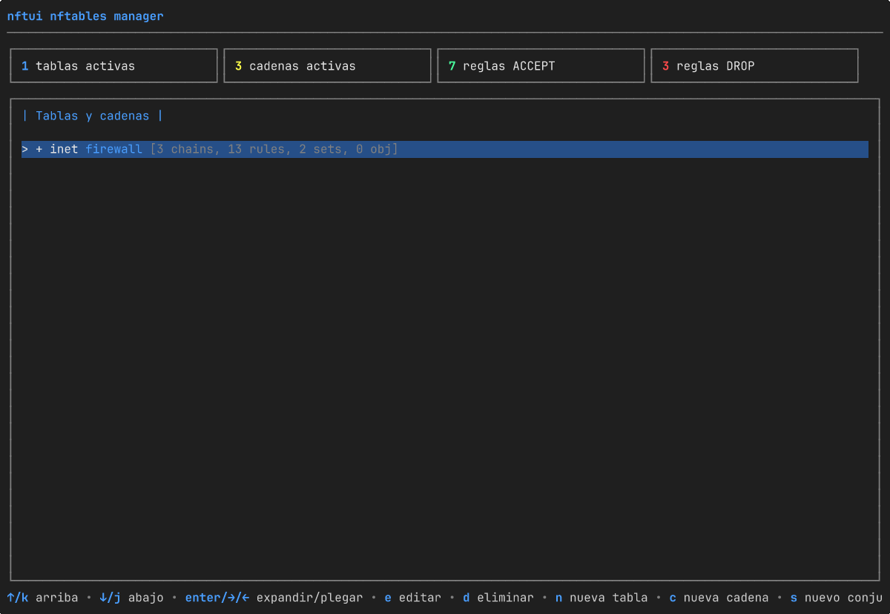

# nftui

[English](README.md) · [Magyar](README.hu.md) · **Español** · [Português (BR)](README.pt-BR.md) · [Français](README.fr.md) · [Deutsch](README.de.md) · [Italiano](README.it.md)

[](https://github.com/aafeher/nftui/actions/workflows/ci.yml)
[](https://github.com/aafeher/nftui/actions/workflows/codeql.yml)
[](https://codecov.io/gh/aafeher/nftui)
[](https://scorecard.dev/viewer/?uri=github.com/aafeher/nftui)
[](https://github.com/aafeher/nftui/releases/latest)
[](LICENSE)
[](go.mod)
[](#requisitos)
[](https://github.com/aafeher/nftui/releases)



`nftui` es una interfaz de usuario de terminal (TUI) para gestionar `nftables`
en Linux. Explora el conjunto de reglas activo, edita reglas con editores
estructurados completos para cada tipo de condición y acción, y aplica los
cambios de vuelta al kernel — sin tocar nunca directamente la CLI de `nft`.

Escrito en Go con el framework
[Bubble Tea](https://github.com/charmbracelet/bubbletea). Habla con el kernel
por netlink mediante la biblioteca
[`google/nftables`](https://github.com/google/nftables).

## Características

### Navegación y gestión del conjunto de reglas

- Vista de árbol de todas las tablas y cadenas con datos vivos leídos del
  kernel. El esqueleto (tablas, cadenas, conjuntos, objetos con nombre) se
  renderiza inmediatamente al arrancar; los recuentos de reglas por cadena se
  rellenan de forma asíncrona, así que un conjunto de reglas con muchas
  cadenas sigue siendo interactivo mientras las listas de reglas llegan en
  segundo plano (cada fila de cadena muestra brevemente `[loading rules...]`
  hasta que su lectura aterriza).
- Listado de reglas por cadena con renderizado legible de cada expresión
  analizada. La lista está ventanizada — solo se serializan y dibujan las
  reglas que caben en pantalla, así que desplazarse por una cadena con más de
  1000 reglas cuesta lo mismo que por una con 10. El filtro en línea (`/`)
  cachea el texto en minúsculas de cada regla la primera vez que se compara,
  de modo que las pulsaciones siguientes siguen siendo ágiles en cadenas
  grandes.
- Vista de detalle por regla organizada en pestañas por categoría de
  condición.
- CRUD completo de tablas, cadenas y reglas: crear, renombrar / editar
  propiedades, eliminar (con confirmación), reordenar reglas arriba / abajo
  dentro de una cadena, insertar antes / añadir al final.

### Editor de reglas — condiciones soportadas

| Categoría | Coincidencias |
|-----------|---------------|
| **CT (conntrack)** | state, direction, status, mark, secmark, expiration, helper, l3proto, protocol, proto-src, proto-dst, labels, eventmask, ip saddr / daddr, bytes, packets, avgpkt (con dirección), zone, count |
| **Cabecera IPv4** | saddr, daddr (CIDR), protocol, ttl, length, dscp, version, hdrlength, id, frag-off, checksum |
| **Cabecera IPv6** | saddr, daddr (CIDR), length, nexthdr, hoplimit, version, dscp (6 bits), flowlabel (20 bits) |
| **TCP** | sport, dport, sequence, ackseq, flags (MultiSelect), window, checksum, urgptr, doff |
| **UDP / UDPLITE** | sport, dport, length (UDP) / csumcov (cobertura de suma de verificación de UDP-Lite — la misma celda del cable, renombrada desde el contexto `meta l4proto`; `udplite length` no existe), checksum |
| **SCTP** | sport, dport, vtag, checksum, **chunk** (coincidencia por tipo de chunk según RFC 4960: data / init / init-ack / sack / heartbeat / heartbeat-ack / abort / shutdown / shutdown-ack / error / cookie-echo / cookie-ack / ecne / cwr / shutdown-complete / auth / asconf-ack / i-data / forward-tsn / asconf / i-forward-tsn — se soportan tanto la mera presencia como restricciones por sub-campo de cada tipo: el Select de tipo de chunk gobierna un Select de sub-campo (`tsn` / `stream` / `ssn` / `ppid` para DATA; `init-tag` / `a-rwnd` / `os` / `mis` / `init-tsn` para INIT; `cum-tsn-ack` / `a-rwnd` / `num-gap-ack-blocks` / `num-dup-tsns` para SACK; etc.) más una entrada de valor que se codifica en big-endian en el ancho correspondiente de 1 / 2 / 4 bytes) |
| **Meta (interfaz)** | iifname, oifname, iif, oif, iiftype, oiftype, iifgroup, oifgroup |
| **Meta (proto / socket / paquete)** | length, protocol (EtherType), nfproto, l4proto, mark, priority, skuid, skgid, cgroup, rtclassid, pkttype, cpu |

### Editor de reglas — acciones soportadas

- **Verdicts**: `accept`, `drop`, `return`, `jump <chain>`, `goto <chain>` —
  con entrada de nombre de cadena para los destinos de jump / goto.
- **Reject**: `with icmp type`, `with icmpx type`, `with tcp reset` — sensible
  a la familia (el Select de tipo ICMP cambia para tablas ip / ip6 / inet /
  bridge).
- **Log**: prefix, level (emerg…debug), grupo NFLOG, snaplen, queue-threshold —
  con validación previa al guardado contra combinaciones que el kernel rechaza
  (p. ej. `level` prohibido en modo NFLOG).
- **Counter**: edita los recuentos de paquetes y bytes de un contador anónimo
  (el uso típico es reiniciarlo a 0).
- **Limit**: rate, unit (second/minute/hour/day/week), burst, type
  (packets/bytes), over.

### UX del editor

- Cada pestaña agrupa campos relacionados; **Tab** / **Shift+Tab** mueve el
  foco entre sub-entradas.
- Los campos modificados se resaltan; una entrada vaciada elimina la
  coincidencia subyacente.
- **F2** valida y aplica todos los cambios a través de netlink
  (`NLM_F_REPLACE`).
- Una línea de ayuda al pie lista siempre todos los atajos disponibles en la
  vista actual.

## Requisitos

- **Linux** con un kernel con soporte de `nftables`.
- **Go 1.25+** para compilar desde el código fuente.
- **`CAP_NET_ADMIN`** en tiempo de ejecución (ejecuta con `sudo` o concede la
  capacidad con `setcap`).
- Una terminal de al menos **80x24** caracteres. Por debajo de eso nftui
  muestra un aviso de redimensionado en lugar de un diseño apretado.

El tiempo de ejecución **no** requiere la CLI `nft` para la ruta principal de
lectura / edición / escritura — la comunicación es directa por netlink. El
binario `nft` solo lo usan unas pocas operaciones concretas donde pasar por la
CLI es más seguro que reconstruir el estado del kernel (renombrar tablas,
recrear cadenas base).

## Instalación

```bash
git clone https://github.com/aafeher/nftui.git
cd nftui
go build -o nftui .
```

### Paquetes precompilados

Cada [release](https://github.com/aafeher/nftui/releases) adjunta paquetes
nativos para `amd64` y `arm64`, todos construidos a partir del mismo binario
que los archivos comprimidos y listados en `checksums.txt` (de modo que la
firma cosign también los cubre):

| Formato | Distros | Instalación |
|---------|---------|-------------|
| `.deb` | Debian / Ubuntu | `sudo apt install ./nftui_<ver>_linux_amd64.deb` |
| `.rpm` | Fedora / RHEL / openSUSE | `sudo dnf install ./nftui_<ver>_linux_amd64.rpm` |
| `.apk` | Alpine | `sudo apk add --allow-untrusted ./nftui_<ver>_linux_amd64.apk` |
| `.pkg.tar.zst` | Arch | `sudo pacman -U ./nftui_<ver>_linux_amd64.pkg.tar.zst` |
| `.ipk` | OpenWrt (opkg) | `opkg install ./nftui_<ver>_linux_amd64.ipk` |

Cada paquete instala `nftui` en `/usr/bin`, la página de manual en
`/usr/share/man/man1`, y declara la dependencia de ejecución `nftables`. Los
binarios son estáticos (sin CGO), así que funcionan igual en sistemas glibc y
musl. OpenWrt está migrando de `opkg` a `apk`, de modo que en arquitecturas
compatibles el `.apk` debería servir para el OpenWrt más nuevo basado en apk
mientras el `.ipk` cubre las versiones opkg existentes. Los routers de otras
arquitecturas (mips, armv7) quedan fuera de alcance — allí compila desde el
código fuente.

**Arch / AUR:** el `.pkg.tar.zst` de la release se instala directamente con
`pacman -U`, sin necesidad de AUR. nftui no publica en el AUR por sí mismo; un
mantenedor de la comunidad es bienvenido a adoptar el
[`packaging/aur/PKGBUILD`](packaging/aur/PKGBUILD) de referencia (un paquete
`-bin` sobre el tarball de la release).

**Gentoo:** el repositorio es un módulo Go estándar, así que
`go build -o nftui .` es la vía más simple. Se proporcionan dos ebuilds de
referencia mantenibles por la comunidad para un overlay local:
[`nftui-1.2.0.ebuild`](packaging/gentoo/nftui-1.2.0.ebuild) compila desde el
código fuente vía `go-module.eclass`, y
[`nftui-bin-1.2.0.ebuild`](packaging/gentoo/nftui-bin-1.2.0.ebuild) instala el
binario precompilado de la release; instala uno u otro (comparten
`/usr/bin/nftui` y se bloquean mutuamente). Consulta
[`packaging/gentoo/README.md`](packaging/gentoo/README.md) para configurar el
overlay. nftui no mantiene una entrada en Portage / GURU.

### Nix flake

El repositorio incluye un [`flake.nix`](flake.nix) con un paquete
`buildGoModule` para `x86_64-linux` y `aarch64-linux`, un `devShell` que
replica la cadena de herramientas de CI, y un `apps.default` ejecutable:

```bash
nix build              # compila en ./result/bin/nftui (+ página de manual)
nix run                # compila y ejecuta (necesita CAP_NET_ADMIN en ejecución)
nix develop            # herramientas: go, gopls, goreleaser, nftables, mandoc
```

`flake.nix` lleva un `vendorHash` fijado para las dependencias de Go, y hay
que re-fijarlo cada vez que cambia `go.sum` — también en cada pull request
`gomod` de Dependabot, que actualiza `go.mod` / `go.sum` pero no puede tocar
el flake. La build falla entonces con `hash mismatch … got: sha256-…`; ese
valor impreso es el que se pega en la línea `vendorHash`. Esto mantiene
independientes las releases binarias (Goreleaser) y las builds de Nix: la vía
Nix no bloquea la publicación de releases.

### Docker

Un [`Dockerfile`](Dockerfile) construye una imagen pequeña (~17 MB) que
incluye la CLI `nft(8)` que nftui necesita en ejecución:

```bash
docker build -t nftui:local .
# build con versión (fija `nftui --version`):
docker build -t nftui:1.2.0 --build-arg VERSION=1.2.0 .
```

nftui gestiona el conjunto de reglas del **host**, así que el contenedor
necesita el espacio de nombres de red del host, la capacidad `NET_ADMIN` y una
TTY interactiva:

```bash
docker run --rm -it --network host --cap-add NET_ADMIN nftui:local
```

Los flags pasan directamente, p. ej. `… nftui:local --read-only`.

Un [`docker-compose.yml`](docker-compose.yml) cablea las mismas opciones. Usa
`run` (no `up`) para que la TUI reciba una TTY real:

```bash
docker compose run --rm nftui
```

El contenedor corre como root y confía en `--cap-add NET_ADMIN` más el límite
del contenedor para el aislamiento; con `--network host` edita el nftables del
host — la misma huella de privilegios que ejecutar el binario en el host
(véase
[Modelo de privilegios y refuerzo del despliegue](#modelo-de-privilegios-y-refuerzo-del-despliegue)).

### Ejecución

O bien con `sudo`:

```bash
sudo ./nftui
```

…o concede al binario la capacidad requerida una sola vez:

```bash
sudo setcap cap_net_admin=ep ./nftui
./nftui
```

### Instalación de la página de manual (opcional)

```bash
sudo install -m 0644 man/nftui.1 /usr/share/man/man1/               # inglés
sudo install -m 0644 man/hu/nftui.1 /usr/share/man/hu/man1/         # húngaro (opcional)
sudo install -m 0644 man/es/nftui.1 /usr/share/man/es/man1/         # español (opcional)
sudo install -m 0644 man/pt_BR/nftui.1 /usr/share/man/pt_BR/man1/   # portugués de Brasil (opcional)
sudo install -m 0644 man/fr/nftui.1 /usr/share/man/fr/man1/         # francés (opcional)
sudo install -m 0644 man/de/nftui.1 /usr/share/man/de/man1/         # alemán (opcional)
sudo install -m 0644 man/it/nftui.1 /usr/share/man/it/man1/         # italiano (opcional)
sudo mandb        # si tu sistema usa man-db (Debian / Ubuntu / Fedora …)
man nftui         # y queda disponible en todas partes
```

Un `man` sensible al locale elige la página traducida a partir de `$LANG` /
`$LC_MESSAGES` (p. ej. `LANG=es_ES.UTF-8 man nftui`). Vista previa desde el
árbol de fuentes sin instalar:

```bash
man -l man/nftui.1          # inglés
man -l man/es/nftui.1       # español
man -l man/pt_BR/nftui.1    # portugués de Brasil
man -l man/fr/nftui.1       # francés
man -l man/de/nftui.1       # alemán
man -l man/it/nftui.1       # italiano
man -l man/hu/nftui.1       # húngaro
```

## Opciones de línea de comandos

| Flag | Descripción |
|------|-------------|
| `--table <name>` | Restringe el árbol a una sola tabla — sus cadenas, conjuntos y objetos con nombre. La coincidencia es por nombre en todas las familias, así que `--table filter` incluirá tanto `inet filter` como `ip filter` si ambas existen. Un nombre desconocido termina antes de arrancar la TUI, mostrando la lista de tablas disponibles. |
| `--config <file>` | Aplica el conjunto de reglas nftables dado mediante `nft -f <file>` **antes** de arrancar la TUI. **Esto muta el conjunto de reglas en ejecución** — el archivo puede contener `flush ruleset`. Úsalo para levantar un estado conocido para pruebas. Se resuelve antes que `--table`, de modo que el estado del kernel tras la carga es lo que `--table` valida. |
| `--read-only` | Desactiva toda ruta de escritura: sin add / insert / move / delete / edit / save de reglas, sin create / delete de cadenas / tablas / conjuntos, sin reinicio de contadores. Las teclas bloqueadas se atenúan en el pie (según el invariante de completitud del pie) y un marcador `[READ-ONLY MODE]` (en español `[SOLO LECTURA]`) acompaña el título de cada vista principal. Útil para navegación segura, auditoría, o combinado con `--config` para inspeccionar una fixtura sin riesgo de ediciones accidentales. |
| `--lang <code>` | Establece el idioma de la interfaz, p. ej. `en`, `hu`, `es`, `pt-BR`, `fr`, `de` o `it`. Anula el entorno de locale (`LC_ALL` / `LC_MESSAGES` / `LANG`). Un valor no establecido o no soportado recurre a la detección automática del locale y finalmente al inglés. Solo se aceptan los idiomas para los que nftui incluye un catálogo — actualmente **inglés**, **húngaro**, **español**, **portugués de Brasil**, **francés**, **alemán** e **italiano**. Véase [Idioma / localización](#idioma--localización). |
| `--help` (también `-h`) | Imprime la lista completa de flags con descripciones de una línea y ejemplos de uso, y termina. Va a stdout (así puedes canalizarla a `less`); un `--help` explícito termina con 0. Los flags inválidos emiten el mismo uso por stderr y terminan con 2. |
| `--version` | Imprime `nftui <versión>` en stdout y termina con 0. La versión se inyecta al construir la release; un binario compilado desde el código fuente informa la versión de módulo del build-info de Go, o `dev` para un `go build` simple. |

Ejemplos:

```bash
sudo ./nftui --table filter                              # muestra solo la(s) tabla(s) llamada(s) 'filter'
sudo ./nftui --table missing                             # termina: "table 'missing' not found. Available tables: …"
sudo ./nftui --config examples/example-nftables-01.conf  # carga la fixtura de prueba manual y la explora
sudo ./nftui --read-only                                 # navegación segura — toda tecla de escritura está atenuada e inerte
sudo ./nftui --config new.conf --table filter            # aplica new.conf y restringe la vista a su tabla 'filter'
./nftui --version                                        # imprime la versión y termina (sin privilegios)
```

Sin `--config`, el conjunto de reglas en ejecución queda intacto. Sin
`--table`, se muestran todas las tablas. Sin `--read-only`, todas las acciones
CRUD están disponibles.

## Idioma / localización

La interfaz de nftui está localizada. El idioma se resuelve una sola vez al
arrancar, en este orden:

1. el flag `--lang <code>` (p. ej. `--lang es`);
2. si no, el entorno de locale POSIX — `LC_ALL`, luego `LC_MESSAGES`, luego
   `LANG` (los sufijos `.codeset` / `@modifier` se ignoran, y `C` / `POSIX`
   significan inglés);
3. si no, inglés.

Un código no establecido o no soportado recurre a la detección automática y
finalmente al inglés, así que nftui siempre arranca en un idioma para el que
tiene catálogo. La elección queda fijada para la sesión — no hay cambio de
idioma dentro de la aplicación.

**Idiomas soportados:** inglés (fuente), húngaro (`hu`), español (`es`),
portugués de Brasil (`pt-BR`), francés (`fr`), alemán (`de`) e italiano
(`it`). El inglés es el
locale *fuente*: cada cadena de
texto de la TUI orientada al usuario se resuelve a través de los catálogos de
mensajes embebidos (`i18n/locales/*.json`), con el inglés como respaldo para
cualquier clave ausente.

**Alcance:** la TUI interactiva — el árbol, los paneles, las vistas de regla /
cadena / conjunto, los diálogos de creación / edición, el editor de reglas,
los pies y las confirmaciones — está totalmente localizada. El vocabulario
propio de nftables (nombres de atributo como `type` / `hook` / `policy`, los
verdicts, las palabras clave de expresión y cualquier sintaxis de regla
copiable) permanece en inglés en todos los idiomas, de modo que lo que lees
sigue coincidiendo con lo que `nft` acepta. La salida de `--help` /
`--version` es solo en inglés — se consume fuera de la TUI, y `--help` se
resuelve antes de seleccionar el idioma. La página de manual `nftui(1)` se
distribuye en inglés ([`man/nftui.1`](man/nftui.1)), húngaro
([`man/hu/nftui.1`](man/hu/nftui.1)), español
([`man/es/nftui.1`](man/es/nftui.1)), portugués de Brasil
([`man/pt_BR/nftui.1`](man/pt_BR/nftui.1)), francés
([`man/fr/nftui.1`](man/fr/nftui.1)), alemán
([`man/de/nftui.1`](man/de/nftui.1)) e italiano
([`man/it/nftui.1`](man/it/nftui.1)); este README existe también en
[inglés](README.md), [húngaro](README.hu.md),
[portugués de Brasil](README.pt-BR.md), [francés](README.fr.md),
[alemán](README.de.md) e [italiano](README.it.md).

```bash
sudo ./nftui --lang es             # interfaz en español
sudo ./nftui --lang pt-BR          # interfaz en portugués de Brasil
sudo ./nftui --lang hu             # interfaz en húngaro
sudo ./nftui --lang fr             # interfaz en francés
sudo ./nftui --lang de             # interfaz en alemán
sudo ./nftui --lang it             # interfaz en italiano
LANG=es_MX.UTF-8 sudo -E ./nftui   # español desde el entorno de locale
sudo ./nftui --lang en             # fuerza inglés sin importar el locale
```

## Modelo de privilegios y refuerzo del despliegue

nftui lee y escribe el conjunto de reglas nftables del kernel por netlink, lo
que requiere la capacidad **`CAP_NET_ADMIN`**. **No tiene autenticación ni
autorización propias**: cualquier usuario que pueda lanzar nftui con esa
capacidad puede reescribir el cortafuegos. Por tanto, nftui es tan seguro como
la forma en que concedas ese privilegio — concédelo demasiado ampliamente y el
binario se convierte en un *confused deputy*. Aplica el control de acceso en
la capa del SO. Se recomiendan dos patrones.

### Recomendado: `sudo` con una regla restringida

Ejecuta nftui a través de `sudo` y limita quién puede hacerlo. Crea un grupo
dedicado (p. ej. `nftadm`), añade a los operadores de confianza y añade una
regla con `visudo`:

```sudoers
# /etc/sudoers.d/nftui  (edítalo con: visudo -f /etc/sudoers.d/nftui)
# Deja que el grupo nftadm ejecute nftui como root — y nada más.
%nftadm ALL=(root) /usr/local/bin/nftui
```

- Usa la **ruta absoluta** para que no se pueda sustituir por otro `nftui`
  anterior en `PATH`.
- Mantén la petición de contraseña (sin `NOPASSWD`) para el uso interactivo:
  `sudo` escribe una entrada en el registro de autenticación por cada
  invocación, dándote un registro de quién-y-cuándo.
- Los operadores ejecutan entonces `sudo nftui`. nftui lee `SUDO_USER`, así
  que con el [registro de auditoría](#registro-de-auditoría) activado, cada
  cambio aplicado registra a la persona detrás de `sudo`, no solo a `root`.

Para un rol de solo lectura / navegación, concede a un grupo más amplio
únicamente la forma `--read-only`. `sudo` compara el comando **y** sus
argumentos exactamente, así que esta regla permite `sudo nftui --read-only`
pero no el `sudo nftui` sin restricciones:

```sudoers
%nftview ALL=(root) /usr/local/bin/nftui --read-only
```

### Alternativa: un binario `setcap` restringido por grupo

Si debes ejecutar sin `sudo` (p. ej. automatización), concede la capacidad al
archivo pero restringe **quién puede ejecutarlo** — nunca lo dejes ejecutable
por todo el mundo:

```bash
sudo chown root:nftadm /usr/local/bin/nftui
sudo chmod 750         /usr/local/bin/nftui   # root: rwx, nftadm: r-x, resto: nada
sudo setcap cap_net_admin+ep /usr/local/bin/nftui
```

- La capacidad viaja con el **archivo**, no con el usuario, así que
  `chmod 755` + `setcap` entrega en la práctica el poder de reescribir el
  cortafuegos a cada cuenta local. `chmod 750` con un grupo dedicado es lo que
  lo mantiene contenido.
- Un binario con `setcap` esquiva `sudo`, así que **no hay entrada en el
  registro de autenticación de sudo** y `SUDO_USER` está vacío — apóyate en
  `NFTUI_AUDIT_LOG` para el registro de cambios (sigue capturando el UID y el
  usuario reales).
- Mantén el binario y sus directorios padre escribibles solo por `root`, para
  que el archivo portador de la capacidad no pueda ser sustituido.

### Defensa en profundidad

- Activa el [registro de auditoría](#registro-de-auditoría)
  (`NFTUI_AUDIT_LOG`) para que cada mutación quede atribuida y con marca de
  tiempo — el SO controla *quién puede ejecutar* nftui; el registro de
  auditoría anota *qué cambió*.
- Usa `--read-only` para roles de inspección / auditoría que nunca deban mutar
  el estado.
- `sudo` se integra con **PAM**, así que la re-autenticación, el MFA o las
  restricciones de horario / host (`pam_time`, `pam_access`) se configuran en
  la capa PAM — este es el "envoltorio PAM" de nftui; la herramienta no añade
  deliberadamente ningún control de acceso propio.

## Registro de auditoría

Para gestión de cambios y cumplimiento (p. ej. SOC 2 / PCI-DSS), nftui puede
registrar cada mutación del conjunto de reglas que aplica. Establece la
variable de entorno `NFTUI_AUDIT_LOG` con la ruta de un archivo escribible:

```bash
sudo NFTUI_AUDIT_LOG=/var/log/nftui-audit.log ./nftui
```

Cuando la variable está **sin establecer o vacía, la auditoría está apagada**
y nftui se comporta exactamente igual que antes — no hay E/S de archivo en la
ruta de mutación. Cuando está establecida, cada cambio aplicado (crear /
eliminar / renombrar tablas, cadenas y conjuntos; añadir / insertar / mover /
eliminar / editar reglas; añadir / eliminar elementos de conjunto; eliminar /
reiniciar objetos con nombre; carga por `--config`; flush del conjunto de
reglas) añade un objeto JSON por línea:

```json
{"time":"2026-06-19T10:30:00.12Z","uid":0,"user":"root","sudo_user":"alice","op":"delete-rule","target":"ipv4 filter input handle 7","result":"ok"}
```

Cada registro lleva la marca de tiempo UTC, el UID y usuario efectivos, el
operador humano detrás de `sudo` (`sudo_user`, de `SUDO_USER`), la operación,
el objeto destino y el resultado (`result` es `ok` o `error`, con un campo
`error` en caso de fallo — los intentos rechazados también se registran).
Propiedades:

- **Solo-añadir** — nftui únicamente añade al final; nunca rota, trunca ni
  vuelve a leer el archivo. Rótalo con `logrotate` o envía las líneas a un
  SIEM.
- **0600** — el archivo se crea con lectura/escritura solo para el
  propietario.
- **Fail-open** — si la ruta no puede abrirse, nftui imprime un único aviso y
  continúa sin auditoría; una ruta de auditoría rota nunca bloquea la gestión
  del cortafuegos. Asegúrate de que la ruta sea escribible por el proceso de
  nftui.

## Atajos de teclado

### Vista principal de árbol (tablas + cadenas)

| Tecla | Acción |
|-------|--------|
| `↑` / `k` | selección hacia arriba |
| `↓` / `j` | selección hacia abajo |
| `Enter` / `→` / `←` | expandir / plegar |
| `F3` | abrir cadena (lista de reglas) |
| `n` | tabla nueva |
| `c` | cadena nueva |
| `e` | editar la tabla o cadena seleccionada |
| `d` | eliminar la tabla o cadena seleccionada |
| `/` | buscar |
| `r` | recargar desde el kernel |
| `q` / `Esc` / `Ctrl+C` | salir |

### Vista de cadena (lista de reglas)

| Tecla | Acción |
|-------|--------|
| `↑` / `k` | selección hacia arriba |
| `↓` / `j` | selección hacia abajo |
| `F3` | ver regla |
| `F4` | editar regla |
| `a` | añadir regla al final |
| `i` | insertar regla antes de la seleccionada |
| `K` (Shift+k) | subir la regla seleccionada |
| `J` (Shift+j) | bajar la regla seleccionada |
| `d` | eliminar regla |
| `/` | filtrar reglas por subcadena (verdict, palabra clave de condición, comentario) |
| `Esc` | volver |
| `q` | salir |

Con el filtro activo, `↑` / `↓` navegan por la lista filtrada, `Enter` / `F3`
abren la regla seleccionada para verla, `F4` abre el editor y `Esc` limpia el
filtro.

### Editor de reglas

| Tecla | Acción |
|-------|--------|
| `F5` / `F6` | pestaña anterior / siguiente |
| `Tab` / `Shift+Tab` | campo siguiente / anterior |
| `F2` | guardar (validar + aplicar al kernel) |
| `Esc` / `F3` | volver |
| `q` / `Ctrl+C` | salir |

## Conjunto de reglas de ejemplo

`examples/example-nftables-01.conf` es la fixtura canónica de prueba manual.
Cubre todas las características documentadas arriba y se verifica con
`nft -c -f` contra el kernel del host. Para un punto de partida realista y de
buenas prácticas en lugar de un escaparate de funciones,
`examples/example-host-firewall.conf` es un cortafuegos de host endurecido
(entrada denegada por defecto salvo SSH/HTTP/HTTPS, salida sin restricciones,
reenvío denegado). Carga cualquiera de los dos explícitamente y solo en un
sistema donde sobrescribir el estado de nftables sea aceptable:

```bash
sudo nft -c -f examples/example-nftables-01.conf       # comprobación de sintaxis
sudo nft flush ruleset                                 # reinicio (PELIGRO en producción)
sudo nft -f examples/example-nftables-01.conf          # aplicar
```

> `nftui` en sí **no** muta el conjunto de reglas en ejecución al arrancar —
> solo lee el estado actual del kernel y escribe los cambios que el usuario
> hace explícitamente.

## Estructura del proyecto

```
main.go                        punto de entrada del programa
nft/                           núcleo que habla con el kernel
  rule.go                      parser de expresión → estructura Rule
  nft_linux.go                 operaciones CRUD por netlink (build tag Linux)
  nft_stub.go                  stubs no-op para builds no-Linux
  expr/                        ayudantes de formato por expresión
  nftserializer/               conjunto de reglas → salida legible
ui/                            TUI de Bubble Tea
  main_window.go               modelo de nivel superior (vista de árbol)
  chain_view.go                lista de reglas
  rule_view.go                 detalle de regla (solo lectura)
  rule_edit.go                 editor de reglas con FieldEditors en pestañas
  field_*.go                   un archivo por FieldEditor
i18n/                          i18n / localización (catálogos de mensajes embebidos)
  i18n.go                      detección / emparejamiento de idioma + traductor T()
  locales/                     catálogos JSON por idioma (en, hu, es, pt-BR, fr, de, it)
examples/example-nftables-01.conf  fixtura de prueba manual
man/nftui.1                    página de manual (groff/mandoc; véase "Instalación")
CHANGELOG.md                   notas por versión (formato Keep a Changelog)
```

## Pruebas

```bash
go test ./...                            # pruebas unitarias (sin kernel)
sudo nft -c -f examples/example-nftables-01.conf   # valida la fixtura
```

### Pruebas de integración

Las pruebas bajo el build tag `integration` ejercitan las rutas vivas de
lectura **y** escritura por netlink con los mismos ayudantes que usa la TUI:
aplicar un conjunto de reglas vía `nft -f` y leerlo de vuelta, además de crear
/ renombrar / eliminar tablas y cadenas y añadir / insertar / mover / eliminar
reglas, comprobando el estado del kernel leído tras cada paso. Quedan
excluidas del `go test ./...` por defecto y se saltan a sí mismas cuando no se
ejecutan como root, así que un `go test` normal sigue siendo portable.

```bash
sudo -E go test -tags=integration ./nft/ -v
```

Cada prueba crea una tabla con nombre único (con sufijo de marca de tiempo,
para que las ejecuciones concurrentes y el estado sobrante no colisionen) y la
desmonta en `t.Cleanup`, incluso cuando las aserciones fallan. El binario
`nft` debe estar en PATH; instálalo desde el paquete `nftables` de tu distro
si falta.

### Integración continua

[`.github/workflows/ci.yml`](.github/workflows/ci.yml) ejecuta las mismas
comprobaciones en cada push y pull request a `main` / `develop`:

- **Build y pruebas unitarias** — `gofmt -l`, `go vet ./...` (build tags por
  defecto e `integration`), `go build ./...` y `go test -race ./...`.
- **Pruebas de integración** — instala el paquete `nftables` y ejecuta
  `sudo -E go test -tags=integration -v ./nft/` para que el arnés tenga el
  `CAP_NET_ADMIN` que necesita para aplicar un conjunto de reglas vivo.
  Escribe un perfil de cobertura sobre el árbol `nft`
  (`-coverpkg=./nft/...`) e imprime el total en el log del job — la ruta viva
  de netlink es invisible para el perfil de las pruebas unitarias, así que
  aquí es donde su cobertura resulta observable. Solo corre tras quedar verde
  el job de pruebas unitarias.
- **Escaneo de vulnerabilidades** — ejecuta `govulncheck ./...` contra el
  módulo y la biblioteca estándar de Go. Como comprobación propia (paralela a
  la build), solo hace fallar la ejecución cuando una vulnerabilidad conocida
  es alcanzable desde el grafo de llamadas de nftui.
- **Comprobación de build reproducible** — construye los binarios de release
  dos veces con `goreleaser build --snapshot` y falla si difieren, verificando
  que la build `mod_timestamp` / `-trimpath` / sin CGO es reproducible byte a
  byte.
- **Build del flake de Nix** — en un runner con Nix, `nix flake check` +
  `nix build .#default` construyen [`flake.nix`](flake.nix) de punta a punta
  (compilando nftui y ejecutando su suite unitaria en el sandbox), de modo que
  el flake no puede romperse en silencio. Este carril también protege el
  `vendorHash` fijado frente a la deriva de `go.sum`: una subida de
  dependencia lo hace fallar con `hash mismatch … got: sha256-…` hasta que ese
  valor queda fijado en `flake.nix`.

Las actualizaciones de dependencias y de GitHub Actions están automatizadas
con Dependabot (`.github/dependabot.yml`, semanal), que abre PRs a medida que
aterrizan releases y arreglos de seguridad aguas arriba.
`github.com/google/nftables` queda excluido de esos PRs porque se mantiene
intencionadamente fijado a un snapshot. Dos conjuntos se agrupan en un único
PR cada uno: todos los pasos `github/codeql-action*` (CodeQL aborta si sus
sub-acciones corren releases distintas) y todos los módulos de Go (cada lote
necesita un re-fijado de `vendorHash`).

La versión de Go viene de `go.mod` vía `actions/setup-go@v6` con
`go-version-file: go.mod`, así que subir la versión de Go del módulo actualiza
la CI en el mismo commit. Las ejecuciones concurrentes sobre la misma ref
cancelan las anteriores en curso (`cancel-in-progress: true`).

## Proceso de release

Las releases las dirigen [Goreleaser](https://goreleaser.com/) y un workflow
disparado por tag
([`.github/workflows/release.yml`](.github/workflows/release.yml)):

1. Promociona la sección `[Unreleased]` de `CHANGELOG.md` a
   `[X.Y.Z] - <fecha>`.
2. `git tag vX.Y.Z` y `git push --tags`.
3. El workflow de Release extrae la sección `[X.Y.Z]` correspondiente de
   `CHANGELOG.md` y ejecuta Goreleaser, que construye binarios Linux
   `amd64` / `arm64` reproducibles
   (`CGO_ENABLED=0 -trimpath -ldflags='-s -w'`, `mod_timestamp` fijado a la
   hora del commit), empaqueta cada uno con `LICENSE`, `README.md`,
   `CHANGELOG.md` y `man/nftui.1` en un `tar.gz`, emite también paquetes
   `.deb` / `.rpm` / `.apk` / Arch `.pkg.tar.zst` / OpenWrt `.ipk` (nfpm,
   mismo binario), escribe un `checksums.txt` SHA-256 que cubre todos los
   artefactos, y publica la GitHub Release con las notas curadas como cuerpo.
4. La release se refuerza con atestación de cadena de suministro:
   `checksums.txt` se firma con **cosign** (sin clave — la firma queda ligada
   a la identidad OIDC del workflow vía Fulcio/Rekor, sin clave privada
   almacenada), se emite un **SBOM de Syft** por archivo, y se registra una
   atestación de **procedencia de build SLSA** para los archivos, los
   checksums y el tarball de dependencias de abajo.
5. Se sube un `nftui-<X.Y.Z>-deps.tar.xz` reproducible (la caché de módulos de
   Go, de `scripts/gen-deps-tarball.sh`) para builds offline desde el código
   fuente — principalmente el ebuild de fuente de Gentoo, cuyo
   `go-module.eclass` prohíbe el acceso a red en tiempo de build. Su contenido
   está fijado por `go.sum`, así que viaja en la atestación de procedencia en
   lugar de en `checksums.txt` (ya firmado).

Verificación de una release descargada:

```bash
# 1. firma sobre el archivo de checksums (cosign sin clave). Fija el firmante al
#    workflow de release de este repo Y al emisor OIDC de GitHub — una identidad/emisor
#    comodín ('.*') solo prueba que la firma es internamente válida, no que la
#    produjimos *nosotros*, así que aceptaría una firma de cualquier identidad de
#    Fulcio y anularía el propósito de la verificación sin clave.
cosign verify-blob --certificate checksums.txt.pem --signature checksums.txt.sig \
  --certificate-identity-regexp '^https://github\.com/aafeher/nftui/\.github/workflows/release\.yml@refs/tags/v' \
  --certificate-oidc-issuer 'https://token.actions.githubusercontent.com' \
  checksums.txt
# 2. el archivo contra los checksums de confianza
sha256sum --check --ignore-missing checksums.txt
# 3. procedencia de build (liga los bytes al workflow de release de este repo)
gh attestation verify nftui_<ver>_linux_amd64.tar.gz --repo <owner>/nftui
```

Para validar la configuración localmente sin publicar:

```bash
goreleaser check                                                  # solo sintaxis de la config
goreleaser release --snapshot --clean --skip=publish,sign,sbom    # build en dist/
```

`sign` / `sbom` se saltan en local porque necesitan la identidad OIDC de
`cosign` del runner de CI y `syft`; la atestación de procedencia es exclusiva
del workflow. La salida snapshot (`dist/`) está en el gitignore, así que el
árbol de trabajo queda limpio.

## Historial de versiones

Las notas por versión viven en [CHANGELOG.md](CHANGELOG.md) en formato
[Keep a Changelog](https://keepachangelog.com/). Hitos principales hasta la
fecha:

- **v0.1.0** (2026-05-24) — primera release publicable: coincidencias CT /
  meta / IP / puerto completas, todas las acciones de verdict, CRUD completo
  del conjunto de reglas.
- **v0.2.0** (2026-05-24) — sentencias NAT (`snat`, `dnat`, `masquerade`),
  `queue`, `quota`.
- **v0.3.0** (2026-05-24) — coincidencias de protocolo extendidas
  (ICMP / ICMPv6, SCTP, DCCP, AH, ESP, COMP, Ethernet, VLAN, ARP, cabeceras de
  extensión IPv6).
- **v0.4.0** (2026-05-24) — conjuntos, mapas y objetos con nombre.
- **v0.5.0** (2026-05-25) — pulido y endurecimiento de conjuntos / mapas /
  objetos con nombre (arreglo del borrado de conjuntos de intervalos, flag
  dynset, soporte CIDR, mapas de verdicts).
- **v0.6.0** (2026-05-29) — consistencia del canal de feedback y UX de pistas
  transitorias: pistas del árbol que se desvanecen solas, enrutado unificado
  de errores de Reset / Delete.
- **v0.7.0** (2026-05-29) — mensajes de error (consejo `CAP_NET_ADMIN`,
  visualización de reglas rechazadas) y navegación (búsqueda `/` en el árbol,
  filtro `/` en `chainView`).
- **v0.8.0** (2026-05-30) — flags de CLI (`--table`, `--config`,
  `--read-only`, `--help`), pulido de release (CHANGELOG, página de manual),
  editor de `sctp chunk`, carga incremental asíncrona.
- **v0.9.0** (2026-06-19) — infraestructura de release (arnés de pruebas de
  integración, workflow de CI, lista de reglas virtualizada, pipeline de
  release con Goreleaser, empaquetado con flake de Nix) más una pasada de
  endurecimiento de nivel empresarial: atestación de cadena de suministro
  (cosign / SBOM / procedencia SLSA), escaneo de vulnerabilidades en CI, un
  registro de auditoría de mutaciones opcional, validación de identificadores
  en defensa en profundidad, y documentos de gobernanza y despliegue
  (`SECURITY.md`, `CONTRIBUTING.md`, `CODE_OF_CONDUCT.md`).
- **v1.0.0** (2026-06-20) — primera release estable: vías de instalación
  ampliadas (Debian / RPM, paquetes Alpine / Arch / OpenWrt, imagen Docker,
  referencias comunitarias Gentoo / AUR), reproducibilidad probada y carriles
  de CI para el flake de Nix, el flag `--version`, un tarball de dependencias
  de módulos Go para builds offline, y renderizado de direcciones IPv6 de
  origen / destino.
- **v1.1.0** (2026-06-21) — UX de ajuste al terminal y navegación más una ola
  de endurecimiento de seguridad / CI: mínimo de 80x24 con recorte de marco y
  aviso de redimensionado, renderizado en pantalla alternativa,
  desplazamiento-al-foco en el editor de reglas y desplazamiento en la vista
  de regla, cabecera de cadena compacta; arreglos para el flush del conjunto
  de reglas al salir y el doble renderizado de reglas; OpenSSF Scorecard /
  CodeQL / Codecov, objetivos de fuzzing de Go y actions fijadas por SHA.

- **v1.2.0** (2026-07-18) — internacionalización y localización: toda la TUI
  está localizada — la fuente inglesa más húngaro, español, portugués de
  Brasil, francés, alemán e italiano — mediante catálogos de mensajes
  embebidos con paridad verificada, selección por `--lang` / locale POSIX,
  mnemónicos de confirmación localizados (el alias alemán `j` está
  condicionado al idioma para proteger la memoria muscular del desplazamiento
  vim), y un par completo de página de manual + README para cada idioma.
## Licencia

MIT — véase [LICENSE](LICENSE).
