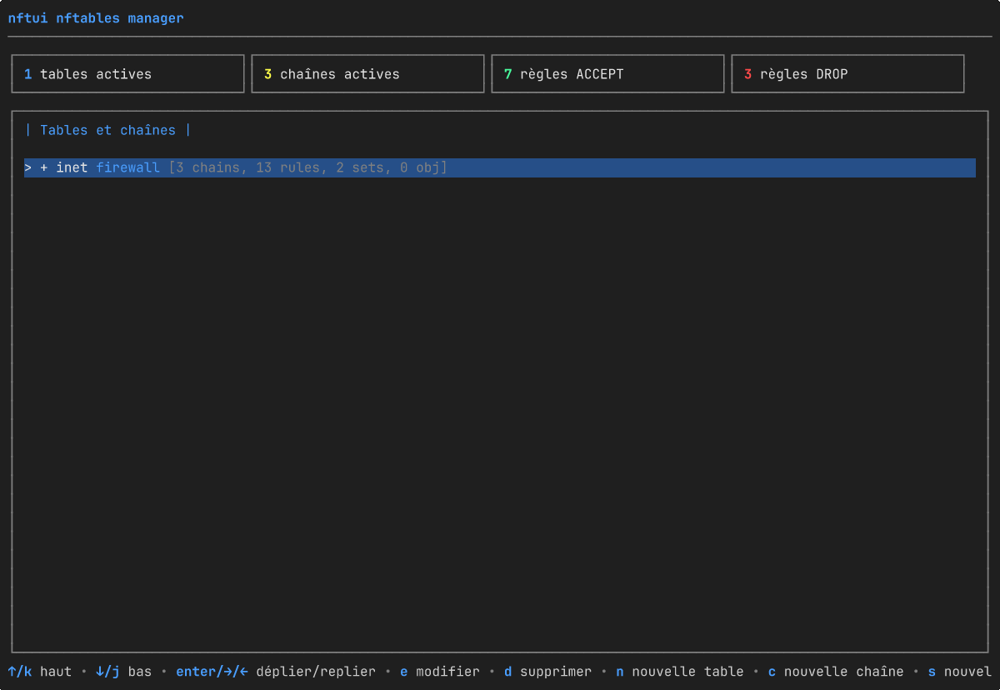

# nftui

[English](README.md) · [Magyar](README.hu.md) · [Español](README.es.md) · [Português (BR)](README.pt-BR.md) · **Français** · [Deutsch](README.de.md) · [Italiano](README.it.md)

[](https://github.com/aafeher/nftui/actions/workflows/ci.yml)
[](https://github.com/aafeher/nftui/actions/workflows/codeql.yml)
[](https://codecov.io/gh/aafeher/nftui)
[](https://scorecard.dev/viewer/?uri=github.com/aafeher/nftui)
[](https://github.com/aafeher/nftui/releases/latest)
[](LICENSE)
[](go.mod)
[](#prérequis)
[](https://github.com/aafeher/nftui/releases)



`nftui` est une interface utilisateur de terminal (TUI) pour gérer `nftables`
sous Linux. Parcourez le jeu de règles actif, modifiez des règles avec des
éditeurs structurés complets pour chaque type de condition et d'action, et
appliquez les changements au noyau — sans jamais toucher directement à la CLI
`nft`.

Écrit en Go avec le framework
[Bubble Tea](https://github.com/charmbracelet/bubbletea). Parle au noyau via
netlink grâce à la bibliothèque
[`google/nftables`](https://github.com/google/nftables).

## Fonctionnalités

### Navigation et gestion du jeu de règles

- Vue en arbre de toutes les tables et chaînes avec des données vivantes lues
  depuis le noyau. Le squelette (tables, chaînes, ensembles, objets nommés)
  est rendu immédiatement au démarrage ; les compteurs de règles par chaîne se
  remplissent de façon asynchrone, si bien qu'un jeu de règles à nombreuses
  chaînes reste interactif pendant que les listes de règles arrivent en
  arrière-plan (chaque ligne de chaîne affiche brièvement `[loading rules...]`
  jusqu'à l'arrivée de sa lecture).
- Liste des règles par chaîne avec un rendu lisible de chaque expression
  analysée. La liste est fenêtrée — seules les règles visibles à l'écran sont
  sérialisées et dessinées, donc faire défiler une chaîne de plus de 1000
  règles coûte autant qu'une chaîne de 10. Le filtre en ligne (`/`) met en
  cache le texte en minuscules de chaque règle à la première comparaison, les
  frappes suivantes restent donc réactives sur les grandes chaînes.
- Vue de détail par règle organisée en onglets par catégorie de condition.
- CRUD complet des tables, chaînes et règles : créer, renommer / modifier les
  propriétés, supprimer (avec confirmation), réordonner les règles vers le
  haut / le bas au sein d'une chaîne, insérer avant / ajouter à la fin.

### Éditeur de règles — conditions prises en charge

| Catégorie | Correspondances |
|-----------|-----------------|
| **CT (conntrack)** | state, direction, status, mark, secmark, expiration, helper, l3proto, protocol, proto-src, proto-dst, labels, eventmask, ip saddr / daddr, bytes, packets, avgpkt (avec direction), zone, count |
| **En-tête IPv4** | saddr, daddr (CIDR), protocol, ttl, length, dscp, version, hdrlength, id, frag-off, checksum |
| **En-tête IPv6** | saddr, daddr (CIDR), length, nexthdr, hoplimit, version, dscp (6 bits), flowlabel (20 bits) |
| **TCP** | sport, dport, sequence, ackseq, flags (MultiSelect), window, checksum, urgptr, doff |
| **UDP / UDPLITE** | sport, dport, length (UDP) / csumcov (couverture de somme de contrôle UDP-Lite — la même cellule sur le fil, renommée depuis le contexte `meta l4proto` ; `udplite length` n'existe pas), checksum |
| **SCTP** | sport, dport, vtag, checksum, **chunk** (correspondance par type de chunk selon la RFC 4960 : data / init / init-ack / sack / heartbeat / heartbeat-ack / abort / shutdown / shutdown-ack / error / cookie-echo / cookie-ack / ecne / cwr / shutdown-complete / auth / asconf-ack / i-data / forward-tsn / asconf / i-forward-tsn — la simple présence et les contraintes par sous-champ propres à chaque type sont toutes deux prises en charge : le Select de type de chunk pilote un Select de sous-champ (`tsn` / `stream` / `ssn` / `ppid` pour DATA ; `init-tag` / `a-rwnd` / `os` / `mis` / `init-tsn` pour INIT ; `cum-tsn-ack` / `a-rwnd` / `num-gap-ack-blocks` / `num-dup-tsns` pour SACK ; etc.) plus une saisie de valeur encodée en big-endian sur la largeur correspondante de 1 / 2 / 4 octets) |
| **Meta (interface)** | iifname, oifname, iif, oif, iiftype, oiftype, iifgroup, oifgroup |
| **Meta (proto / socket / paquet)** | length, protocol (EtherType), nfproto, l4proto, mark, priority, skuid, skgid, cgroup, rtclassid, pkttype, cpu |

### Éditeur de règles — actions prises en charge

- **Verdicts** : `accept`, `drop`, `return`, `jump <chain>`, `goto <chain>` —
  avec saisie du nom de chaîne pour les cibles de jump / goto.
- **Reject** : `with icmp type`, `with icmpx type`, `with tcp reset` —
  sensible à la famille (le Select de type ICMP change pour les tables ip /
  ip6 / inet / bridge).
- **Log** : prefix, level (emerg…debug), groupe NFLOG, snaplen,
  queue-threshold — avec validation avant enregistrement contre les
  combinaisons rejetées par le noyau (p. ex. `level` interdit en mode NFLOG).
- **Counter** : modifie les compteurs de paquets et d'octets d'un compteur
  anonyme (l'usage typique est la remise à 0).
- **Limit** : rate, unit (second/minute/hour/day/week), burst, type
  (packets/bytes), over.

### UX de l'éditeur

- Chaque onglet regroupe des champs apparentés ; **Tab** / **Shift+Tab**
  déplace le focus entre les sous-saisies.
- Les champs modifiés sont mis en évidence ; une saisie vidée supprime la
  correspondance sous-jacente.
- **F2** valide et applique tous les changements via netlink
  (`NLM_F_REPLACE`).
- Une ligne d'aide en pied de page liste toujours tous les raccourcis
  disponibles dans la vue courante.

## Prérequis

- **Linux** avec un noyau prenant en charge `nftables`.
- **Go 1.25+** pour compiler depuis les sources.
- **`CAP_NET_ADMIN`** à l'exécution (lancez via `sudo` ou accordez la capacité
  avec `setcap`).
- Un terminal d'au moins **80x24** caractères. En dessous, nftui affiche une
  invite de redimensionnement plutôt qu'une mise en page à l'étroit.

L'exécution ne **nécessite pas** la CLI `nft` pour le chemin principal de
lecture / édition / écriture — la communication est directe via netlink. Le
binaire `nft` n'est utilisé que par quelques opérations ciblées où passer par
la CLI est plus sûr que reconstruire l'état du noyau (renommage de table,
recréation de chaîne de base).

## Installation

```bash
git clone https://github.com/aafeher/nftui.git
cd nftui
go build -o nftui .
```

### Paquets précompilés

Chaque [release](https://github.com/aafeher/nftui/releases) joint des paquets
natifs pour `amd64` et `arm64`, tous construits à partir du même binaire que
les archives et listés dans `checksums.txt` (la signature cosign les couvre
donc aussi) :

| Format | Distributions | Installation |
|--------|---------------|--------------|
| `.deb` | Debian / Ubuntu | `sudo apt install ./nftui_<ver>_linux_amd64.deb` |
| `.rpm` | Fedora / RHEL / openSUSE | `sudo dnf install ./nftui_<ver>_linux_amd64.rpm` |
| `.apk` | Alpine | `sudo apk add --allow-untrusted ./nftui_<ver>_linux_amd64.apk` |
| `.pkg.tar.zst` | Arch | `sudo pacman -U ./nftui_<ver>_linux_amd64.pkg.tar.zst` |
| `.ipk` | OpenWrt (opkg) | `opkg install ./nftui_<ver>_linux_amd64.ipk` |

Chaque paquet installe `nftui` dans `/usr/bin`, la page de manuel dans
`/usr/share/man/man1`, et déclare la dépendance d'exécution `nftables`. Les
binaires sont statiques (sans CGO), ils fonctionnent donc aussi bien sur les
systèmes glibc que musl. OpenWrt migre d'`opkg` vers `apk` ; sur les
architectures compatibles, le `.apk` devrait servir l'OpenWrt récent basé sur
apk tandis que le `.ipk` couvre les versions opkg existantes. Les routeurs
d'autres architectures (mips, armv7) sont hors périmètre — compilez-y depuis
les sources.

**Arch / AUR :** le `.pkg.tar.zst` de la release s'installe directement avec
`pacman -U`, sans passer par l'AUR. nftui ne publie pas lui-même sur l'AUR ;
un mainteneur communautaire est bienvenu pour adopter le
[`packaging/aur/PKGBUILD`](packaging/aur/PKGBUILD) de référence (un paquet
`-bin` sur l'archive de la release).

**Gentoo :** le dépôt est un module Go standard, `go build -o nftui .` est
donc la voie la plus simple. Deux ebuilds de référence maintenables par la
communauté sont fournis pour un overlay local :
[`nftui-1.2.0.ebuild`](packaging/gentoo/nftui-1.2.0.ebuild) compile depuis les
sources via `go-module.eclass`, et
[`nftui-bin-1.2.0.ebuild`](packaging/gentoo/nftui-bin-1.2.0.ebuild) installe
le binaire précompilé de la release ; installez l'un ou l'autre (ils partagent
`/usr/bin/nftui` et se bloquent mutuellement). Voir
[`packaging/gentoo/README.md`](packaging/gentoo/README.md) pour la mise en
place de l'overlay. nftui ne maintient pas d'entrée Portage / GURU.

### Nix flake

Le dépôt fournit un [`flake.nix`](flake.nix) avec un paquet `buildGoModule`
pour `x86_64-linux` et `aarch64-linux`, un `devShell` qui reflète la chaîne
d'outils de la CI, et un `apps.default` exécutable :

```bash
nix build              # compile dans ./result/bin/nftui (+ page de manuel)
nix run                # compile et exécute (nécessite CAP_NET_ADMIN à l'exécution)
nix develop            # outils : go, gopls, goreleaser, nftables, mandoc
```

`flake.nix` porte un `vendorHash` figé pour les dépendances Go, et il doit
être re-fixé à chaque changement de `go.sum` — y compris à chaque pull request
`gomod` de Dependabot, qui met à jour `go.mod` / `go.sum` mais ne peut pas
toucher au flake. La build échoue alors avec `hash mismatch … got: sha256-…` ;
c'est cette valeur affichée qu'il faut coller dans la ligne `vendorHash`. Cela
garde les releases binaires (Goreleaser) et les builds Nix indépendantes : la
voie Nix ne bloque pas la publication des releases.

### Docker

Un [`Dockerfile`](Dockerfile) construit une petite image (~17 Mo) qui embarque
la CLI `nft(8)` dont nftui a besoin à l'exécution :

```bash
docker build -t nftui:local .
# build versionnée (renseigne `nftui --version`) :
docker build -t nftui:1.2.0 --build-arg VERSION=1.2.0 .
```

nftui gère le jeu de règles de l'**hôte**, le conteneur a donc besoin de
l'espace de noms réseau de l'hôte, de la capacité `NET_ADMIN` et d'un TTY
interactif :

```bash
docker run --rm -it --network host --cap-add NET_ADMIN nftui:local
```

Les options passent telles quelles, p. ex. `… nftui:local --read-only`.

Un [`docker-compose.yml`](docker-compose.yml) câble les mêmes options.
Utilisez `run` (pas `up`) pour que la TUI reçoive un vrai TTY :

```bash
docker compose run --rm nftui
```

Le conteneur tourne en root et s'appuie sur `--cap-add NET_ADMIN` plus la
frontière du conteneur pour l'isolation ; avec `--network host` il modifie le
nftables de l'hôte — la même empreinte de privilèges que d'exécuter le binaire
sur l'hôte (voir
[Modèle de privilèges et durcissement du déploiement](#modèle-de-privilèges-et-durcissement-du-déploiement)).

### Exécution

Soit avec `sudo` :

```bash
sudo ./nftui
```

…soit en accordant une seule fois la capacité requise au binaire :

```bash
sudo setcap cap_net_admin=ep ./nftui
./nftui
```

### Installation de la page de manuel (facultatif)

```bash
sudo install -m 0644 man/nftui.1 /usr/share/man/man1/               # anglais
sudo install -m 0644 man/hu/nftui.1 /usr/share/man/hu/man1/         # hongrois (facultatif)
sudo install -m 0644 man/es/nftui.1 /usr/share/man/es/man1/         # espagnol (facultatif)
sudo install -m 0644 man/pt_BR/nftui.1 /usr/share/man/pt_BR/man1/   # portugais du Brésil (facultatif)
sudo install -m 0644 man/fr/nftui.1 /usr/share/man/fr/man1/         # français (facultatif)
sudo install -m 0644 man/de/nftui.1 /usr/share/man/de/man1/         # allemand (facultatif)
sudo install -m 0644 man/it/nftui.1 /usr/share/man/it/man1/         # italien (facultatif)
sudo mandb        # si votre système utilise man-db (Debian / Ubuntu / Fedora …)
man nftui         # elle est alors disponible partout
```

Un `man` sensible à la locale choisit la page traduite d'après `$LANG` /
`$LC_MESSAGES` (p. ex. `LANG=fr_FR.UTF-8 man nftui`). Aperçu depuis l'arbre
des sources sans installer :

```bash
man -l man/nftui.1          # anglais
man -l man/fr/nftui.1       # français
man -l man/es/nftui.1       # espagnol
man -l man/pt_BR/nftui.1    # portugais du Brésil
man -l man/de/nftui.1       # allemand
man -l man/it/nftui.1       # italien
man -l man/hu/nftui.1       # hongrois
```

## Options de ligne de commande

| Option | Description |
|--------|-------------|
| `--table <name>` | Restreint l'arbre à une seule table — ses chaînes, ensembles et objets nommés. La correspondance se fait par nom dans toutes les familles, `--table filter` inclura donc à la fois `inet filter` et `ip filter` si les deux existent. Un nom inconnu termine avant le démarrage de la TUI en affichant la liste des tables disponibles. |
| `--config <file>` | Applique le jeu de règles nftables donné via `nft -f <file>` **avant** le démarrage de la TUI. **Ceci mute le jeu de règles en cours d'exécution** — le fichier peut contenir `flush ruleset`. À utiliser pour mettre en place un état connu pour les tests. Résolu avant `--table`, de sorte que l'état du noyau après chargement est ce que `--table` valide. |
| `--read-only` | Désactive tout chemin d'écriture : pas d'add / insert / move / delete / edit / save de règles, pas de create / delete de chaînes / tables / ensembles, pas de remise à zéro de compteur. Les touches bloquées s'estompent dans le pied de page (selon l'invariant de complétude du pied de page) et un marqueur `[READ-ONLY MODE]` (en français `[LECTURE SEULE]`) accompagne le titre de chaque vue principale. Utile pour la navigation sûre, l'audit, ou combiné à `--config` pour inspecter une fixture sans risque de modification accidentelle. |
| `--lang <code>` | Définit la langue de l'interface, p. ex. `en`, `hu`, `es`, `pt-BR`, `fr`, `de` ou `it`. Outrepasse l'environnement de locale (`LC_ALL` / `LC_MESSAGES` / `LANG`). Une valeur absente ou non prise en charge retombe sur la détection automatique de la locale, puis sur l'anglais. Seules les langues pour lesquelles nftui embarque un catalogue sont prises en compte — actuellement **anglais**, **hongrois**, **espagnol**, **portugais du Brésil**, **français**, **allemand** et **italien**. Voir [Langue / localisation](#langue--localisation). |
| `--help` (aussi `-h`) | Affiche la liste complète des options avec des descriptions d'une ligne et des exemples d'usage, puis termine. Va sur stdout (vous pouvez donc la rediriger vers `less`) ; un `--help` explicite termine avec 0. Les options invalides émettent le même texte d'usage sur stderr et terminent avec 2. |
| `--version` | Affiche `nftui <version>` sur stdout et termine avec 0. La version est injectée lors de la build de release ; un binaire compilé depuis les sources rapporte la version de module du build-info Go, ou `dev` pour un simple `go build`. |

Exemples :

```bash
sudo ./nftui --table filter                              # n'affiche que la ou les tables nommées 'filter'
sudo ./nftui --table missing                             # termine : "table 'missing' not found. Available tables: …"
sudo ./nftui --config examples/example-nftables-01.conf  # charge la fixture de test manuel, puis la parcourt
sudo ./nftui --read-only                                 # navigation sûre — toute touche d'écriture est estompée et inerte
sudo ./nftui --config new.conf --table filter            # applique new.conf, puis restreint la vue à sa table 'filter'
./nftui --version                                        # affiche la version et termine (aucun privilège requis)
```

Sans `--config`, le jeu de règles en cours d'exécution reste intact. Sans
`--table`, toutes les tables sont affichées. Sans `--read-only`, toutes les
actions CRUD sont disponibles.

## Langue / localisation

L'interface de nftui est localisée. La langue est résolue une seule fois au
démarrage, dans cet ordre :

1. l'option `--lang <code>` (p. ex. `--lang fr`) ;
2. sinon l'environnement de locale POSIX — `LC_ALL`, puis `LC_MESSAGES`, puis
   `LANG` (les suffixes `.codeset` / `@modifier` sont ignorés, et `C` /
   `POSIX` signifient anglais) ;
3. sinon l'anglais.

Un code absent ou non pris en charge retombe sur la détection automatique,
puis sur l'anglais, nftui démarre donc toujours dans une langue pour laquelle
il a un catalogue. Le choix est figé pour la session — il n'y a pas de
changement de langue en cours d'application.

**Langues prises en charge :** anglais (source), hongrois (`hu`), espagnol
(`es`), portugais du Brésil (`pt-BR`), français (`fr`), allemand (`de`) et
italien (`it`).
L'anglais est la locale *source* : chaque texte de la TUI destiné à l'utilisateur est résolu
via les catalogues de messages embarqués (`i18n/locales/*.json`), l'anglais
servant de repli pour toute clé manquante.

**Périmètre :** la TUI interactive — l'arbre, les tableaux de bord, les vues
de règle / chaîne / ensemble, les dialogues de création / modification,
l'éditeur de règles, les pieds de page et les confirmations — est entièrement
localisée. Le vocabulaire propre à nftables (noms d'attribut comme `type` /
`hook` / `policy`, les verdicts, les mots-clés d'expression et toute syntaxe
de règle copiable) reste en anglais dans toutes les langues, si bien que ce
que vous lisez correspond toujours à ce que `nft` accepte. La sortie de
`--help` / `--version` est en anglais uniquement — elle est consommée hors de
la TUI, et `--help` est résolu avant la sélection de la langue. La page de
manuel `nftui(1)` est fournie en anglais ([`man/nftui.1`](man/nftui.1)),
hongrois ([`man/hu/nftui.1`](man/hu/nftui.1)), espagnol
([`man/es/nftui.1`](man/es/nftui.1)), portugais du Brésil
([`man/pt_BR/nftui.1`](man/pt_BR/nftui.1)), français
([`man/fr/nftui.1`](man/fr/nftui.1)), allemand
([`man/de/nftui.1`](man/de/nftui.1)) et italien
([`man/it/nftui.1`](man/it/nftui.1)) ; ce README existe aussi en
[anglais](README.md), [hongrois](README.hu.md), [espagnol](README.es.md),
[portugais du Brésil](README.pt-BR.md), [allemand](README.de.md) et
[italien](README.it.md).

```bash
sudo ./nftui --lang fr             # interface en français
sudo ./nftui --lang es             # interface en espagnol
sudo ./nftui --lang hu             # interface en hongrois
sudo ./nftui --lang de             # interface en allemand
sudo ./nftui --lang it             # interface en italien
LANG=fr_FR.UTF-8 sudo -E ./nftui   # français via l'environnement de locale
sudo ./nftui --lang en             # force l'anglais quelle que soit la locale
```

## Modèle de privilèges et durcissement du déploiement

nftui lit et écrit le jeu de règles nftables du noyau via netlink, ce qui
nécessite la capacité **`CAP_NET_ADMIN`**. Il n'a **aucune authentification ni
autorisation propre** : tout utilisateur capable de lancer nftui avec cette
capacité peut réécrire le pare-feu. nftui n'est donc sûr que dans la mesure où
vous accordez ce privilège avec soin — accordé trop largement, le binaire
devient un *confused deputy*. Imposez le contrôle d'accès au niveau de l'OS.
Deux schémas sont recommandés.

### Recommandé : `sudo` avec une règle restreinte

Lancez nftui via `sudo` et limitez qui peut le faire. Créez un groupe dédié
(p. ex. `nftadm`), ajoutez-y les opérateurs de confiance et ajoutez une règle
avec `visudo` :

```sudoers
# /etc/sudoers.d/nftui  (à éditer avec : visudo -f /etc/sudoers.d/nftui)
# Laisse le groupe nftadm lancer nftui en root — et rien d'autre.
%nftadm ALL=(root) /usr/local/bin/nftui
```

- Utilisez le **chemin absolu** afin qu'un autre `nftui` plus tôt dans `PATH`
  ne puisse pas être substitué.
- Gardez la demande de mot de passe (pas de `NOPASSWD`) pour l'usage
  interactif : `sudo` écrit une entrée dans le journal d'authentification à
  chaque invocation, vous donnant une trace de qui-et-quand.
- Les opérateurs lancent alors `sudo nftui`. nftui lit `SUDO_USER`, donc avec
  le [journal d'audit](#journal-daudit) activé, chaque changement appliqué
  enregistre l'humain derrière `sudo`, pas seulement `root`.

Pour un rôle lecture seule / navigation, n'accordez à un groupe plus large que
la forme `--read-only`. `sudo` compare la commande **et** ses arguments
exactement, cette règle autorise donc `sudo nftui --read-only` mais pas le
`sudo nftui` sans restriction :

```sudoers
%nftview ALL=(root) /usr/local/bin/nftui --read-only
```

### Alternative : un binaire `setcap` restreint par groupe

Si vous devez fonctionner sans `sudo` (p. ex. automatisation), accordez la
capacité au fichier mais restreignez **qui peut l'exécuter** — ne le laissez
jamais exécutable par tous :

```bash
sudo chown root:nftadm /usr/local/bin/nftui
sudo chmod 750         /usr/local/bin/nftui   # root : rwx, nftadm : r-x, autres : rien
sudo setcap cap_net_admin+ep /usr/local/bin/nftui
```

- La capacité voyage avec le **fichier**, pas avec l'utilisateur ; `chmod 755`
  + `setcap` remet donc en pratique le pouvoir de réécrire le pare-feu à
  chaque compte local. `chmod 750` avec un groupe dédié est ce qui le
  contient.
- Un binaire `setcap` contourne `sudo`, il n'y a donc **aucune entrée dans le
  journal d'authentification de sudo** et `SUDO_USER` est vide — appuyez-vous
  sur `NFTUI_AUDIT_LOG` pour la trace des changements (il capture toujours
  l'UID et l'utilisateur réels).
- Gardez le binaire et ses répertoires parents accessibles en écriture
  uniquement à `root`, afin que le fichier porteur de la capacité ne puisse
  pas être remplacé.

### Défense en profondeur

- Activez le [journal d'audit](#journal-daudit) (`NFTUI_AUDIT_LOG`) pour que
  chaque mutation soit attribuée et horodatée — l'OS contrôle *qui peut
  lancer* nftui ; le journal d'audit enregistre *ce qui a changé*.
- Utilisez `--read-only` pour les rôles d'inspection / d'audit qui ne doivent
  jamais muter l'état.
- `sudo` s'intègre à **PAM** : la ré-authentification, le MFA ou les
  restrictions d'horaire / d'hôte (`pam_time`, `pam_access`) se configurent
  dans la couche PAM — c'est l'« enrobage PAM » de nftui ; l'outil n'ajoute
  délibérément aucun contrôle d'accès propre.

## Journal d'audit

Pour la gestion des changements et la conformité (p. ex. SOC 2 / PCI-DSS),
nftui peut enregistrer chaque mutation du jeu de règles qu'il applique.
Définissez la variable d'environnement `NFTUI_AUDIT_LOG` avec le chemin d'un
fichier accessible en écriture :

```bash
sudo NFTUI_AUDIT_LOG=/var/log/nftui-audit.log ./nftui
```

Quand la variable est **absente ou vide, l'audit est désactivé** et nftui se
comporte exactement comme avant — aucune E/S de fichier sur le chemin de
mutation. Quand elle est définie, chaque changement appliqué (créer /
supprimer / renommer tables, chaînes et ensembles ; ajouter / insérer /
déplacer / supprimer / modifier des règles ; ajouter / supprimer des éléments
d'ensemble ; supprimer / remettre à zéro des objets nommés ; chargement par
`--config` ; flush du jeu de règles) ajoute un objet JSON par ligne :

```json
{"time":"2026-06-19T10:30:00.12Z","uid":0,"user":"root","sudo_user":"alice","op":"delete-rule","target":"ipv4 filter input handle 7","result":"ok"}
```

Chaque enregistrement porte l'horodatage UTC, l'UID et l'utilisateur
effectifs, l'opérateur humain derrière `sudo` (`sudo_user`, depuis
`SUDO_USER`), l'opération, l'objet cible et le résultat (`result` vaut `ok` ou
`error`, avec un champ `error` en cas d'échec — les tentatives rejetées sont
aussi journalisées). Propriétés :

- **Ajout seul** — nftui ne fait qu'ajouter à la fin ; il ne fait jamais de
  rotation, de troncature ni de relecture du fichier. Faites-le tourner avec
  `logrotate` ou expédiez les lignes vers un SIEM.
- **0600** — le fichier est créé en lecture/écriture pour le seul
  propriétaire.
- **Fail-open** — si le chemin ne peut pas être ouvert, nftui affiche un seul
  avertissement et continue sans audit ; un chemin d'audit cassé ne bloque
  jamais la gestion du pare-feu. Assurez-vous que le chemin est accessible en
  écriture au processus nftui.

## Raccourcis clavier

### Vue principale en arbre (tables + chaînes)

| Touche | Action |
|--------|--------|
| `↑` / `k` | sélection vers le haut |
| `↓` / `j` | sélection vers le bas |
| `Enter` / `→` / `←` | déplier / replier |
| `F3` | ouvrir la chaîne (liste de règles) |
| `n` | nouvelle table |
| `c` | nouvelle chaîne |
| `e` | modifier la table ou la chaîne sélectionnée |
| `d` | supprimer la table ou la chaîne sélectionnée |
| `/` | rechercher |
| `r` | recharger depuis le noyau |
| `q` / `Esc` / `Ctrl+C` | quitter |

### Vue de chaîne (liste de règles)

| Touche | Action |
|--------|--------|
| `↑` / `k` | sélection vers le haut |
| `↓` / `j` | sélection vers le bas |
| `F3` | voir la règle |
| `F4` | modifier la règle |
| `a` | ajouter une règle à la fin |
| `i` | insérer une règle avant la sélection |
| `K` (Shift+k) | monter la règle sélectionnée |
| `J` (Shift+j) | descendre la règle sélectionnée |
| `d` | supprimer la règle |
| `/` | filtrer les règles par sous-chaîne (verdict, mot-clé de condition, commentaire) |
| `Esc` | retour |
| `q` | quitter |

Filtre actif, `↑` / `↓` naviguent dans la liste filtrée, `Enter` / `F3`
ouvrent la règle sélectionnée en consultation, `F4` ouvre l'éditeur et `Esc`
efface le filtre.

### Éditeur de règles

| Touche | Action |
|--------|--------|
| `F5` / `F6` | onglet précédent / suivant |
| `Tab` / `Shift+Tab` | champ suivant / précédent |
| `F2` | enregistrer (valider + appliquer au noyau) |
| `Esc` / `F3` | retour |
| `q` / `Ctrl+C` | quitter |

## Jeu de règles d'exemple

`examples/example-nftables-01.conf` est la fixture canonique de test manuel.
Elle couvre toutes les fonctionnalités documentées ci-dessus et est vérifiée
avec `nft -c -f` contre le noyau de l'hôte. Pour un point de départ réaliste
et de bonnes pratiques plutôt qu'une vitrine de fonctionnalités,
`examples/example-host-firewall.conf` est un pare-feu d'hôte durci (entrée
refusée par défaut sauf SSH/HTTP/HTTPS, sortie libre, transfert refusé).
Chargez l'un ou l'autre explicitement, et seulement sur un système où écraser
l'état nftables est acceptable :

```bash
sudo nft -c -f examples/example-nftables-01.conf       # vérification de syntaxe
sudo nft flush ruleset                                 # remise à zéro (DANGER en prod)
sudo nft -f examples/example-nftables-01.conf          # appliquer
```

> `nftui` lui-même ne mute **pas** le jeu de règles en cours d'exécution au
> démarrage — il ne fait que lire l'état actuel du noyau et écrire les
> changements que l'utilisateur effectue explicitement.

## Structure du projet

```
main.go                        point d'entrée du programme
nft/                           cœur qui parle au noyau
  rule.go                      parseur expression → structure Rule
  nft_linux.go                 opérations CRUD netlink (build tag Linux)
  nft_stub.go                  stubs no-op pour les builds non-Linux
  expr/                        assistants de formatage par expression
  nftserializer/               jeu de règles → sortie lisible
ui/                            TUI Bubble Tea
  main_window.go               modèle de plus haut niveau (vue en arbre)
  chain_view.go                liste de règles
  rule_view.go                 détail de règle (lecture seule)
  rule_edit.go                 éditeur de règles à FieldEditors en onglets
  field_*.go                   un fichier par FieldEditor
i18n/                          i18n / localisation (catalogues de messages embarqués)
  i18n.go                      détection / appariement de langue + traducteur T()
  locales/                     catalogues JSON par langue (en, hu, es, pt-BR, fr, de, it)
examples/example-nftables-01.conf  fixture de test manuel
man/nftui.1                    page de manuel (groff/mandoc ; voir « Installation »)
CHANGELOG.md                   notes par version (format Keep a Changelog)
```

## Tests

```bash
go test ./...                            # tests unitaires (aucun noyau requis)
sudo nft -c -f examples/example-nftables-01.conf   # valide la fixture
```

### Tests d'intégration

Les tests sous le build tag `integration` exercent les chemins vivants de
lecture **et** d'écriture netlink avec les mêmes assistants que la TUI :
appliquer un jeu de règles via `nft -f` et le relire, plus créer / renommer /
supprimer des tables et des chaînes et ajouter / insérer / déplacer /
supprimer des règles, en vérifiant l'état du noyau relu après chaque étape.
Ils sont exclus du `go test ./...` par défaut et se sautent eux-mêmes quand
ils ne tournent pas en root, un simple `go test` reste donc portable.

```bash
sudo -E go test -tags=integration ./nft/ -v
```

Chaque test crée une table au nom unique (suffixée par un horodatage, pour que
les exécutions concurrentes et l'état résiduel ne se percutent pas) et la
démonte dans `t.Cleanup`, même quand les assertions échouent. Le binaire `nft`
doit être dans PATH ; installez-le depuis le paquet `nftables` de votre
distribution s'il manque.

### Intégration continue

[`.github/workflows/ci.yml`](.github/workflows/ci.yml) exécute les mêmes
vérifications à chaque push et pull request vers `main` / `develop` :

- **Build et tests unitaires** — `gofmt -l`, `go vet ./...` (build tags par
  défaut et `integration`), `go build ./...` et `go test -race ./...`.
- **Tests d'intégration** — installe le paquet `nftables`, puis exécute
  `sudo -E go test -tags=integration -v ./nft/` afin que le harnais dispose du
  `CAP_NET_ADMIN` nécessaire pour appliquer un jeu de règles vivant. Écrit un
  profil de couverture sur l'arbre `nft` (`-coverpkg=./nft/...`) et affiche le
  total dans le journal du job — le chemin netlink vivant est invisible pour
  le profil des tests unitaires, c'est donc ici que sa couverture est
  observable. Ne tourne qu'après le passage au vert du job de tests
  unitaires.
- **Analyse de vulnérabilités** — exécute `govulncheck ./...` contre le module
  et la bibliothèque standard Go. En tant que vérification distincte
  (parallèle à la build), elle ne fait échouer l'exécution que lorsqu'une
  vulnérabilité connue est atteignable depuis le graphe d'appels de nftui.
- **Vérification de build reproductible** — construit deux fois les binaires
  de release avec `goreleaser build --snapshot` et échoue s'ils diffèrent,
  vérifiant que la build `mod_timestamp` / `-trimpath` / sans CGO est
  reproductible octet par octet.
- **Build du flake Nix** — sur un runner Nix, `nix flake check` +
  `nix build .#default` construisent [`flake.nix`](flake.nix) de bout en bout
  (compilation de nftui et exécution de sa suite unitaire dans le bac à
  sable), le flake ne peut donc pas se casser en silence. Cette voie garde
  aussi le `vendorHash` figé contre la dérive de `go.sum` : une montée de
  dépendance la fait échouer avec `hash mismatch … got: sha256-…` tant que
  cette valeur n'est pas fixée dans `flake.nix`.

Les mises à jour des dépendances et des GitHub Actions sont automatisées avec
Dependabot (`.github/dependabot.yml`, hebdomadaire), qui ouvre des PR au fil
des releases et correctifs de sécurité amont. `github.com/google/nftables` est
exclu de ces PR car il est volontairement figé sur un instantané. Deux
ensembles sont groupés en une seule PR chacun : toutes les étapes
`github/codeql-action*` (CodeQL s'interrompt si ses sous-actions tournent sur
des releases différentes) et tous les modules Go (chaque lot demande un
re-fixage de `vendorHash`).

La version de Go vient de `go.mod` via `actions/setup-go@v6` avec
`go-version-file: go.mod`, monter la version Go du module met donc la CI à
jour dans le même commit. Les exécutions concurrentes sur la même ref annulent
les précédentes en cours (`cancel-in-progress: true`).

## Processus de release

Les releases sont pilotées par [Goreleaser](https://goreleaser.com/) et un
workflow déclenché par tag
([`.github/workflows/release.yml`](.github/workflows/release.yml)) :

1. Promouvez la section `[Unreleased]` de `CHANGELOG.md` en
   `[X.Y.Z] - <date>`.
2. `git tag vX.Y.Z` puis `git push --tags`.
3. Le workflow de Release extrait la section `[X.Y.Z]` correspondante de
   `CHANGELOG.md`, puis exécute Goreleaser, qui construit des binaires Linux
   `amd64` / `arm64` reproductibles
   (`CGO_ENABLED=0 -trimpath -ldflags='-s -w'`, `mod_timestamp` figé à l'heure
   du commit), empaquette chacun avec `LICENSE`, `README.md`, `CHANGELOG.md`
   et `man/nftui.1` dans un `tar.gz`, émet aussi des paquets `.deb` / `.rpm` /
   `.apk` / Arch `.pkg.tar.zst` / OpenWrt `.ipk` (nfpm, même binaire), écrit
   un `checksums.txt` SHA-256 couvrant chaque artefact, et publie la GitHub
   Release avec les notes soignées en corps.
4. La release est durcie par attestation de chaîne d'approvisionnement :
   `checksums.txt` est signé avec **cosign** (sans clé — la signature est liée
   à l'identité OIDC du workflow via Fulcio/Rekor, aucune clé privée
   stockée), un **SBOM Syft** est émis par archive, et une attestation de
   **provenance de build SLSA** est enregistrée pour les archives, les
   checksums et l'archive de dépendances ci-dessous.
5. Un `nftui-<X.Y.Z>-deps.tar.xz` reproductible (le cache de modules Go, issu
   de `scripts/gen-deps-tarball.sh`) est téléversé pour les builds hors ligne
   depuis les sources — principalement l'ebuild source Gentoo, dont le
   `go-module.eclass` interdit l'accès réseau au moment de la build. Son
   contenu est figé par `go.sum`, il voyage donc dans l'attestation de
   provenance plutôt que dans `checksums.txt` (déjà signé).

Vérifier une release téléchargée :

```bash
# 1. signature du fichier de checksums (cosign sans clé). Épinglez le signataire au
#    workflow de release de ce dépôt ET à l'émetteur OIDC de GitHub — une identité /
#    un émetteur joker ('.*') prouve seulement que la signature est valide en
#    interne, pas que c'est *nous* qui l'avons produite ; il accepterait donc une
#    signature de n'importe quelle identité Fulcio et ruinerait l'intérêt de la
#    vérification sans clé.
cosign verify-blob --certificate checksums.txt.pem --signature checksums.txt.sig \
  --certificate-identity-regexp '^https://github\.com/aafeher/nftui/\.github/workflows/release\.yml@refs/tags/v' \
  --certificate-oidc-issuer 'https://token.actions.githubusercontent.com' \
  checksums.txt
# 2. l'archive contre les checksums de confiance
sha256sum --check --ignore-missing checksums.txt
# 3. provenance de build (lie les octets au workflow de release de ce dépôt)
gh attestation verify nftui_<ver>_linux_amd64.tar.gz --repo <owner>/nftui
```

Pour valider la configuration localement sans publier :

```bash
goreleaser check                                                  # syntaxe de la config seulement
goreleaser release --snapshot --clean --skip=publish,sign,sbom    # build dans dist/
```

`sign` / `sbom` sont sautés en local car ils nécessitent l'identité OIDC
`cosign` du runner de CI et `syft` ; l'attestation de provenance est réservée
au workflow. La sortie snapshot (`dist/`) est dans le gitignore, l'arbre de
travail reste donc propre.

## Historique des versions

Les notes par version vivent dans [CHANGELOG.md](CHANGELOG.md) au format
[Keep a Changelog](https://keepachangelog.com/). Jalons principaux à ce
jour :

- **v0.1.0** (2026-05-24) — première release publiable : correspondances CT /
  meta / IP / port complètes, toutes les actions de verdict, CRUD complet du
  jeu de règles.
- **v0.2.0** (2026-05-24) — instructions NAT (`snat`, `dnat`, `masquerade`),
  `queue`, `quota`.
- **v0.3.0** (2026-05-24) — correspondances de protocole étendues
  (ICMP / ICMPv6, SCTP, DCCP, AH, ESP, COMP, Ethernet, VLAN, ARP, en-têtes
  d'extension IPv6).
- **v0.4.0** (2026-05-24) — ensembles, maps et objets nommés.
- **v0.5.0** (2026-05-25) — finition et durcissement des ensembles / maps /
  objets nommés (correction de la suppression des ensembles d'intervalles,
  flag dynset, prise en charge CIDR, maps de verdicts).
- **v0.6.0** (2026-05-29) — cohérence du canal de retour et UX des indices
  transitoires : indices de l'arbre à estompage automatique, routage unifié
  des erreurs Reset / Delete.
- **v0.7.0** (2026-05-29) — messages d'erreur (conseil `CAP_NET_ADMIN`,
  affichage des règles rejetées) et navigation (recherche `/` dans l'arbre,
  filtre `/` dans `chainView`).
- **v0.8.0** (2026-05-30) — options CLI (`--table`, `--config`, `--read-only`,
  `--help`), finition de release (CHANGELOG, page de manuel), éditeur
  `sctp chunk`, chargement incrémental asynchrone.
- **v0.9.0** (2026-06-19) — infrastructure de release (harnais de tests
  d'intégration, workflow de CI, liste de règles virtualisée, pipeline de
  release Goreleaser, empaquetage flake Nix) plus une passe de durcissement de
  niveau entreprise : attestation de chaîne d'approvisionnement
  (cosign / SBOM / provenance SLSA), analyse de vulnérabilités en CI, un
  journal d'audit des mutations optionnel, validation d'identifiants en
  défense en profondeur, et documents de gouvernance et de déploiement
  (`SECURITY.md`, `CONTRIBUTING.md`, `CODE_OF_CONDUCT.md`).
- **v1.0.0** (2026-06-20) — première release stable : voies d'installation
  élargies (Debian / RPM, paquets Alpine / Arch / OpenWrt, une image Docker,
  références communautaires Gentoo / AUR), reproductibilité prouvée et voies
  de CI pour le flake Nix, l'option `--version`, une archive de dépendances de
  modules Go pour les builds hors ligne, et le rendu des adresses IPv6 source
  / destination.
- **v1.1.0** (2026-06-21) — UX d'ajustement au terminal et navigation, plus
  une vague de durcissement sécurité / CI : minimum 80x24 avec cadrage et
  invite de redimensionnement, rendu en écran alternatif, défilement-au-focus
  dans l'éditeur de règles et défilement dans la vue de règle, en-tête de
  chaîne compact ; corrections du flush du jeu de règles à la sortie et du
  double rendu des règles ; OpenSSF Scorecard / CodeQL / Codecov, cibles de
  fuzzing Go et actions épinglées par SHA.

- **v1.2.0** (2026-07-18) — internationalisation et localisation : toute la
  TUI est localisée — la source anglaise plus hongrois, espagnol, portugais du
  Brésil, français, allemand et italien — via des catalogues de messages
  embarqués à parité testée, la sélection par `--lang` / locale POSIX, des
  mnémoniques de confirmation localisés (l'alias allemand `j` est conditionné
  à la langue pour protéger le réflexe de défilement vim), et une paire
  complète page de manuel + README pour chaque langue.
## Licence

MIT — voir [LICENSE](LICENSE).
