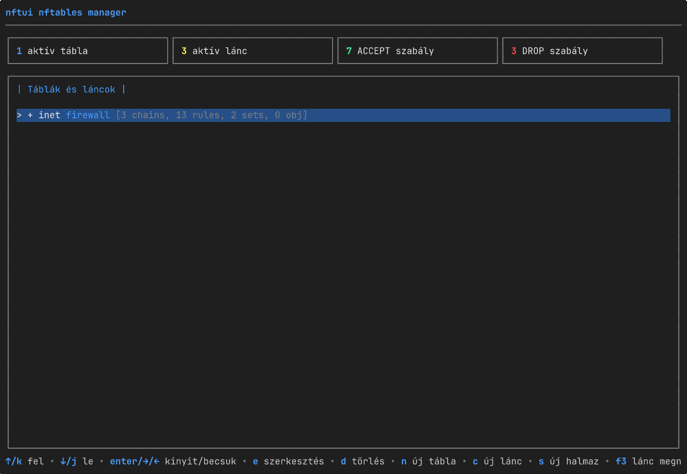

# nftui

[English](README.md) · **Magyar** · [Español](README.es.md) · [Português (BR)](README.pt-BR.md) · [Français](README.fr.md) · [Deutsch](README.de.md) · [Italiano](README.it.md)

[](https://github.com/aafeher/nftui/actions/workflows/ci.yml)
[](https://github.com/aafeher/nftui/actions/workflows/codeql.yml)
[](https://codecov.io/gh/aafeher/nftui)
[](https://scorecard.dev/viewer/?uri=github.com/aafeher/nftui)
[](https://github.com/aafeher/nftui/releases/latest)
[](LICENSE)
[](go.mod)
[](#követelmények)
[](https://github.com/aafeher/nftui/releases)



Az `nftui` egy terminál felhasználói felület (TUI) a Linux `nftables`
kezeléséhez. Böngészd az élő szabálykészletet, szerkeszd a szabályokat minden
feltétel- és művelettípushoz teljes strukturált szerkesztőkkel, és alkalmazd a
változtatásokat a kernelbe — anélkül, hogy közvetlenül az `nft` CLI-hez kellene
nyúlnod.

Go-ban készült a [Bubble Tea](https://github.com/charmbracelet/bubbletea)
keretrendszerrel. A kernellel netlinken keresztül kommunikál a
[`google/nftables`](https://github.com/google/nftables) könyvtár segítségével.

## Funkciók

### Szabálykészlet böngészése és kezelése

- Fanézet az összes tábláról és láncról, a kernelből lekért élő adatokkal. A
  váz (táblák, láncok, halmazok, nevesített objektumok) azonnal renderelődik
  induláskor; a lánconkénti szabályszámok aszinkron módon töltődnek be, így egy
  sok láncot tartalmazó szabálykészlet interaktív marad, miközben a
  szabálylisták a háttérben megérkeznek (minden láncsor rövid ideig
  `[loading rules...]`-t mutat, amíg a lekérése be nem fejeződik).
- Lánconkénti szabálylista, minden feldolgozott kifejezés emberi olvasásra
  szánt megjelenítésével. A lista ablakozott — csak a képernyőre férő
  szabályok szerializálódnak és rajzolódnak ki, így egy 1000+ szabályos lánc
  görgetése ugyanannyiba kerül, mint egy 10 szabályosé. A beépített szűrő (`/`)
  gyorsítótárazza minden szabály kisbetűs keresési szövegét az első
  illesztéskor, így a további billentyűleütések nagy láncokon is
  reszponzívak maradnak.
- Szabályonkénti részletnézet, feltétel-kategóriák szerinti fülekbe rendezve.
- Teljes CRUD a táblákon, láncokon és szabályokon: létrehozás, átnevezés /
  tulajdonságszerkesztés, törlés (megerősítéssel), szabályok átrendezése
  fel / le egy láncon belül, beszúrás elé / hozzáfűzés a végéhez.

### Szabályszerkesztő — támogatott feltételek

| Kategória | Illesztések |
|----------|---------|
| **CT (conntrack)** | state, direction, status, mark, secmark, expiration, helper, l3proto, protocol, proto-src, proto-dst, labels, eventmask, ip saddr / daddr, bytes, packets, avgpkt (iránnyal), zone, count |
| **IPv4 fejléc** | saddr, daddr (CIDR), protocol, ttl, length, dscp, version, hdrlength, id, frag-off, checksum |
| **IPv6 fejléc** | saddr, daddr (CIDR), length, nexthdr, hoplimit, version, dscp (6 bit), flowlabel (20 bit) |
| **TCP** | sport, dport, sequence, ackseq, flags (MultiSelect), window, checksum, urgptr, doff |
| **UDP / UDPLITE** | sport, dport, length, checksum |
| **SCTP** | sport, dport, vtag, checksum, **chunk** (RFC 4960 chunk-típus illesztés: data / init / init-ack / sack / heartbeat / heartbeat-ack / abort / shutdown / shutdown-ack / error / cookie-echo / cookie-ack / ecne / cwr / shutdown-complete / auth / asconf-ack / i-data / forward-tsn / asconf / i-forward-tsn — a puszta jelenlét és a típusonkénti almező-megkötések egyaránt támogatottak: a chunk-típus Select vezérel egy almező Selectet (`tsn` / `stream` / `ssn` / `ppid` a DATA-hoz; `init-tag` / `a-rwnd` / `os` / `mis` / `init-tsn` az INIT-hez; `cum-tsn-ack` / `a-rwnd` / `num-gap-ack-blocks` / `num-dup-tsns` a SACK-hoz; stb.) plusz egy érték-bemenet, amely BE-kódolással a megfelelő 1 / 2 / 4 bájtos szélességbe ír) |
| **Meta (interfész)** | iifname, oifname, iif, oif, iiftype, oiftype, iifgroup, oifgroup |
| **Meta (proto / socket / packet)** | length, protocol (EtherType), nfproto, l4proto, mark, priority, skuid, skgid, cgroup, rtclassid, pkttype, cpu |

### Szabályszerkesztő — támogatott műveletek

- **Verdictek**: `accept`, `drop`, `return`, `jump <chain>`, `goto <chain>` —
  a jump / goto célokhoz lánc-név bemenettel.
- **Reject**: `with icmp type`, `with icmpx type`, `with tcp reset` —
  család-tudatosan (az ICMP-típus Select változik ip / ip6 / inet / bridge
  tábláknál).
- **Log**: prefix, level (emerg…debug), NFLOG group, snaplen, queue-threshold —
  mentés előtti validációval a kernel által elutasított kombinációk ellen (pl.
  a `level` tiltott NFLOG módban).
- **Counter**: egy névtelen számláló csomag- és bájt-értékeinek szerkesztése
  (tipikus használat a nullázás).
- **Limit**: rate, unit (second/minute/hour/day/week), burst, type
  (packets/bytes), over.

### Szerkesztő UX

- Minden fül összefüggő mezőket csoportosít; a **Tab** / **Shift+Tab** a
  fókuszt az al-bemenetek között mozgatja.
- A módosított mezők kiemelődnek; a kiürített bemenetek eltávolítják a mögöttes
  illesztést.
- Az **F2** validálja és alkalmazza az összes változtatást netlinken keresztül
  (`NLM_F_REPLACE`).
- Egy lábléc-súgósor mindig kilistázza az aktuális nézet összes elérhető
  billentyűparancsát.

## Követelmények

- **Linux** olyan kernellel, amely támogatja az `nftables`-t.
- **Go 1.25+** a forrásból fordításhoz.
- **`CAP_NET_ADMIN`** futásidőben (futtasd `sudo`-val, vagy add meg a
  jogosultságot `setcap`-pal).
- Legalább **80x24** karakteres terminál. Ez alatt az nftui egy átméretezési
  felszólítást mutat a zsúfolt elrendezés helyett.

A futásidő **nem** igényli az `nft` CLI-t az alapvető olvasási / szerkesztési /
írási úthoz — a kommunikáció közvetlenül netlinken zajlik. Az `nft` binárist
csak néhány célzott művelet használja, ahol a CLI-n keresztüli oda-vissza
fordítás biztonságosabb, mint a kernelállapot újraépítése (tábla-átnevezés,
alap-lánc újralétrehozás).

## Telepítés

```bash
git clone https://github.com/aafeher/nftui.git
cd nftui
go build -o nftui .
```

### Előre elkészített csomagok

Minden [kiadás](https://github.com/aafeher/nftui/releases) natív csomagokat
csatol `amd64` és `arm64` architektúrához, mind ugyanabból a binárisból építve,
mint az archívumok, és a `checksums.txt`-ben felsorolva (így a cosign aláírás
kiterjed rájuk):

| Formátum | Disztribúciók | Telepítés |
|--------|---------|---------|
| `.deb` | Debian / Ubuntu | `sudo apt install ./nftui_<ver>_linux_amd64.deb` |
| `.rpm` | Fedora / RHEL / openSUSE | `sudo dnf install ./nftui_<ver>_linux_amd64.rpm` |
| `.apk` | Alpine | `sudo apk add --allow-untrusted ./nftui_<ver>_linux_amd64.apk` |
| `.pkg.tar.zst` | Arch | `sudo pacman -U ./nftui_<ver>_linux_amd64.pkg.tar.zst` |
| `.ipk` | OpenWrt (opkg) | `opkg install ./nftui_<ver>_linux_amd64.ipk` |

Minden csomag az `nftui`-t a `/usr/bin`-be, a man oldalt a
`/usr/share/man/man1`-be telepíti, és deklarálja az `nftables` futásidejű
függőséget. A binárisok statikusak (CGO-mentesek), így glibc és musl
rendszereken egyaránt futnak. Az OpenWrt az `opkg`-ról az `apk`-ra vált át, így
az illeszkedő architektúrákon az `.apk` az újabb apk-alapú OpenWrt-et
szolgálja, míg az `.ipk` a meglévő opkg kiadásokat fedi le. A más
architektúrájú routerek (mips, armv7) hatókörön kívül esnek — ott fordíts
forrásból.

**Arch / AUR:** a kiadás `.pkg.tar.zst`-je közvetlenül a `pacman -U`-val
telepszik, AUR nélkül. Az nftui maga nem publikál az AUR-ba; egy közösségi
karbantartó szívesen átveheti a referencia
[`packaging/aur/PKGBUILD`](packaging/aur/PKGBUILD)-et (egy `-bin` csomag a
kiadás tarball fölött).

**Gentoo:** a repó egy szabványos Go modul, így a `go build -o nftui .` a
legegyszerűbb út. Két közösségileg karbantartható referencia-ebuild áll
rendelkezésre egy helyi overlayhez: a
[`nftui-1.2.0.ebuild`](packaging/gentoo/nftui-1.2.0.ebuild) forrásból épít a
`go-module.eclass`-szal, a
[`nftui-bin-1.2.0.ebuild`](packaging/gentoo/nftui-bin-1.2.0.ebuild) pedig az
előre elkészített kiadási binárist telepíti; az egyiket vagy a másikat
telepítsd (osztoznak a `/usr/bin/nftui`-n és blokkolják egymást). Az overlay
beállításához lásd a
[`packaging/gentoo/README.md`](packaging/gentoo/README.md)-t. Az nftui nem tart
fenn Portage / GURU bejegyzést.

### Nix flake

A repó szállít egy [`flake.nix`](flake.nix)-et `buildGoModule` csomaggal
`x86_64-linux`-ra és `aarch64-linux`-ra, egy `devShell`-lel, amely a CI
eszközkészletét tükrözi, és egy futtatható `apps.default`-tal:

```bash
nix build              # a ./result/bin/nftui-be épít (+ man oldal)
nix run                # épít és futtat (futásidőben CAP_NET_ADMIN kell)
nix develop            # eszközkészlet: go, gopls, goreleaser, nftables, mandoc
```

Az első `nix build`-nél a `vendorHash` szándékosan `lib.fakeHash`-re van
állítva — a Nix kiírja a valódi `sha256-…`-t a hibában, és a felhasználó
beilleszti a `flake.nix`-be (pin-eld újra, valahányszor a `go.sum` változik).
Ez függetlenül tartja a bináris kiadásokat (Goreleaser) és a Nix build-eket: a
Nix út nem blokkolja a kiadás publikálását.

### Docker

Egy [`Dockerfile`](Dockerfile) egy kicsi (~17 MB) image-et épít, amely
tartalmazza az `nft(8)` CLI-t, amelyre az nftui futásidőben szükségel:

```bash
docker build -t nftui:local .
# verziózott build (beállítja az `nftui --version`-t):
docker build -t nftui:1.2.0 --build-arg VERSION=1.2.0 .
```

Az nftui a **host** szabálykészletét kezeli, így a konténernek szüksége van a
host hálózati névterére, a `NET_ADMIN` jogosultságra és egy interaktív TTY-re:

```bash
docker run --rm -it --network host --cap-add NET_ADMIN nftui:local
```

A kapcsolók közvetlenül átadódnak, pl. `… nftui:local --read-only`.

Egy [`docker-compose.yml`](docker-compose.yml) ugyanezeket az opciókat köti
össze. Használd a `run`-t (ne az `up`-ot), hogy a TUI valódi TTY-t kapjon:

```bash
docker compose run --rm nftui
```

A konténer root-ként fut, és a `--cap-add NET_ADMIN`-ra plusz a
konténer-határra támaszkodik az izolációhoz; `--network host`-tal a host
nftables-ét szerkeszti — ugyanaz a jogosultsági lábnyom, mint a binárist a
hoston futtatva (lásd
[Jogosultsági modell és telepítési megerősítés](#jogosultsági-modell-és-telepítési-megerősítés)).

### Futtatás

Vagy `sudo`-val:

```bash
sudo ./nftui
```

…vagy add meg a binárisnak a szükséges jogosultságot egyszer:

```bash
sudo setcap cap_net_admin=ep ./nftui
./nftui
```

### A man oldal telepítése (opcionális)

```bash
sudo install -m 0644 man/nftui.1 /usr/share/man/man1/               # angol
sudo install -m 0644 man/hu/nftui.1 /usr/share/man/hu/man1/         # magyar (opcionális)
sudo install -m 0644 man/es/nftui.1 /usr/share/man/es/man1/         # spanyol (opcionális)
sudo install -m 0644 man/pt_BR/nftui.1 /usr/share/man/pt_BR/man1/   # brazíliai portugál (opcionális)
sudo install -m 0644 man/fr/nftui.1 /usr/share/man/fr/man1/         # francia (opcionális)
sudo install -m 0644 man/de/nftui.1 /usr/share/man/de/man1/         # német (opcionális)
sudo install -m 0644 man/it/nftui.1 /usr/share/man/it/man1/         # olasz (opcionális)
sudo mandb        # ha a rendszered man-db-t használ (Debian / Ubuntu / Fedora …)
man nftui         # ezután mindenhol elérhető
```

A locale-tudatos `man` a `$LANG` / `$LC_MESSAGES` alapján választja ki a
lefordított oldalt (pl. `LANG=hu_HU.UTF-8 man nftui`). Előnézet a forrásfából
telepítés nélkül:

```bash
man -l man/hu/nftui.1       # magyar
man -l man/es/nftui.1       # spanyol
man -l man/pt_BR/nftui.1    # brazíliai portugál
man -l man/fr/nftui.1       # francia
man -l man/de/nftui.1       # német
man -l man/it/nftui.1       # olasz
```

## Parancssori kapcsolók

| Kapcsoló | Leírás |
|------|-------------|
| `--table <name>` | A fanézetet egyetlen táblára szűkíti — annak láncaira, halmazaira és nevesített objektumaira. Az illesztés név szerint történik minden család között, így a `--table filter` az `inet filter`-t és az `ip filter`-t is tartalmazza, ha mindkettő létezik. Ismeretlen név esetén a TUI indulása előtt kilép az elérhető táblák listájával. |
| `--config <file>` | A megadott nftables szabálykészletet alkalmazza az `nft -f <file>` paranccsal **a TUI indulása előtt**. **Ez módosítja a futó szabálykészletet** — a fájl tartalmazhat `flush ruleset`-et. Használd egy ismert állapot előhozására teszteléshez. A `--table` előtt fut le, így a betöltés utáni kernelállapot az, amit a `--table` ellenőriz. |
| `--read-only` | Minden írási utat letilt: nincs szabály hozzáadás / beszúrás / mozgatás / törlés / szerkesztés / mentés, nincs lánc / tábla / halmaz létrehozás / törlés, nincs számláló-nullázás. A tiltott billentyűk elhalványulnak a láblécben (a lábléc-teljesség invariáns szerint), és a cím mellett egy `[READ-ONLY MODE]` (magyarul `[CSAK OLVASHATÓ]`) jelölés jelenik meg minden fő nézetben. Hasznos biztonságos böngészéshez, auditáláshoz, vagy a `--config`-gal párosítva egy fixtúra megtekintéséhez véletlen szerkesztés kockázata nélkül. |
| `--lang <code>` | Beállítja a felület nyelvét, pl. `en`, `hu`, `es`, `pt-BR`, `fr`, `de` vagy `it`. Felülírja a locale-környezetet (`LC_ALL` / `LC_MESSAGES` / `LANG`). Beállítatlan vagy nem támogatott érték esetén a locale automatikus felismerésére, végül az angolra esik vissza. Csak azokat a nyelveket veszi figyelembe, amelyekhez az nftui katalógust szállít — jelenleg **angol**, **magyar**, **spanyol**, **brazíliai portugál**, **francia**, **német** és **olasz**. Lásd [Nyelv / lokalizáció](#nyelv--lokalizáció). |
| `--help` (`-h` is) | Kiírja a teljes kapcsolólistát egysoros leírásokkal és használati példákkal, majd kilép. A stdout-ra megy (így `less`-be csövezhető); a kifejezett `--help` 0 kóddal lép ki. Érvénytelen kapcsolók ugyanezt a súgót a stderr-re írják és 2 kóddal lépnek ki. |
| `--version` | Kiírja az `nftui <version>`-t a stdout-ra és 0 kóddal kilép. A verziót a kiadási build injektálja; a forrásból fordított bináris a Go build-info modulverziót írja ki, vagy `dev`-et egy sima `go build`-nél. |

Példák:

```bash
sudo ./nftui --table filter                              # csak a 'filter' nevű tábla/táblák
sudo ./nftui --table missing                             # kilép: "table 'missing' not found. Available tables: …"
sudo ./nftui --config examples/example-nftables-01.conf  # a kézi teszt fixtúra betöltése, majd böngészése
sudo ./nftui --read-only                                 # biztonságos böngészés — minden írási billentyű halvány és inaktív
sudo ./nftui --config new.conf --table filter            # new.conf alkalmazása, majd a nézet a 'filter' táblára szűkítése
./nftui --version                                        # a verzió kiírása és kilépés (jogosultság nélkül)
```

A `--config` nélkül a futó szabálykészlet érintetlen marad. A `--table` nélkül
minden tábla látszik. A `--read-only` nélkül minden CRUD művelet elérhető.

## Nyelv / lokalizáció

Az nftui felülete lokalizált. A nyelv induláskor egyszer dől el, ebben a
sorrendben:

1. a `--lang <code>` kapcsoló (pl. `--lang hu`);
2. egyébként a POSIX locale-környezet — `LC_ALL`, majd `LC_MESSAGES`, majd
   `LANG` (a `.codeset` / `@modifier` utótagok figyelmen kívül maradnak, a
   `C` / `POSIX` pedig angolt jelent);
3. egyébként angol.

Beállítatlan vagy nem támogatott kód esetén az automatikus felismerésre, végül
az angolra esik vissza, így az nftui mindig olyan nyelven indul, amelyhez van
katalógusa. A választás a munkamenetre rögzített — nincs alkalmazáson belüli
nyelvváltás.

**Támogatott nyelvek:** angol (forrás), magyar (`hu`), spanyol (`es`),
brazíliai portugál (`pt-BR`), francia (`fr`), német (`de`) és olasz (`it`). Az angol a *forrás*
lokál: a TUI minden felhasználónak szánt szövege a beágyazott
üzenet-katalógusokon (`i18n/locales/*.json`) keresztül dől el, angol
tartalékkal minden hiányzó kulcshoz.

**Hatókör:** az interaktív TUI — a fanézet, a dashboardok, a szabály- / lánc- /
halmaz-nézetek, a létrehozó / szerkesztő dialógusok, a szabályszerkesztő, a
láblécek és a megerősítők — teljesen lokalizált. Az nftables saját szókincse
(attribútumnevek, mint `type` / `hook` / `policy`, a verdictek, a kifejezés-
kulcsszavak, és minden copy-paste-elhető szabály-szintaxis) minden nyelven
angolul marad, így amit olvasol, továbbra is egyezik azzal, amit az `nft`
elfogad. A `--help` / `--version` kimenet angol-only (a TUI-n kívül fogyasztott,
és a `--help` a nyelv kiválasztása előtt dől el). A `nftui(1)` man oldal angolul
([`man/nftui.1`](man/nftui.1)), magyarul ([`man/hu/nftui.1`](man/hu/nftui.1)),
spanyolul ([`man/es/nftui.1`](man/es/nftui.1)), brazíliai portugálul
([`man/pt_BR/nftui.1`](man/pt_BR/nftui.1)), franciául
([`man/fr/nftui.1`](man/fr/nftui.1)), németül
([`man/de/nftui.1`](man/de/nftui.1)) és olaszul
([`man/it/nftui.1`](man/it/nftui.1)) is elérhető; ez a README pedig
[angolul](README.md), [spanyolul](README.es.md),
[brazíliai portugálul](README.pt-BR.md), [franciául](README.fr.md),
[németül](README.de.md) és [olaszul](README.it.md) is létezik.

```bash
sudo ./nftui --lang hu             # magyar felület
sudo ./nftui --lang es             # spanyol felület
sudo ./nftui --lang pt-BR          # brazíliai portugál felület
sudo ./nftui --lang fr             # francia felület
sudo ./nftui --lang de             # német felület
sudo ./nftui --lang it             # olasz felület
LANG=hu_HU.UTF-8 sudo -E ./nftui   # magyar a locale-környezetből
sudo ./nftui --lang en             # angol, locale-tól függetlenül
```

## Jogosultsági modell és telepítési megerősítés

Az nftui a kernel nftables szabálykészletét olvassa és írja netlinken
keresztül, amihez a **`CAP_NET_ADMIN`** jogosultság kell. **Nincs saját
hitelesítése vagy jogosultságkezelése**: bárki, aki el tudja indítani az
nftui-t ezzel a jogosultsággal, átírhatja a tűzfalat. Az nftui ezért csak
annyira biztonságos, amennyire a jogosultságot megadod — ha túl tágan adod meg,
a bináris *confused deputy*-vá válik. Az hozzáférést az OS rétegben kényszerítsd
ki. Két minta ajánlott.

### Ajánlott: `sudo` korlátozott szabállyal

Futtasd az nftui-t `sudo`-n keresztül, és korlátozd, ki teheti ezt. Hozz létre
egy dedikált csoportot (pl. `nftadm`), add hozzá a megbízható operátorokat, és
adj hozzá egy szabályt `visudo`-val:

```sudoers
# /etc/sudoers.d/nftui  (szerkeszd ezzel: visudo -f /etc/sudoers.d/nftui)
# Az nftadm csoport futtathatja az nftui-t root-ként — és semmi mást.
%nftadm ALL=(root) /usr/local/bin/nftui
```

- Használd az **abszolút útvonalat**, hogy egy másik, a `PATH`-on előrébb lévő
  `nftui`-t ne lehessen becsempészni.
- Tartsd bekapcsolva a jelszókérést (ne `NOPASSWD`) interaktív használatnál: a
  `sudo` minden meghíváshoz auth-log bejegyzést ír, ami ki-és-mikor
  nyilvántartást ad.
- Az operátorok ezután `sudo nftui`-t futtatnak. Az nftui beolvassa a
  `SUDO_USER`-t, így az [audit naplóval](#audit-naplózás) bekapcsolva minden
  alkalmazott változtatás rögzíti a `sudo` mögötti embert, nem csak a `root`-ot.

Egy csak-olvasható / böngésző szerephez adj meg egy szélesebb csoportnak csak a
`--read-only` formát. A `sudo` a parancsot **és** az argumentumait pontosan
illeszti, így ez a szabály engedélyezi a `sudo nftui --read-only`-t, de nem a
korlátozatlan `sudo nftui`-t:

```sudoers
%nftview ALL=(root) /usr/local/bin/nftui --read-only
```

### Alternatíva: csoport-korlátozott `setcap` bináris

Ha `sudo` nélkül kell futtatnod (pl. automatizáláshoz), add meg a jogosultságot
a fájlnak, de korlátozd, **ki futtathatja** — soha ne hagyd
mindenki-által-futtathatóan:

```bash
sudo chown root:nftadm /usr/local/bin/nftui
sudo chmod 750         /usr/local/bin/nftui   # root: rwx, nftadm: r-x, mások: semmi
sudo setcap cap_net_admin+ep /usr/local/bin/nftui
```

- A jogosultság a **fájlhoz** tapad, nem a felhasználóhoz, így a `chmod 755` +
  `setcap` gyakorlatilag minden helyi fióknak tűzfal-átírási hatalmat ad. A
  `chmod 750` egy dedikált csoporttal az, ami kordában tartja.
- Egy `setcap` bináris megkerüli a `sudo`-t, így **nincs sudo auth-log
  bejegyzés**, és a `SUDO_USER` üres — támaszkodj az `NFTUI_AUDIT_LOG`-ra a
  változás-nyilvántartáshoz (az még mindig rögzíti a valós UID/felhasználót).
- Tartsd a binárist és a szülőkönyvtárait csak `root` által írhatóan, hogy a
  jogosultságot hordozó fájlt ne lehessen kicserélni.

### Mélységi védelem

- Kapcsold be az [audit naplót](#audit-naplózás) (`NFTUI_AUDIT_LOG`), hogy
  minden módosítás attribuált és időbélyegzett legyen — az OS azt szabályozza,
  *ki futtathatja* az nftui-t; az audit napló azt rögzíti, *mit változtattak*.
- Használd a `--read-only`-t az olyan megtekintő / audit szerepekhez, amelyeknek
  soha nem szabad állapotot módosítaniuk.
- A `sudo` integrálódik a **PAM**-mal, így az újra-hitelesítés, az MFA, vagy az
  idő/host korlátozások (`pam_time`, `pam_access`) a PAM rétegben
  konfigurálhatók — ez az nftui „PAM burkolása”; az eszköz szándékosan nem ad
  saját hozzáférés-vezérlést.

## Audit naplózás

Változáskezeléshez és megfeleléshez (pl. SOC 2 / PCI-DSS) az nftui minden
szabálykészlet-módosítást rögzíthet, amit alkalmaz. Állítsd az `NFTUI_AUDIT_LOG`
környezeti változót egy írható fájlútvonalra:

```bash
sudo NFTUI_AUDIT_LOG=/var/log/nftui-audit.log ./nftui
```

Ha a változó **beállítatlan vagy üres, az auditálás ki van kapcsolva**, és az
nftui pontosan úgy viselkedik, mint korábban — nincs fájl-I/O a módosítási úton.
Ha be van állítva, minden alkalmazott változtatás (tábla, lánc és halmaz
létrehozás / törlés / átnevezés; szabály hozzáadás / beszúrás / mozgatás /
törlés / szerkesztés; halmaz-elem hozzáadás / törlés; nevesített objektum
törlés / nullázás; `--config` betöltés; szabálykészlet-ürítés) soronként egy
JSON objektumot fűz hozzá:

```json
{"time":"2026-06-19T10:30:00.12Z","uid":0,"user":"root","sudo_user":"alice","op":"delete-rule","target":"ipv4 filter input handle 7","result":"ok"}
```

Minden rekord tartalmazza az UTC időbélyeget, az effektív UID-t és felhasználót,
a `sudo` mögötti emberi operátort (`sudo_user`, a `SUDO_USER`-ből), a műveletet,
a cél objektumot, és a kimenetelt (a `result` `ok` vagy `error`, hiba esetén egy
`error` mezővel — az elutasított próbálkozások is naplózódnak). Tulajdonságok:

- **Append-only** — az nftui csak hozzáfűz; soha nem rotál, csonkol vagy olvas
  vissza. Rotáld `logrotate`-tel, vagy szállítsd a sorokat egy SIEM-be.
- **0600** — a fájl csak a tulajdonos által olvasható/írható jön létre.
- **Fail-open** — ha az útvonal nem nyitható meg, az nftui egy figyelmeztetést
  ír ki és auditálás nélkül folytatja; egy hibás audit-útvonal soha nem
  blokkolja a tűzfalkezelést. Gondoskodj róla, hogy az útvonal írható legyen az
  nftui folyamat számára.

## Billentyűparancsok

### Fő fanézet (táblák + láncok)

| Billentyű | Művelet |
|-----|--------|
| `↑` / `k` | kijelölés felfelé |
| `↓` / `j` | kijelölés lefelé |
| `Enter` / `→` / `←` | kinyitás / összecsukás |
| `F3` | lánc megnyitása (szabálylista) |
| `n` | új tábla |
| `c` | új lánc |
| `e` | a kijelölt tábla vagy lánc szerkesztése |
| `d` | a kijelölt tábla vagy lánc törlése |
| `/` | keresés |
| `r` | frissítés a kernelből |
| `q` / `Esc` / `Ctrl+C` | kilépés |

### Lánc nézet (szabálylista)

| Billentyű | Művelet |
|-----|--------|
| `↑` / `k` | kijelölés felfelé |
| `↓` / `j` | kijelölés lefelé |
| `F3` | szabály megtekintése |
| `F4` | szabály szerkesztése |
| `a` | szabály hozzáfűzése a végéhez |
| `i` | szabály beszúrása a kijelölt elé |
| `K` (Shift+k) | a kijelölt szabály feljebb mozgatása |
| `J` (Shift+j) | a kijelölt szabály lejjebb mozgatása |
| `d` | szabály törlése |
| `/` | szabályok szűrése részlánc szerint (verdict, feltétel-kulcsszó, megjegyzés) |
| `Esc` | vissza |
| `q` | kilépés |

Amíg a szűrő aktív, a `↑` / `↓` a szűrt listában navigál, az `Enter` / `F3`
megnyitja a kijelölt szabályt megtekintésre, az `F4` a szerkesztőt nyitja, az
`Esc` pedig törli a szűrőt.

### Szabályszerkesztő

| Billentyű | Művelet |
|-----|--------|
| `F5` / `F6` | előző / következő fül |
| `Tab` / `Shift+Tab` | következő / előző mező |
| `F2` | mentés (validálás + alkalmazás a kernelbe) |
| `Esc` / `F3` | vissza |
| `q` / `Ctrl+C` | kilépés |

## Példa szabálykészlet

Az `examples/example-nftables-01.conf` a kanonikus kézi teszt fixtúra. Lefedi az
összes fent dokumentált funkciót, és az `nft -c -f`-fel ellenőrizzük a host
kernel ellen. Reális, jó gyakorlatot követő kiindulóponthoz (funkció-bemutató
helyett) az `examples/example-host-firewall.conf` egy megerősített egy-hostos
tűzfal (alapból-tilt bejövő, kivéve SSH/HTTP/HTTPS, korlátozatlan kimenő, a
továbbítás tiltva). Bármelyiket kifejezetten csak olyan rendszeren töltsd be,
ahol az nftables állapot felülírása rendben van:

```bash
sudo nft -c -f examples/example-nftables-01.conf       # szintaxis-ellenőrzés
sudo nft flush ruleset                                 # nullázás (VESZÉLYES éles rendszeren)
sudo nft -f examples/example-nftables-01.conf          # alkalmazás
```

> Az `nftui` maga **nem** módosítja a futó szabálykészletet induláskor — csak az
> aktuális kernelállapotot olvassa, és azokat a változtatásokat írja ki,
> amelyeket a felhasználó kifejezetten megtesz.

## Projekt-felépítés

```
main.go                        program belépési pont
nft/                           kernellel kommunikáló mag
  rule.go                      kifejezés → Rule struktúra feldolgozó
  nft_linux.go                 netlink CRUD műveletek (Linux build tag)
  nft_stub.go                  no-op csonkok nem-Linux buildekhez
  expr/                        kifejezésenkénti formázó segédek
  nftserializer/               szabálykészlet → emberi olvasásra szánt kimenet
ui/                            Bubble Tea TUI
  main_window.go               legfelső szintű modell (fanézet)
  chain_view.go                szabálylista
  rule_view.go                 szabály-részletek (csak-olvasható)
  rule_edit.go                 szabályszerkesztő fülezett FieldEditorökkel
  field_*.go                   fájlonként egy FieldEditor
i18n/                          i18n / lokalizáció (beágyazott üzenet-katalógusok)
  i18n.go                      nyelv-felismerés / -illesztés + T() fordító
  locales/                     nyelvenkénti JSON katalógusok (en, hu, es, pt-BR, fr, de, it)
examples/example-nftables-01.conf  kézi teszt fixtúra
man/nftui.1                    man oldal (groff/mandoc; lásd „Telepítés”)
man/hu/nftui.1                 magyar man oldal
CHANGELOG.md                   verziónkénti kiadási jegyzetek (Keep a Changelog formátum)
```

## Tesztelés

```bash
go test ./...                            # unit tesztek (nem kell kernel)
sudo nft -c -f examples/example-nftables-01.conf   # a fixtúra validálása
```

### Integrációs tesztek

Az `integration` build tag alatti tesztek az élő netlink olvasási **és** írási
utakat gyakorolják ugyanazokkal a segédekkel, amelyeket a TUI használ: egy
szabálykészlet alkalmazása `nft -f`-fel és visszaolvasása, plusz táblák és
láncok létrehozása / átnevezése / törlése, valamint szabályok hozzáadása /
beszúrása / mozgatása / törlése, minden lépés után a visszaolvasott
kernelállapot ellenőrzésével. Ki vannak zárva az alapértelmezett
`go test ./...`-ból, és kihagyják magukat, ha nem root-ként futnak, így egy sima
`go test` hordozható marad.

```bash
sudo -E go test -tags=integration ./nft/ -v
```

Minden teszt egyedileg elnevezett táblát hoz létre (időbélyeg-utótaggal, hogy a
párhuzamos futások és a maradék állapot ne ütközzenek), és lebontja a
`t.Cleanup`-ban, még akkor is, ha az állítások elbuknak. Az `nft` binárisnak a
PATH-on kell lennie; telepítsd a disztribúciód `nftables` csomagjából, ha
hiányzik.

### Folyamatos integráció (CI)

A [`.github/workflows/ci.yml`](.github/workflows/ci.yml) ugyanazokat az
ellenőrzéseket futtatja minden push és pull request esetén a `main` /
`develop`-ra:

- **Build & unit tesztek** — `gofmt -l`, `go vet ./...` (alapértelmezett és
  `integration` build tag), `go build ./...`, és `go test -race ./...`.
- **Integrációs tesztek** — telepíti az `nftables` csomagot, majd futtatja a
  `sudo -E go test -tags=integration -v ./nft/`-t, hogy a harness megkapja a
  szükséges `CAP_NET_ADMIN`-t egy élő szabálykészlet alkalmazásához. Coverage
  profilt ír az `nft` fáról (`-coverpkg=./nft/...`), és kiírja az összesítést a
  job logba — az élő netlink út láthatatlan a unit-teszt profil számára, így itt
  figyelhető meg a lefedettsége. Csak azután fut, hogy a unit-teszt job zöld.
- **Sebezhetőség-vizsgálat** — `govulncheck ./...`-t futtat a modul és a Go
  standard könyvtár ellen. Saját ellenőrzésként (a buildel párhuzamosan) csak
  akkor bukik el, ha egy ismert sebezhetőség elérhető az nftui hívási gráfjából.
- **Reprodukálható build ellenőrzés** — kétszer építi a kiadási binárisokat a
  `goreleaser build --snapshot`-tal, és elbukik, ha a kettő eltér, ellenőrizve,
  hogy a `mod_timestamp` / `-trimpath` / CGO-mentes build bájtról bájtra
  reprodukálható.
- **Nix flake build** — egy Nix runneren a `nix flake check` + `nix build
  .#default` végponttól végpontig építi a [`flake.nix`](flake.nix)-et (lefordítva
  az nftui-t és lefuttatva a unit-készletét a sandboxban), így a flake nem
  törhet el csendben. Az első futásnak pin-elnie kell a `flake.nix`
  `vendorHash`-ét — helykitöltőként szállítjuk, és az elbukó build kiírja a
  beillesztendő valódi értéket.

A függőség- és GitHub-Actions-frissítéseket a Dependabot automatizálja
(`.github/dependabot.yml`, hetente), amely PR-eket nyit, ahogy az upstream
kiadások és biztonsági javítások megérkeznek. A
`github.com/google/nftables` ki van zárva ezekből a PR-ekből, mert szándékosan
egy pin-elt snapshoton van tartva.

A Go verzió a `go.mod`-ból jön az `actions/setup-go@v6`-on keresztül a
`go-version-file: go.mod`-dal, így a modul Go verziójának emelése ugyanabban a
commitban frissíti a CI-t. Az azonos ref-en futó párhuzamos futások megszakítják
a korábbi folyamatban lévőket (`cancel-in-progress: true`).

## Kiadási folyamat

A kiadásokat a [Goreleaser](https://goreleaser.com/) és egy tag-triggerelt
workflow ([`.github/workflows/release.yml`](.github/workflows/release.yml))
vezérli:

1. Emeld a `CHANGELOG.md` `[Unreleased]` szekcióját `[X.Y.Z] - <dátum>`-ra.
2. `git tag vX.Y.Z` és `git push --tags`.
3. A Release workflow kinyeri az illeszkedő `[X.Y.Z]` szekciót a
   `CHANGELOG.md`-ből, majd futtatja a Goreleasert, amely reprodukálható Linux
   `amd64` / `arm64` binárisokat épít (`CGO_ENABLED=0 -trimpath -ldflags='-s -w'`,
   a `mod_timestamp` a commit-időre pin-elve), mindegyiket a `LICENSE`,
   `README.md`, `CHANGELOG.md` és `man/nftui.1` fájlokkal `tar.gz`-be csomagolja,
   emellett `.deb` / `.rpm` / `.apk` / Arch `.pkg.tar.zst` / OpenWrt `.ipk`
   csomagokat is kibocsát (nfpm, ugyanaz a bináris), ír egy SHA-256
   `checksums.txt`-t minden artefaktumra, és publikálja a GitHub Release-t a
   gondozott jegyzetekkel a törzsében.
4. A kiadás ellátási-lánc attesztációval van megerősítve: a `checksums.txt`
   **cosign**-nal aláírva (kulcs nélkül — az aláírás a workflow OIDC
   identitásához kötött Fulcio/Rekor révén, tárolt privát kulcs nélkül), egy
   **Syft SBOM** kerül kibocsátásra archívumonként, és egy **SLSA
   build-provenance** attesztáció rögzül az archívumokra, a checksumokra és az
   alábbi függőség-tarballra.
5. Egy reprodukálható `nftui-<X.Y.Z>-deps.tar.xz` (a Go modul-gyorsítótár, a
   `scripts/gen-deps-tarball.sh`-ból) töltődik fel offline forrásbuildekhez —
   főként a Gentoo forrás-ebuildhez, amelynek `go-module.eclass`-a tiltja a
   hálózati hozzáférést build közben. Tartalmát a `go.sum` pin-eli, így a
   build-provenance attesztáción utazik, nem a `checksums.txt`-n (ami már
   aláírt).

Egy letöltött kiadás ellenőrzése:

```bash
# 1. aláírás a checksum fájlon (kulcs nélküli cosign). Pin-eld az aláírót ehhez
#    a repóhoz tartozó release workflow-hoz ÉS a GitHub OIDC kibocsátójához — egy
#    wildcard identitás/kibocsátó ('.*') csak azt bizonyítja, hogy az aláírás
#    belsőleg érvényes, nem azt, hogy *mi* állítottuk elő, így bármely Fulcio
#    identitás aláírását elfogadná, meghiúsítva a kulcs nélküli ellenőrzés célját.
cosign verify-blob --certificate checksums.txt.pem --signature checksums.txt.sig \
  --certificate-identity-regexp '^https://github\.com/aafeher/nftui/\.github/workflows/release\.yml@refs/tags/v' \
  --certificate-oidc-issuer 'https://token.actions.githubusercontent.com' \
  checksums.txt
# 2. az archívum ellenőrzése a megbízható checksumok ellen
sha256sum --check --ignore-missing checksums.txt
# 3. build provenance (a bájtokat ehhez a repóhoz tartozó release workflow-hoz köti)
gh attestation verify nftui_<ver>_linux_amd64.tar.gz --repo <owner>/nftui
```

A konfiguráció helyi validálása publikálás nélkül:

```bash
goreleaser check                                                  # csak config-szintaxis
goreleaser release --snapshot --clean --skip=publish,sign,sbom    # build a dist/-be
```

A `sign` / `sbom` helyben ki van hagyva, mert a CI runner `cosign` OIDC
identitását és `syft`-jét igénylik; a provenance attesztáció csak workflow-ban
elérhető. A snapshot kimenet (`dist/`) gitignore-olt, így a munkafa tiszta
marad.

## Kiadási előzmények

A verziónkénti kiadási jegyzetek a [CHANGELOG.md](CHANGELOG.md)-ben élnek
[Keep a Changelog](https://keepachangelog.com/) formátumban. Az eddigi fő
mérföldkövek:

- **v0.1.0** (2026-05-24) — első publikálható kiadás: teljes CT / meta / IP /
  port illesztések, minden verdict művelet, teljes szabálykészlet-CRUD.
- **v0.2.0** (2026-05-24) — NAT utasítások (`snat`, `dnat`, `masquerade`),
  `queue`, `quota`.
- **v0.3.0** (2026-05-24) — kiterjesztett protokoll-illesztések (ICMP / ICMPv6,
  SCTP, DCCP, AH, ESP, COMP, Ethernet, VLAN, ARP, IPv6 kiterjesztés-fejlécek).
- **v0.4.0** (2026-05-24) — halmazok, map-ek és nevesített objektumok.
- **v0.5.0** (2026-05-25) — halmazok / map-ek / nevesített objektumok csiszolása
  és megerősítése (interval-halmaz törlés javítás, dynset flag, CIDR támogatás,
  verdict map-ek).
- **v0.6.0** (2026-05-29) — visszajelzés-csatorna konzisztencia és átmeneti-tipp
  UX: automatikusan elhalványuló fa-tippek, egységesített Reset / Delete hiba-
  útválasztás.
- **v0.7.0** (2026-05-29) — hibaüzenetek (`CAP_NET_ADMIN` tanács, elutasított-
  szabály megjelenítés) és navigáció (`/` keresés a fában, `/` szűrő a
  `chainView`-ban).
- **v0.8.0** (2026-05-30) — CLI kapcsolók (`--table`, `--config`, `--read-only`,
  `--help`), kiadási csiszolás (CHANGELOG, man oldal), `sctp chunk` szerkesztő,
  aszinkron inkrementális betöltés.
- **v0.9.0** (2026-06-19) — kiadási infrastruktúra (integrációs teszt harness,
  CI workflow, virtualizált szabálylista, Goreleaser kiadási pipeline, Nix flake
  csomagolás) plusz egy vállalati-készenléti megerősítő kör: ellátási-lánc
  attesztáció (cosign / SBOM / SLSA provenance), CI sebezhetőség-vizsgálat, egy
  opcionális módosítás-audit napló, mélységi-védelem azonosító-validáció, és
  irányítási & telepítési dokumentumok (`SECURITY.md`, `CONTRIBUTING.md`,
  `CODE_OF_CONDUCT.md`).
- **v1.0.0** (2026-06-20) — első stabil kiadás: kibővített telepítési utak
  (Debian / RPM, Alpine / Arch / OpenWrt csomagok, Docker image, közösségi
  Gentoo / AUR referenciák), bizonyított reprodukálhatóság és Nix-flake CI
  sávok, a `--version` kapcsoló, egy Go-modul függőség-tarball offline
  forrásbuildekhez, és IPv6 forrás- / cél-cím megjelenítés.
- **v1.1.0** (2026-06-21) — terminál-illesztés & navigációs UX plusz egy
  biztonsági/CI megerősítő hullám: 80x24 minimum keret-vágással és átméretezési
  felszólítással, alternatív-képernyős renderelés, scroll-to-focus a
  szabályszerkesztőben és görgetés a szabály-nézetben, kompakt lánc-fejléc;
  javítások a szabálykészletet ürítő kilépésre és a kétszer renderelt
  szabályokra; OpenSSF Scorecard / CodeQL / Codecov, Go fuzz célok, és
  SHA-pin-elt action-ök.

- **v1.2.0** (2026-07-18) — nemzetköziesítés és honosítás: a teljes TUI
  honosított — az angol forrás mellett magyar, spanyol, brazil portugál,
  francia, német és olasz — beágyazott, paritás-tesztelt üzenetkatalógusokkal,
  `--lang` / POSIX-locale választással, honosított megerősítő-mnemonikokkal (a
  német `j` alias nyelvfüggő, a vim-görgetési izommemória védelmében), és
  minden nyelvhez teljes man oldal + README fordítás-párral.
## Licenc

MIT — lásd [LICENSE](LICENSE).
