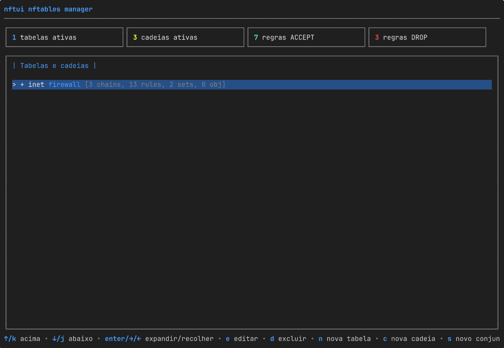

# nftui

[English](README.md) · [Magyar](README.hu.md) · [Español](README.es.md) · **Português (BR)** · [Français](README.fr.md) · [Deutsch](README.de.md) · [Italiano](README.it.md)

[](https://github.com/aafeher/nftui/actions/workflows/ci.yml)
[](https://github.com/aafeher/nftui/actions/workflows/codeql.yml)
[](https://codecov.io/gh/aafeher/nftui)
[](https://scorecard.dev/viewer/?uri=github.com/aafeher/nftui)
[](https://github.com/aafeher/nftui/releases/latest)
[](LICENSE)
[](go.mod)
[](#requisitos)
[](https://github.com/aafeher/nftui/releases)



`nftui` é uma interface de usuário de terminal (TUI) para gerenciar o
`nftables` no Linux. Navegue pelo conjunto de regras ativo, edite regras com
editores estruturados completos para cada tipo de condição e ação, e aplique
as mudanças de volta ao kernel — sem nunca tocar diretamente na CLI do `nft`.

Escrito em Go com o framework
[Bubble Tea](https://github.com/charmbracelet/bubbletea). Fala com o kernel
via netlink por meio da biblioteca
[`google/nftables`](https://github.com/google/nftables).

## Recursos

### Navegação e gerenciamento do conjunto de regras

- Visão em árvore de todas as tabelas e cadeias com dados vivos lidos do
  kernel. O esqueleto (tabelas, cadeias, conjuntos, objetos nomeados) é
  renderizado imediatamente na inicialização; as contagens de regras por
  cadeia são preenchidas de forma assíncrona, então um conjunto de regras com
  muitas cadeias continua interativo enquanto as listas de regras chegam em
  segundo plano (cada linha de cadeia mostra brevemente `[loading rules...]`
  até a sua leitura aterrissar).
- Listagem de regras por cadeia com renderização legível de cada expressão
  analisada. A lista é janelada — apenas as regras que cabem na tela são
  serializadas e desenhadas, então rolar por uma cadeia com mais de 1000
  regras custa o mesmo que por uma com 10. O filtro em linha (`/`) faz cache
  do texto em minúsculas de cada regra na primeira comparação, de modo que as
  teclas seguintes continuam responsivas em cadeias grandes.
- Visão de detalhe por regra organizada em abas por categoria de condição.
- CRUD completo de tabelas, cadeias e regras: criar, renomear / editar
  propriedades, excluir (com confirmação), reordenar regras para cima / para
  baixo dentro de uma cadeia, inserir antes / acrescentar ao final.

### Editor de regras — condições suportadas

| Categoria | Correspondências |
|-----------|------------------|
| **CT (conntrack)** | state, direction, status, mark, secmark, expiration, helper, l3proto, protocol, proto-src, proto-dst, labels, eventmask, ip saddr / daddr, bytes, packets, avgpkt (com direção), zone, count |
| **Cabeçalho IPv4** | saddr, daddr (CIDR), protocol, ttl, length, dscp, version, hdrlength, id, frag-off, checksum |
| **Cabeçalho IPv6** | saddr, daddr (CIDR), length, nexthdr, hoplimit, version, dscp (6 bits), flowlabel (20 bits) |
| **TCP** | sport, dport, sequence, ackseq, flags (MultiSelect), window, checksum, urgptr, doff |
| **UDP / UDPLITE** | sport, dport, length, checksum |
| **SCTP** | sport, dport, vtag, checksum, **chunk** (correspondência por tipo de chunk conforme a RFC 4960: data / init / init-ack / sack / heartbeat / heartbeat-ack / abort / shutdown / shutdown-ack / error / cookie-echo / cookie-ack / ecne / cwr / shutdown-complete / auth / asconf-ack / i-data / forward-tsn / asconf / i-forward-tsn — tanto a mera presença quanto restrições por sub-campo de cada tipo são suportadas: o Select de tipo de chunk comanda um Select de sub-campo (`tsn` / `stream` / `ssn` / `ppid` para DATA; `init-tag` / `a-rwnd` / `os` / `mis` / `init-tsn` para INIT; `cum-tsn-ack` / `a-rwnd` / `num-gap-ack-blocks` / `num-dup-tsns` para SACK; etc.) mais uma entrada de valor codificada em big-endian na largura correspondente de 1 / 2 / 4 bytes) |
| **Meta (interface)** | iifname, oifname, iif, oif, iiftype, oiftype, iifgroup, oifgroup |
| **Meta (proto / socket / pacote)** | length, protocol (EtherType), nfproto, l4proto, mark, priority, skuid, skgid, cgroup, rtclassid, pkttype, cpu |

### Editor de regras — ações suportadas

- **Verdicts**: `accept`, `drop`, `return`, `jump <chain>`, `goto <chain>` —
  com entrada de nome de cadeia para os alvos de jump / goto.
- **Reject**: `with icmp type`, `with icmpx type`, `with tcp reset` — sensível
  à família (o Select de tipo ICMP muda para tabelas ip / ip6 / inet /
  bridge).
- **Log**: prefix, level (emerg…debug), grupo NFLOG, snaplen, queue-threshold —
  com validação antes de salvar contra combinações rejeitadas pelo kernel
  (p. ex. `level` proibido no modo NFLOG).
- **Counter**: edita as contagens de pacotes e bytes de um contador anônimo
  (o uso típico é zerá-lo).
- **Limit**: rate, unit (second/minute/hour/day/week), burst, type
  (packets/bytes), over.

### UX do editor

- Cada aba agrupa campos relacionados; **Tab** / **Shift+Tab** move o foco
  entre as sub-entradas.
- Campos modificados são destacados; uma entrada esvaziada remove a
  correspondência subjacente.
- **F2** valida e aplica todas as mudanças via netlink (`NLM_F_REPLACE`).
- Uma linha de ajuda no rodapé sempre lista todos os atalhos disponíveis na
  visão atual.

## Requisitos

- **Linux** com um kernel com suporte a `nftables`.
- **Go 1.25+** para compilar a partir do código-fonte.
- **`CAP_NET_ADMIN`** em tempo de execução (execute via `sudo` ou conceda a
  capacidade com `setcap`).
- Um terminal de pelo menos **80x24** caracteres. Abaixo disso o nftui mostra
  um aviso de redimensionamento em vez de um layout apertado.

O tempo de execução **não** requer a CLI `nft` para o caminho principal de
leitura / edição / escrita — a comunicação é direta via netlink. O binário
`nft` só é usado por algumas operações pontuais em que passar pela CLI é mais
seguro do que reconstruir o estado do kernel (renomear tabelas, recriar
cadeias base).

## Instalação

```bash
git clone https://github.com/aafeher/nftui.git
cd nftui
go build -o nftui .
```

### Pacotes pré-compilados

Cada [release](https://github.com/aafeher/nftui/releases) anexa pacotes
nativos para `amd64` e `arm64`, todos construídos a partir do mesmo binário
dos arquivos compactados e listados em `checksums.txt` (de modo que a
assinatura cosign também os cobre):

| Formato | Distros | Instalação |
|---------|---------|------------|
| `.deb` | Debian / Ubuntu | `sudo apt install ./nftui_<ver>_linux_amd64.deb` |
| `.rpm` | Fedora / RHEL / openSUSE | `sudo dnf install ./nftui_<ver>_linux_amd64.rpm` |
| `.apk` | Alpine | `sudo apk add --allow-untrusted ./nftui_<ver>_linux_amd64.apk` |
| `.pkg.tar.zst` | Arch | `sudo pacman -U ./nftui_<ver>_linux_amd64.pkg.tar.zst` |
| `.ipk` | OpenWrt (opkg) | `opkg install ./nftui_<ver>_linux_amd64.ipk` |

Cada pacote instala o `nftui` em `/usr/bin`, a página de manual em
`/usr/share/man/man1`, e declara a dependência de execução `nftables`. Os
binários são estáticos (sem CGO), então rodam igualmente em sistemas glibc e
musl. O OpenWrt está migrando de `opkg` para `apk`, então em arquiteturas
compatíveis o `.apk` deve servir ao OpenWrt mais novo baseado em apk enquanto
o `.ipk` cobre as versões opkg existentes. Roteadores de outras arquiteturas
(mips, armv7) estão fora do escopo — lá, compile a partir do código-fonte.

**Arch / AUR:** o `.pkg.tar.zst` da release instala diretamente com
`pacman -U`, sem precisar do AUR. O nftui não publica no AUR por conta
própria; um mantenedor da comunidade é bem-vindo a adotar o
[`packaging/aur/PKGBUILD`](packaging/aur/PKGBUILD) de referência (um pacote
`-bin` sobre o tarball da release).

**Gentoo:** o repositório é um módulo Go padrão, então `go build -o nftui .` é
o caminho mais simples. Dois ebuilds de referência manteníveis pela comunidade
são fornecidos para um overlay local:
[`nftui-1.2.0.ebuild`](packaging/gentoo/nftui-1.2.0.ebuild) compila do
código-fonte via `go-module.eclass`, e
[`nftui-bin-1.2.0.ebuild`](packaging/gentoo/nftui-bin-1.2.0.ebuild) instala o
binário pré-compilado da release; instale um ou outro (eles compartilham
`/usr/bin/nftui` e se bloqueiam mutuamente). Veja
[`packaging/gentoo/README.md`](packaging/gentoo/README.md) para configurar o
overlay. O nftui não mantém uma entrada no Portage / GURU.

### Nix flake

O repositório inclui um [`flake.nix`](flake.nix) com um pacote
`buildGoModule` para `x86_64-linux` e `aarch64-linux`, um `devShell` que
espelha a cadeia de ferramentas da CI, e um `apps.default` executável:

```bash
nix build              # compila em ./result/bin/nftui (+ página de manual)
nix run                # compila e executa (precisa de CAP_NET_ADMIN em execução)
nix develop            # ferramentas: go, gopls, goreleaser, nftables, mandoc
```

No primeiro `nix build`, o `vendorHash` está intencionalmente definido como
`lib.fakeHash` — o Nix imprime o `sha256-…` real no erro e o usuário o cola no
`flake.nix` (refixe sempre que o `go.sum` mudar). Isso mantém independentes as
releases binárias (Goreleaser) e as builds Nix: o caminho Nix não bloqueia a
publicação de releases.

### Docker

Um [`Dockerfile`](Dockerfile) constrói uma imagem pequena (~17 MB) que embute
a CLI `nft(8)` de que o nftui precisa em execução:

```bash
docker build -t nftui:local .
# build com versão (define `nftui --version`):
docker build -t nftui:1.2.0 --build-arg VERSION=1.2.0 .
```

O nftui gerencia o conjunto de regras do **host**, então o contêiner precisa
do namespace de rede do host, da capacidade `NET_ADMIN` e de um TTY
interativo:

```bash
docker run --rm -it --network host --cap-add NET_ADMIN nftui:local
```

Os flags passam direto, p. ex. `… nftui:local --read-only`.

Um [`docker-compose.yml`](docker-compose.yml) liga as mesmas opções. Use
`run` (não `up`) para que a TUI receba um TTY de verdade:

```bash
docker compose run --rm nftui
```

O contêiner roda como root e confia em `--cap-add NET_ADMIN` mais o limite do
contêiner para o isolamento; com `--network host` ele edita o nftables do
host — a mesma pegada de privilégios de rodar o binário no host (veja
[Modelo de privilégios e reforço da implantação](#modelo-de-privilégios-e-reforço-da-implantação)).

### Execução

Com `sudo`:

```bash
sudo ./nftui
```

…ou conceda ao binário a capacidade necessária uma única vez:

```bash
sudo setcap cap_net_admin=ep ./nftui
./nftui
```

### Instalação da página de manual (opcional)

```bash
sudo install -m 0644 man/nftui.1 /usr/share/man/man1/               # inglês
sudo install -m 0644 man/hu/nftui.1 /usr/share/man/hu/man1/         # húngaro (opcional)
sudo install -m 0644 man/es/nftui.1 /usr/share/man/es/man1/         # espanhol (opcional)
sudo install -m 0644 man/pt_BR/nftui.1 /usr/share/man/pt_BR/man1/   # português do Brasil (opcional)
sudo install -m 0644 man/fr/nftui.1 /usr/share/man/fr/man1/         # francês (opcional)
sudo install -m 0644 man/de/nftui.1 /usr/share/man/de/man1/         # alemão (opcional)
sudo install -m 0644 man/it/nftui.1 /usr/share/man/it/man1/         # italiano (opcional)
sudo mandb        # se o seu sistema usa man-db (Debian / Ubuntu / Fedora …)
man nftui         # e fica disponível em todo lugar
```

Um `man` sensível ao locale escolhe a página traduzida a partir de `$LANG` /
`$LC_MESSAGES` (p. ex. `LANG=pt_BR.UTF-8 man nftui`). Pré-visualize da árvore
de código-fonte sem instalar:

```bash
man -l man/nftui.1          # inglês
man -l man/pt_BR/nftui.1    # português do Brasil
man -l man/es/nftui.1       # espanhol
man -l man/fr/nftui.1       # francês
man -l man/de/nftui.1       # alemão
man -l man/it/nftui.1       # italiano
man -l man/hu/nftui.1       # húngaro
```

## Opções de linha de comando

| Flag | Descrição |
|------|-----------|
| `--table <name>` | Restringe a árvore a uma única tabela — suas cadeias, conjuntos e objetos nomeados. A correspondência é por nome em todas as famílias, então `--table filter` incluirá tanto `inet filter` quanto `ip filter` se ambas existirem. Um nome desconhecido encerra antes de a TUI iniciar, mostrando a lista de tabelas disponíveis. |
| `--config <file>` | Aplica o conjunto de regras nftables dado via `nft -f <file>` **antes** de a TUI iniciar. **Isso muta o conjunto de regras em execução** — o arquivo pode conter `flush ruleset`. Use para levantar um estado conhecido para testes. É resolvido antes de `--table`, de modo que o estado do kernel após a carga é o que `--table` valida. |
| `--read-only` | Desativa todo caminho de escrita: sem add / insert / move / delete / edit / save de regras, sem create / delete de cadeias / tabelas / conjuntos, sem zerar contadores. As teclas bloqueadas ficam esmaecidas no rodapé (conforme o invariante de completude do rodapé) e um marcador `[READ-ONLY MODE]` (em português `[SOMENTE LEITURA]`) acompanha o título de cada visão principal. Útil para navegação segura, auditoria, ou combinado com `--config` para inspecionar uma fixture sem risco de edições acidentais. |
| `--lang <code>` | Define o idioma da interface, p. ex. `en`, `hu`, `es`, `pt-BR`, `fr`, `de` ou `it`. Sobrepõe o ambiente de locale (`LC_ALL` / `LC_MESSAGES` / `LANG`). Um valor não definido ou não suportado recorre à detecção automática do locale e, por fim, ao inglês. Apenas os idiomas para os quais o nftui inclui um catálogo são aceitos — atualmente **inglês**, **húngaro**, **espanhol**, **português do Brasil**, **francês**, **alemão** e **italiano**. Veja [Idioma / localização](#idioma--localização). |
| `--help` (também `-h`) | Imprime a lista completa de flags com descrições de uma linha e exemplos de uso, e encerra. Vai para stdout (então dá para canalizar para o `less`); um `--help` explícito encerra com 0. Flags inválidos emitem o mesmo texto de uso no stderr e encerram com 2. |
| `--version` | Imprime `nftui <versão>` no stdout e encerra com 0. A versão é injetada na build de release; um binário compilado do código-fonte informa a versão de módulo do build-info do Go, ou `dev` para um `go build` simples. |

Exemplos:

```bash
sudo ./nftui --table filter                              # mostra apenas a(s) tabela(s) chamada(s) 'filter'
sudo ./nftui --table missing                             # encerra: "table 'missing' not found. Available tables: …"
sudo ./nftui --config examples/example-nftables-01.conf  # carrega a fixture de teste manual e a navega
sudo ./nftui --read-only                                 # navegação segura — toda tecla de escrita fica esmaecida e inerte
sudo ./nftui --config new.conf --table filter            # aplica new.conf e restringe a visão à sua tabela 'filter'
./nftui --version                                        # imprime a versão e encerra (sem privilégios)
```

Sem `--config`, o conjunto de regras em execução fica intacto. Sem `--table`,
todas as tabelas são mostradas. Sem `--read-only`, todas as ações CRUD ficam
disponíveis.

## Idioma / localização

A interface do nftui é localizada. O idioma é resolvido uma única vez na
inicialização, nesta ordem:

1. o flag `--lang <code>` (p. ex. `--lang pt-BR`);
2. senão, o ambiente de locale POSIX — `LC_ALL`, depois `LC_MESSAGES`, depois
   `LANG` (os sufixos `.codeset` / `@modifier` são ignorados, e `C` / `POSIX`
   significam inglês);
3. senão, inglês.

Um código não definido ou não suportado recorre à detecção automática e, por
fim, ao inglês, então o nftui sempre inicia em um idioma para o qual tem
catálogo. A escolha fica fixada para a sessão — não há troca de idioma dentro
do aplicativo.

**Idiomas suportados:** inglês (fonte), húngaro (`hu`), espanhol (`es`),
português do Brasil (`pt-BR`), francês (`fr`), alemão (`de`) e italiano
(`it`). O inglês é o
locale *fonte*: cada texto da TUI
voltado ao usuário é resolvido pelos catálogos de mensagens embutidos
(`i18n/locales/*.json`), com o inglês como reserva para qualquer chave
ausente.

**Escopo:** a TUI interativa — a árvore, os painéis, as visões de regra /
cadeia / conjunto, os diálogos de criação / edição, o editor de regras, os
rodapés e as confirmações — é totalmente localizada. O vocabulário próprio do
nftables (nomes de atributo como `type` / `hook` / `policy`, os verdicts, as
palavras-chave de expressão e qualquer sintaxe de regra copiável) permanece em
inglês em todos os idiomas, de modo que o que você lê continua batendo com o
que o `nft` aceita. A saída de `--help` / `--version` é apenas em inglês — ela
é consumida fora da TUI, e o `--help` é resolvido antes de o idioma ser
selecionado. A página de manual `nftui(1)` é distribuída em inglês
([`man/nftui.1`](man/nftui.1)), húngaro ([`man/hu/nftui.1`](man/hu/nftui.1)),
espanhol ([`man/es/nftui.1`](man/es/nftui.1)), português do Brasil
([`man/pt_BR/nftui.1`](man/pt_BR/nftui.1)), francês
([`man/fr/nftui.1`](man/fr/nftui.1)), alemão
([`man/de/nftui.1`](man/de/nftui.1)) e italiano
([`man/it/nftui.1`](man/it/nftui.1)); este README existe também em
[inglês](README.md), [húngaro](README.hu.md), [espanhol](README.es.md),
[francês](README.fr.md), [alemão](README.de.md) e
[italiano](README.it.md).

```bash
sudo ./nftui --lang pt-BR          # interface em português do Brasil
sudo ./nftui --lang es             # interface em espanhol
sudo ./nftui --lang hu             # interface em húngaro
sudo ./nftui --lang fr             # interface em francês
sudo ./nftui --lang de             # interface em alemão
sudo ./nftui --lang it             # interface em italiano
LANG=pt_BR.UTF-8 sudo -E ./nftui   # português do Brasil pelo ambiente de locale
sudo ./nftui --lang en             # força inglês independentemente do locale
```

## Modelo de privilégios e reforço da implantação

O nftui lê e escreve o conjunto de regras nftables do kernel via netlink, o
que exige a capacidade **`CAP_NET_ADMIN`**. Ele **não tem autenticação nem
autorização próprias**: qualquer usuário que consiga iniciar o nftui com essa
capacidade pode reescrever o firewall. O nftui é, portanto, tão seguro quanto
a forma como você concede esse privilégio — conceda-o de forma ampla demais e
o binário vira um *confused deputy*. Imponha o controle de acesso na camada do
SO. Dois padrões são recomendados.

### Recomendado: `sudo` com uma regra restrita

Execute o nftui através do `sudo` e limite quem pode fazê-lo. Crie um grupo
dedicado (p. ex. `nftadm`), adicione os operadores de confiança e adicione uma
regra com `visudo`:

```sudoers
# /etc/sudoers.d/nftui  (edite com: visudo -f /etc/sudoers.d/nftui)
# Deixe o grupo nftadm executar o nftui como root — e nada mais.
%nftadm ALL=(root) /usr/local/bin/nftui
```

- Use o **caminho absoluto** para que um `nftui` diferente mais cedo no `PATH`
  não possa ser substituído no lugar.
- Mantenha o pedido de senha (sem `NOPASSWD`) para uso interativo: o `sudo`
  grava uma entrada no log de autenticação a cada invocação, dando um registro
  de quem-e-quando.
- Os operadores então executam `sudo nftui`. O nftui lê `SUDO_USER`, então com
  o [log de auditoria](#log-de-auditoria) ativado, cada mudança aplicada
  registra o humano por trás do `sudo`, não apenas `root`.

Para um papel somente-leitura / navegação, conceda a um grupo mais amplo
apenas a forma `--read-only`. O `sudo` compara o comando **e** os seus
argumentos exatamente, então esta regra permite `sudo nftui --read-only` mas
não o `sudo nftui` irrestrito:

```sudoers
%nftview ALL=(root) /usr/local/bin/nftui --read-only
```

### Alternativa: um binário `setcap` restrito por grupo

Se você precisa rodar sem `sudo` (p. ex. automação), conceda a capacidade ao
arquivo mas restrinja **quem pode executá-lo** — nunca o deixe executável por
todo mundo:

```bash
sudo chown root:nftadm /usr/local/bin/nftui
sudo chmod 750         /usr/local/bin/nftui   # root: rwx, nftadm: r-x, demais: nada
sudo setcap cap_net_admin+ep /usr/local/bin/nftui
```

- A capacidade acompanha o **arquivo**, não o usuário, então `chmod 755` +
  `setcap` entrega, na prática, o poder de reescrever o firewall a cada conta
  local. `chmod 750` com um grupo dedicado é o que o mantém contido.
- Um binário com `setcap` contorna o `sudo`, então **não há entrada no log de
  autenticação do sudo** e `SUDO_USER` fica vazio — conte com
  `NFTUI_AUDIT_LOG` para o registro de mudanças (ele ainda captura o UID e o
  usuário reais).
- Mantenha o binário e os seus diretórios pais graváveis apenas por `root`,
  para que o arquivo portador da capacidade não possa ser trocado.

### Defesa em profundidade

- Ative o [log de auditoria](#log-de-auditoria) (`NFTUI_AUDIT_LOG`) para que
  cada mutação fique atribuída e com carimbo de tempo — o SO controla *quem
  pode executar* o nftui; o log de auditoria registra *o que mudou*.
- Use `--read-only` para papéis de inspeção / auditoria que nunca devem mutar
  o estado.
- O `sudo` se integra ao **PAM**, então re-autenticação, MFA ou restrições de
  horário / host (`pam_time`, `pam_access`) são configuradas na camada PAM —
  esse é o "envelopamento PAM" do nftui; a ferramenta deliberadamente não
  adiciona controle de acesso próprio.

## Log de auditoria

Para gestão de mudanças e conformidade (p. ex. SOC 2 / PCI-DSS), o nftui pode
registrar cada mutação do conjunto de regras que aplica. Defina a variável de
ambiente `NFTUI_AUDIT_LOG` com o caminho de um arquivo gravável:

```bash
sudo NFTUI_AUDIT_LOG=/var/log/nftui-audit.log ./nftui
```

Quando a variável está **indefinida ou vazia, a auditoria fica desligada** e o
nftui se comporta exatamente como antes — não há E/S de arquivo no caminho de
mutação. Quando definida, cada mudança aplicada (criar / excluir / renomear
tabelas, cadeias e conjuntos; adicionar / inserir / mover / excluir / editar
regras; adicionar / excluir elementos de conjunto; excluir / zerar objetos
nomeados; carga via `--config`; flush do conjunto de regras) acrescenta um
objeto JSON por linha:

```json
{"time":"2026-06-19T10:30:00.12Z","uid":0,"user":"root","sudo_user":"alice","op":"delete-rule","target":"ipv4 filter input handle 7","result":"ok"}
```

Cada registro carrega o carimbo de tempo UTC, o UID e o usuário efetivos, o
operador humano por trás do `sudo` (`sudo_user`, de `SUDO_USER`), a operação,
o objeto alvo e o resultado (`result` é `ok` ou `error`, com um campo `error`
em caso de falha — tentativas rejeitadas também são registradas).
Propriedades:

- **Somente-acréscimo** — o nftui apenas acrescenta ao final; nunca rotaciona,
  trunca nem relê o arquivo. Rotacione-o com `logrotate` ou envie as linhas a
  um SIEM.
- **0600** — o arquivo é criado com leitura/escrita apenas para o dono.
- **Fail-open** — se o caminho não puder ser aberto, o nftui imprime um único
  aviso e continua sem auditoria; um caminho de auditoria quebrado nunca
  bloqueia a gestão do firewall. Garanta que o caminho seja gravável pelo
  processo do nftui.

## Atalhos de teclado

### Visão principal em árvore (tabelas + cadeias)

| Tecla | Ação |
|-------|------|
| `↑` / `k` | seleção para cima |
| `↓` / `j` | seleção para baixo |
| `Enter` / `→` / `←` | expandir / recolher |
| `F3` | abrir cadeia (lista de regras) |
| `n` | nova tabela |
| `c` | nova cadeia |
| `e` | editar a tabela ou cadeia selecionada |
| `d` | excluir a tabela ou cadeia selecionada |
| `/` | buscar |
| `r` | recarregar do kernel |
| `q` / `Esc` / `Ctrl+C` | sair |

### Visão de cadeia (lista de regras)

| Tecla | Ação |
|-------|------|
| `↑` / `k` | seleção para cima |
| `↓` / `j` | seleção para baixo |
| `F3` | ver regra |
| `F4` | editar regra |
| `a` | acrescentar regra ao final |
| `i` | inserir regra antes da selecionada |
| `K` (Shift+k) | mover a regra selecionada para cima |
| `J` (Shift+j) | mover a regra selecionada para baixo |
| `d` | excluir regra |
| `/` | filtrar regras por substring (verdict, palavra-chave da condição, comentário) |
| `Esc` | voltar |
| `q` | sair |

Com o filtro ativo, `↑` / `↓` navegam pela lista filtrada, `Enter` / `F3`
abrem a regra selecionada para visualização, `F4` abre o editor e `Esc` limpa
o filtro.

### Editor de regras

| Tecla | Ação |
|-------|------|
| `F5` / `F6` | aba anterior / seguinte |
| `Tab` / `Shift+Tab` | campo seguinte / anterior |
| `F2` | salvar (validar + aplicar ao kernel) |
| `Esc` / `F3` | voltar |
| `q` / `Ctrl+C` | sair |

## Conjunto de regras de exemplo

`examples/example-nftables-01.conf` é a fixture canônica de teste manual. Ela
cobre todos os recursos documentados acima e é verificada com `nft -c -f`
contra o kernel do host. Para um ponto de partida realista e de boas práticas
em vez de uma vitrine de recursos, `examples/example-host-firewall.conf` é um
firewall de host endurecido (entrada negada por padrão exceto SSH/HTTP/HTTPS,
saída irrestrita, encaminhamento negado). Carregue qualquer um deles
explicitamente e apenas em um sistema em que sobrescrever o estado do nftables
seja aceitável:

```bash
sudo nft -c -f examples/example-nftables-01.conf       # verificação de sintaxe
sudo nft flush ruleset                                 # reset (PERIGO em produção)
sudo nft -f examples/example-nftables-01.conf          # aplicar
```

> O próprio `nftui` **não** muta o conjunto de regras em execução na
> inicialização — ele apenas lê o estado atual do kernel e escreve as mudanças
> que o usuário faz explicitamente.

## Estrutura do projeto

```
main.go                        ponto de entrada do programa
nft/                           núcleo que fala com o kernel
  rule.go                      parser de expressão → estrutura Rule
  nft_linux.go                 operações CRUD via netlink (build tag Linux)
  nft_stub.go                  stubs no-op para builds não-Linux
  expr/                        auxiliares de formatação por expressão
  nftserializer/               conjunto de regras → saída legível
ui/                            TUI Bubble Tea
  main_window.go               modelo de nível superior (visão em árvore)
  chain_view.go                lista de regras
  rule_view.go                 detalhe de regra (somente leitura)
  rule_edit.go                 editor de regras com FieldEditors em abas
  field_*.go                   um arquivo por FieldEditor
i18n/                          i18n / localização (catálogos de mensagens embutidos)
  i18n.go                      detecção / correspondência de idioma + tradutor T()
  locales/                     catálogos JSON por idioma (en, hu, es, pt-BR, fr, de, it)
examples/example-nftables-01.conf  fixture de teste manual
man/nftui.1                    página de manual (groff/mandoc; veja "Instalação")
CHANGELOG.md                   notas por versão (formato Keep a Changelog)
```

## Testes

```bash
go test ./...                            # testes unitários (sem kernel)
sudo nft -c -f examples/example-nftables-01.conf   # valida a fixture
```

### Testes de integração

Os testes sob o build tag `integration` exercitam os caminhos vivos de
leitura **e** escrita via netlink com os mesmos auxiliares que a TUI usa:
aplicar um conjunto de regras via `nft -f` e lê-lo de volta, além de criar /
renomear / excluir tabelas e cadeias e adicionar / inserir / mover / excluir
regras, verificando o estado do kernel lido após cada passo. Eles ficam fora
do `go test ./...` padrão e pulam a si mesmos quando não executados como root,
então um `go test` simples continua portátil.

```bash
sudo -E go test -tags=integration ./nft/ -v
```

Cada teste cria uma tabela com nome único (sufixado com carimbo de tempo, para
que execuções concorrentes e estado remanescente não colidam) e a desmonta em
`t.Cleanup`, mesmo quando as asserções falham. O binário `nft` precisa estar
no PATH; instale-o pelo pacote `nftables` da sua distro se estiver faltando.

### Integração contínua

[`.github/workflows/ci.yml`](.github/workflows/ci.yml) executa as mesmas
verificações a cada push e pull request para `main` / `develop`:

- **Build e testes unitários** — `gofmt -l`, `go vet ./...` (build tags padrão
  e `integration`), `go build ./...` e `go test -race ./...`.
- **Testes de integração** — instala o pacote `nftables` e executa
  `sudo -E go test -tags=integration -v ./nft/` para que o arnês tenha o
  `CAP_NET_ADMIN` de que precisa para aplicar um conjunto de regras vivo.
  Grava um perfil de cobertura sobre a árvore `nft` (`-coverpkg=./nft/...`) e
  imprime o total no log do job — o caminho vivo de netlink é invisível ao
  perfil dos testes unitários, então é aqui que a sua cobertura fica
  observável. Só roda depois de o job de testes unitários ficar verde.
- **Varredura de vulnerabilidades** — executa `govulncheck ./...` contra o
  módulo e a biblioteca padrão do Go. Como verificação própria (paralela à
  build), só falha a execução quando uma vulnerabilidade conhecida é
  alcançável a partir do grafo de chamadas do nftui.
- **Verificação de build reproduzível** — constrói os binários de release duas
  vezes com `goreleaser build --snapshot` e falha se os dois diferirem,
  verificando que a build `mod_timestamp` / `-trimpath` / sem CGO é
  reproduzível byte a byte.
- **Build do flake Nix** — em um runner com Nix, `nix flake check` +
  `nix build .#default` constroem o [`flake.nix`](flake.nix) de ponta a ponta
  (compilando o nftui e rodando a sua suíte unitária no sandbox), de modo que
  o flake não pode quebrar em silêncio. A primeira execução precisa fixar o
  `vendorHash` do `flake.nix` — ele vem como marcador de posição e a build que
  falha imprime o valor real a colar.

As atualizações de dependências e de GitHub Actions são automatizadas com o
Dependabot (`.github/dependabot.yml`, semanal), que abre PRs à medida que
releases e correções de segurança chegam. `github.com/google/nftables` fica
excluído desses PRs porque é intencionalmente mantido em um snapshot fixado.

A versão do Go vem do `go.mod` via `actions/setup-go@v6` com
`go-version-file: go.mod`, então subir a versão do Go do módulo atualiza a CI
no mesmo commit. Execuções concorrentes na mesma ref cancelam as anteriores em
andamento (`cancel-in-progress: true`).

## Processo de release

As releases são conduzidas pelo [Goreleaser](https://goreleaser.com/) e por um
workflow disparado por tag
([`.github/workflows/release.yml`](.github/workflows/release.yml)):

1. Promova a seção `[Unreleased]` do `CHANGELOG.md` para `[X.Y.Z] - <data>`.
2. `git tag vX.Y.Z` e `git push --tags`.
3. O workflow de Release extrai a seção `[X.Y.Z]` correspondente do
   `CHANGELOG.md` e executa o Goreleaser, que constrói binários Linux
   `amd64` / `arm64` reproduzíveis
   (`CGO_ENABLED=0 -trimpath -ldflags='-s -w'`, `mod_timestamp` fixado no
   horário do commit), empacota cada um com `LICENSE`, `README.md`,
   `CHANGELOG.md` e `man/nftui.1` num `tar.gz`, também emite pacotes
   `.deb` / `.rpm` / `.apk` / Arch `.pkg.tar.zst` / OpenWrt `.ipk` (nfpm,
   mesmo binário), grava um `checksums.txt` SHA-256 cobrindo todos os
   artefatos, e publica a GitHub Release com as notas curadas como corpo.
4. A release é reforçada com atestação de cadeia de suprimentos: o
   `checksums.txt` é assinado com **cosign** (sem chave — a assinatura fica
   vinculada à identidade OIDC do workflow via Fulcio/Rekor, sem chave privada
   armazenada), um **SBOM Syft** é emitido por arquivo, e uma atestação de
   **proveniência de build SLSA** é registrada para os arquivos, os checksums
   e o tarball de dependências abaixo.
5. Um `nftui-<X.Y.Z>-deps.tar.xz` reproduzível (o cache de módulos Go, de
   `scripts/gen-deps-tarball.sh`) é enviado para builds offline a partir do
   código-fonte — principalmente o ebuild de fonte do Gentoo, cujo
   `go-module.eclass` proíbe acesso à rede em tempo de build. O seu conteúdo é
   fixado pelo `go.sum`, então viaja na atestação de proveniência em vez de no
   `checksums.txt` (já assinado).

Verificando uma release baixada:

```bash
# 1. assinatura sobre o arquivo de checksums (cosign sem chave). Fixe o assinante ao
#    workflow de release deste repo E ao emissor OIDC do GitHub — uma identidade/emissor
#    curinga ('.*') só prova que a assinatura é internamente válida, não que *nós* a
#    produzimos, então aceitaria uma assinatura de qualquer identidade Fulcio e
#    anularia o propósito da verificação sem chave.
cosign verify-blob --certificate checksums.txt.pem --signature checksums.txt.sig \
  --certificate-identity-regexp '^https://github\.com/aafeher/nftui/\.github/workflows/release\.yml@refs/tags/v' \
  --certificate-oidc-issuer 'https://token.actions.githubusercontent.com' \
  checksums.txt
# 2. o arquivo contra os checksums confiáveis
sha256sum --check --ignore-missing checksums.txt
# 3. proveniência de build (vincula os bytes ao workflow de release deste repo)
gh attestation verify nftui_<ver>_linux_amd64.tar.gz --repo <owner>/nftui
```

Para validar a configuração localmente sem publicar:

```bash
goreleaser check                                                  # só a sintaxe da config
goreleaser release --snapshot --clean --skip=publish,sign,sbom    # build em dist/
```

`sign` / `sbom` são pulados localmente porque precisam da identidade OIDC do
`cosign` do runner de CI e do `syft`; a atestação de proveniência é exclusiva
do workflow. A saída snapshot (`dist/`) está no gitignore, então a árvore de
trabalho fica limpa.

## Histórico de versões

As notas por versão vivem no [CHANGELOG.md](CHANGELOG.md) no formato
[Keep a Changelog](https://keepachangelog.com/). Marcos principais até
agora:

- **v0.1.0** (2026-05-24) — primeira release publicável: correspondências CT /
  meta / IP / porta completas, todas as ações de verdict, CRUD completo do
  conjunto de regras.
- **v0.2.0** (2026-05-24) — sentenças NAT (`snat`, `dnat`, `masquerade`),
  `queue`, `quota`.
- **v0.3.0** (2026-05-24) — correspondências de protocolo estendidas
  (ICMP / ICMPv6, SCTP, DCCP, AH, ESP, COMP, Ethernet, VLAN, ARP, cabeçalhos
  de extensão IPv6).
- **v0.4.0** (2026-05-24) — conjuntos, mapas e objetos nomeados.
- **v0.5.0** (2026-05-25) — polimento e endurecimento de conjuntos / mapas /
  objetos nomeados (correção da exclusão de conjuntos de intervalos, flag
  dynset, suporte a CIDR, mapas de verdicts).
- **v0.6.0** (2026-05-29) — consistência do canal de feedback e UX de dicas
  transitórias: dicas da árvore com esmaecimento automático, roteamento
  unificado de erros de Reset / Delete.
- **v0.7.0** (2026-05-29) — mensagens de erro (conselho de `CAP_NET_ADMIN`,
  exibição de regras rejeitadas) e navegação (busca `/` na árvore, filtro `/`
  no `chainView`).
- **v0.8.0** (2026-05-30) — flags de CLI (`--table`, `--config`,
  `--read-only`, `--help`), polimento de release (CHANGELOG, página de
  manual), editor de `sctp chunk`, carga incremental assíncrona.
- **v0.9.0** (2026-06-19) — infraestrutura de release (arnês de testes de
  integração, workflow de CI, lista de regras virtualizada, pipeline de
  release Goreleaser, empacotamento com flake Nix) mais um passe de
  endurecimento de prontidão empresarial: atestação de cadeia de suprimentos
  (cosign / SBOM / proveniência SLSA), varredura de vulnerabilidades na CI, um
  log de auditoria de mutações opcional, validação de identificadores em
  defesa em profundidade, e documentos de governança e implantação
  (`SECURITY.md`, `CONTRIBUTING.md`, `CODE_OF_CONDUCT.md`).
- **v1.0.0** (2026-06-20) — primeira release estável: caminhos de instalação
  ampliados (Debian / RPM, pacotes Alpine / Arch / OpenWrt, uma imagem Docker,
  referências comunitárias Gentoo / AUR), reprodutibilidade comprovada e
  faixas de CI para o flake Nix, o flag `--version`, um tarball de
  dependências de módulos Go para builds offline, e renderização de endereços
  IPv6 de origem / destino.
- **v1.1.0** (2026-06-21) — UX de ajuste ao terminal e navegação mais uma onda
  de endurecimento de segurança / CI: mínimo de 80x24 com recorte de moldura e
  aviso de redimensionamento, renderização em tela alternativa,
  rolagem-até-o-foco no editor de regras e rolagem na visão de regra,
  cabeçalho de cadeia compacto; correções para o flush do conjunto de regras
  ao sair e a renderização dupla de regras; OpenSSF Scorecard / CodeQL /
  Codecov, alvos de fuzzing Go e actions fixadas por SHA.

- **v1.2.0** (2026-07-18) — internacionalização e localização: toda a TUI
  está localizada — a fonte inglesa mais húngaro, espanhol, português do
  Brasil, francês, alemão e italiano — via catálogos de mensagens embutidos
  com paridade testada, seleção por `--lang` / locale POSIX, mnemônicos de
  confirmação localizados (o alias alemão `j` é condicionado ao idioma para
  proteger a memória muscular da rolagem vim), e um par completo de página de
  manual + README para cada idioma.
## Licença

MIT — veja [LICENSE](LICENSE).
